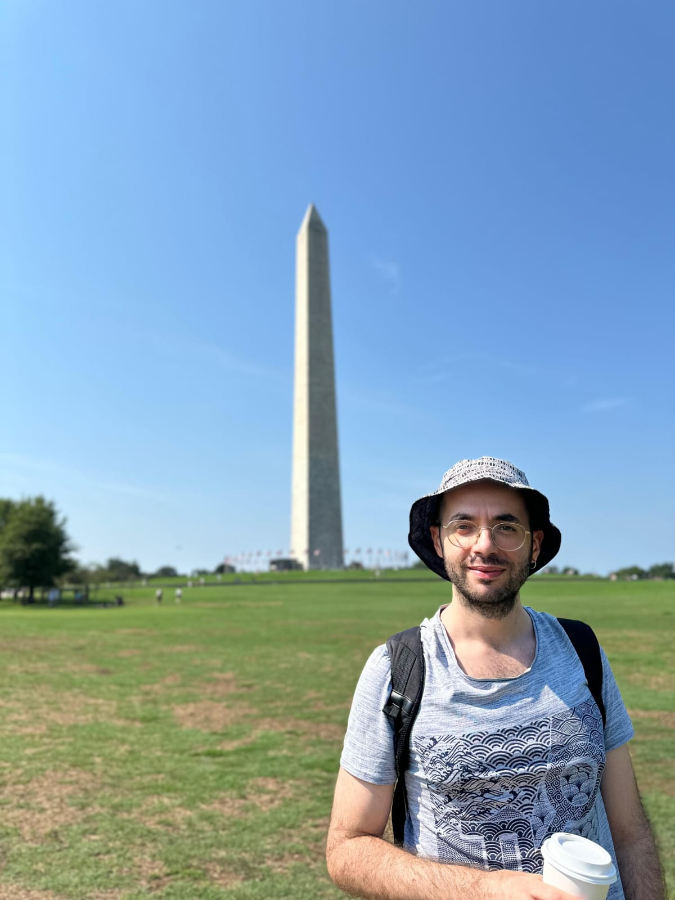
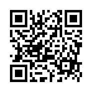
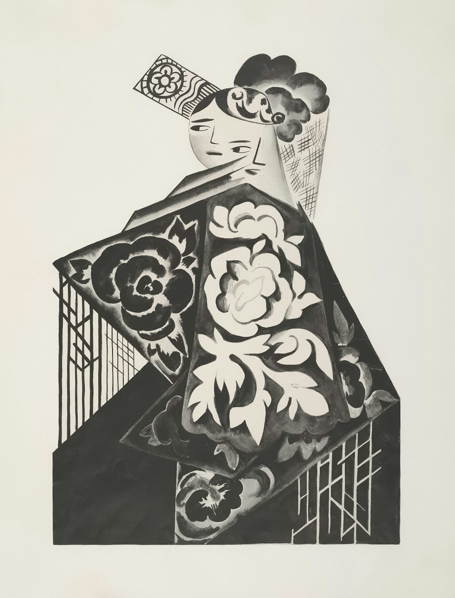
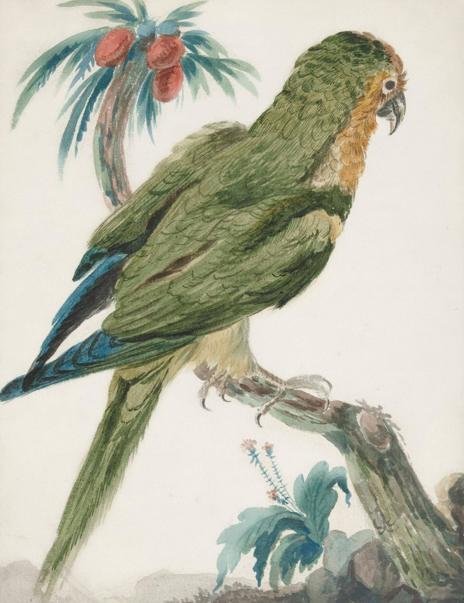

# Digital Humanities e Data Management per i Beni Culturali (2025/2026)

## 00. Il corso

➡️ Mail: [sebastian.barzaghi2@unibo.it](mailto:sebastian.barzaghi2@unibo.it)
➡️ ORCID: [0000-0002-0799-1527](https://orcid.org/0000-0002-0799-1527)
➡️ Sito: [sebastian.barzaghi2](https://www.unibo.it/sitoweb/sebastian.barzaghi2/)

---

### Piacere!

Sono un _assegnista di ricerca_ presso il Dipartimento di Beni Culturali dell’Università di Bologna.

➡️ Mi occupo di sviluppo di metodologie e tecnologie per la **gestione**, **modellazione** e **pubblicazione** dei **dati** nel contesto delle scienze umane e dei beni culturali.

Altre cose di cui mi interesso: 
* Bibliometria;
* Linked Open Data;
* Scienza aperta;
* Ingegneria dei dati.

---

### Cosa vi aspettate?

Inquadrate il codice QR (o cliccate sul link sottostante) e rispondete al questionario.

➡️ Link: https://forms.gle/xJZ8uALmvNk6DwXA7

➡️ Tempo: 10 minuti

Pensateci, ma non troppo: mi interessano le risposte "a caldo", non costruite.

---

### Qual è il vostro livello di familiarità con il concetto di _Digital Humanities_?

[Risposte](https://docs.google.com/spreadsheets/d/e/2PACX-1vQMu0vEO8OR9gqU9p7Tm-ix_XCHizqKNQyPULuWaUS-lKZpH8PLZrOZXdnGNK-Yh2FWbQ9PzRG5mHDr/pubchart?oid=2107735615&format=interactive)

➡️ Definiamolo per ora come _il punto di incontro tra scienze informatiche e discipline umanistiche_.

Avendo a che fare con dati digitali e fonti umanistiche, le _Digital Humanities_ sono la cornice concettuale e metodologica entro la quale necessariamente ci dobbiamo muovere.

---

### Qual è il tuo livello di familiarità con il concetto di “gestione dei dati”?

[Risposte](https://docs.google.com/spreadsheets/d/e/2PACX-1vQMu0vEO8OR9gqU9p7Tm-ix_XCHizqKNQyPULuWaUS-lKZpH8PLZrOZXdnGNK-Yh2FWbQ9PzRG5mHDr/pubchart?oid=1815759586&format=interactive)

➡️ Definiamolo per ora come _un processo complesso che ci permette di rendere utili e utilizzabili ciò che chiamiamo "dati"_.

La gestione dei dati è il tema fondamentale che affronteremo e attorno al quale l'intero corso è organizzato, compresi gli strumenti che ci ritroveremo ad utilizzare.

---

### Qual è il tuo livello di familiarità con il concetto di “scienza aperta"?

[Risposte](https://docs.google.com/spreadsheets/d/e/2PACX-1vQMu0vEO8OR9gqU9p7Tm-ix_XCHizqKNQyPULuWaUS-lKZpH8PLZrOZXdnGNK-Yh2FWbQ9PzRG5mHDr/pubchart?oid=1248897268&format=interactive)

➡️ Per ora, limitiamoci a dire che si tratta di _scienza fatta bene_.

La "Scienza Aperta" è uno dei paradigmi che guideranno le attività che faremo per tutto il resto del corso.

---

### Informazioni preliminari

#### Obiettivi

Fornire competenze e strumenti pratici per la raccolta, la gestione e la pubblicazione di dati riguardanti i beni culturali (bibliografici e storico-artistici).

#### Temi

Digital Humanities, Data Management, Open Science

#### Risultati

Progetti _vostri_ che testimoniano le competenze acquisite.

---

<!-- footer: Spesso in una slide troverete un riquadro di questo tipo, contenente la fonte bibliografica (liberamente accessibile) da cui ho tratto il contenuto della slide. Consideratela parte facoltativa del materiale integrativo, da leggere secondo il vostro interesse. -->

### Regole

I libri e gli articoli sono un accompagnamento alle slide delle lezioni.

Tutti i materiali esterni sono gratuiti.

Tutti i materiali sono pubblicati su Virtuale e GitHub.

La presenza non è obbligatoria ma consigliata.

L'esame consiste in un progetto (individuale o di gruppo). 

---

<!-- footer: "" -->

### Organizzazione del corso: _come_

* 15 lezioni
* Ogni mercoledì, giovedì e venerdì
* 2 ore per lezione
* Parte teorica e pratica per ogni lezione
* 1 pausa di 10 minuti

---

### Organizzazione del corso: _quando_

| Giorno | Orario | Luogo |
| ------ | ------- | ----- |
| Mercoledì | 09:00 - 11:00 | LAB. INFORMATICO, Via Angelo Mariani 5 - Ravenna |
| Giovedì | 09:00 - 11:00 | LAB. INFORMATICO, Via Angelo Mariani 5 - Ravenna |
| Venerdì | 12:00 - 14:00  | LAB. INFORMATICO, Via Angelo Mariani 5 - Ravenna |

---

### Organizzazione del corso: _cosa_ (1/3)

| Lezione | Titolo | Tematiche | Data |
| ------- | ------ | --------- | ---- |
| [[01]](https://dhdmch.github.io/2025-2026/lessons/01/01.html) | Introduzione | Dati; Metadati; Digital Humanities | 12-11-2025 |
| [[02]](https://dhdmch.github.io/2025-2026/lessons/02/02.html) | Pianificazione I | Data Management; Python: intro; Markdown | 13-11-2025 |
| 03 | Pianificazione II | Data Management; Python: dati | 14-11-2025 |
| 04 | Pianificazione III | Metadati; Python: strutture dati | 19-11-2025 |
| 05 | Raccolta I | ? ; Python: loop e conditionals | 20-11-2025 |
| 06 | Raccolta II | ? ; Python: funzioni | 21-11-2025 |
| 07 | Processamento I | ? ; Python: intro a Pandas | 26-11-2025 |
| 08 | Processamento II | ? ; Pandas: data cleaning | 27-11-2025 |
| 09 | Processamento III | ?; Pandas: manipolazione | 28-11-2025 |
| 10 | Analisi I | ?; Pandas: EDA | 03-12-2025 |
| 11 | Analisi II | ?; Pandas e Seaborn: data visualization | 04-12-2025 |
| 12 | Analisi III | ?; ? | 05-12-2025 |
| 13 | Pubblicazione I | FAIR Principles; licenze; ? | 10-12-2025 |
| 14 | Pubblicazione II | Zenodo; GitHub | 11-12-2025 |
| 15 | Workshop | Workshop finale | 12-12-2025 |

---

### Esame finale

#### Contenuti

➡️ Un **progetto** di **gestione dei dati** correlato a tematiche di interesse bibliografico e/o storico-artistico, che verrà **pubblicato** online e presentato durante un **colloquio orale**, basato su **linee guida** specifiche che saranno presentate e discusse durante il corso.

➡️ Potrete lavorare **in gruppo** (di massimo 3 persone) o **individualmente**. 

➡️ Potete confrontarvi tra di voi e chiedere chiarimenti al sottoscritto.

---

### Esame finale

#### Preparazione

Non spaventatevi: avremo modo di esercitarci e capire assieme i vari passaggi da seguire per realizzare un buon progetto (e portare a casa un 30 e lode).

➡️ Nelle sessioni pratiche, lavoreremo assieme con **un caso di studio** di gestione dei dati in cui vi aiuterò attivamente, per farvi sperimentare con gli strumenti e i metodi presentati a lezione.

---

### Esame finale

#### Valutazione

Il contributo personale di ciascuna persona sarà valutato durante il colloquio orale:

* <50% (valutazione insufficiente): preparazione non adeguata in nessun aspetto del progetto;
* 51-70% (valutazione sufficiente): tra 18/30 e 23/30;
* 71-90% (valutazione positiva): tra 24/30 e 27/30;
* 91-100% (valutazione eccellente): tra 28/30 e 30/30.

---

### Esame finale

L'anno scorso abbiamo sperimentato con più software già esistenti e diversi approcci alla gestione dei dati di un caso di studio specifico.

#### Esempi dell'anno precedente

* [SIDE QUEST - MAIN QUEST](https://malemg.github.io/sqmq_project/);
* [Quer Pasticciaccio](https://github.com/elisabestia/qrpstcccc_project_dhdm/tree/main);
* [Strangeways, here we come](https://ggdrll.github.io/shwc_Tani_project/);
* [CDR-TMLA](https://albadelia.github.io/cdr_tmlca_examproject_dhdm/).

⚠️ **Quest'anno sarà diverso**: gli strumenti e lo spazio di manovra per fare "quello che si vuole" sono ridotti, a favore di una scelta più controllata e un focus progettuale più preciso.

---

### Valutazione del corso

⚠️ Ad un certo punto, anche voi dovrete valutare me!

⚠️ Il questionario di valutazione è **davvero molto importante**, quindi - a tempo debito - insisterò sulla sua compilazione da parte vostra.

⚠️ Vi prego di fare valutazioni quanto più corrette ed oggettive possibili, in modo da farmi capire cosa è andato bene e cosa invece no.

---

### Raccomandazioni finali

➡️ Affrontare cose nuove è sempre difficile, quindi non preoccupatevi se il corso può sembrare complesso: lo è!

➡️ Però, è pensato per essere accessibile a studenti non abituati a questo tipo di tematiche.

➡️ Se fatte in buona fede, non esistono domande stupide (quindi **fatele**, altrimenti do per scontato che abbiate capito tutto).

➡️ A seconda della domanda, potrei aver bisogno di tempo per darvi una risposta sensata, quindi - nel caso - abbiate un po’ di pazienza.

---

# Digital Humanities e Data Management per i Beni Culturali (2025/2026)

## 00. Il corso ✅

➡️ Mail: [sebastian.barzaghi2@unibo.it](mailto:sebastian.barzaghi2@unibo.it)
➡️ ORCID: [0000-0002-0799-1527](https://orcid.org/0000-0002-0799-1527)
➡️ Sito: [sebastian.barzaghi2](https://www.unibo.it/sitoweb/sebastian.barzaghi2/)

➡️ [Lezione successiva](https://dhdmch.github.io/2025-2026/lessons/01/01.html)