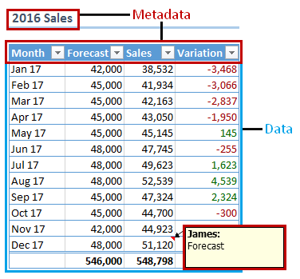
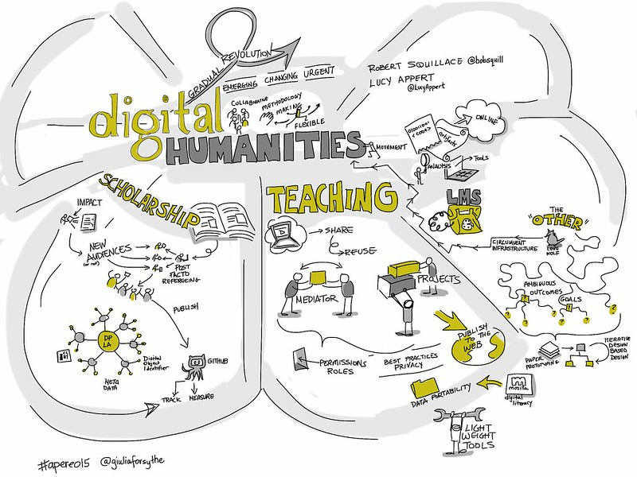
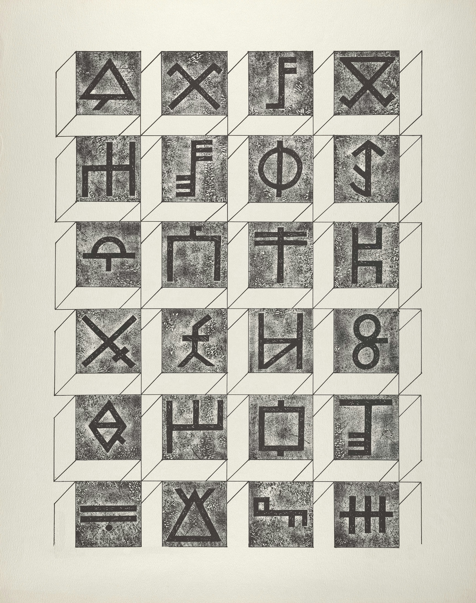

<!-- paginate: False -->

# Digital Humanities e Data Management per i Beni Culturali (2025/2026)

## 01. Origini

➡️ Mail: [sebastian.barzaghi2@unibo.it](mailto:sebastian.barzaghi2@unibo.it)
➡️ ORCID: [0000-0002-0799-1527](https://orcid.org/0000-0002-0799-1527)
➡️ Sito: [sebastian.barzaghi2](https://www.unibo.it/sitoweb/sebastian.barzaghi2/)

---

<!-- paginate: True -->

### Conoscete questa immagine?

* Nel 1854 un’epidemia di colera colpì il quartiere di Soho a Londra, causando decine di morti in pochi giorni. 
* Il medico John Snow mappò i casi e identificò una pompa dell’acqua contaminata in Broad Street come origine del contagio. 
* La rimozione della leva della pompa fermò l’epidemia e segnò una svolta nella nascita dell’epidemiologia moderna.

---

### Cosa intendiamo con _dati_?

* Numeri?
* Statistiche?
* Oggetti digitali?
* Oggetti fisici?
* Software?
* Testi?
* Immagini?
* Video?
* Fonti primarie?
* Fonti secondarie?
* Eventi?
* Interpretazioni?

---

<!-- footer: Drucker, J. (2011). Humanities Approaches to Graphical Display. Digital Humanities Quarterly, 5(1). <a href="https://www.proquest.com/scholarly-journals/humanities-approaches-graphical-display/docview/2555208513/se-2">https://www.proquest.com/scholarly-journals/humanities-approaches-graphical-display/docview/2555208513/se-2</a> -->

### Qualcosa che viene "dato"?

Il numero di nuovi romanzi pubblicati da un singolo editore tra il 1855 e il 1862.

Si tratta di un dato (_datum_, participio passato di _dare_): "qualcosa che viene dato" dalla natura all'osservatore.

Si tratta di un approccio "realista": secondo questa visione, i dati sono indipendenti dall'osservatore. 

Non c'è differenza tra il fenomeno osservato e l'osservazione.

---

<!-- footer: Leonelli, S. (2016). Data-Centric Biology: A Philosophical Study. University of Chicago Press. <a href="https://doi.org/10.7208/chicago/9780226416502.001.0001">https://doi.org/10.7208/chicago/9780226416502.001.0001</a> -->

### Non è così semplice...

La comparsa nel 1855 di quattordici romanzi dipende da molteplici eventi che si sovrappongono e si influenzano a vicenda: stesura, acquisizione, revisione, pre-stampa e pubblicazione.

Un dato non esiste di per sé, ma esiste nel momento in cui viene generato, raccolto e/o interpretato attraverso strumenti e sforzi umani.

Ciò che è considerabile dato dipende da chi lo usa, come, e per quale scopo.

---

<!-- footer: Andersson, L., Huvila, I., & Sköld, O. (2024). An Introduction to Paradata. In "Perspectives on Paradata: Research and Practice of Documenting Process Knowledge" (pp. 1-14). Cham: Springer International Publishing. <a href="https://doi.org/10.1007/978-3-031-53946-6_1">https://doi.org/10.1007/978-3-031-53946-6_1</a> -->

### Un dato è "qualcosa che viene preso"

I dati sono rappresentazioni di entità usate come prova di fenomeni per scopi di ricerca, studio, o altre pratiche di creazione della conoscenza.

Li usiamo come strumenti per comprendere il mondo e modificarlo a seconda delle nostre necessità.

---

<!-- paginate: False -->

<!-- footer: Noppe, N., Vanvelk, J., & Callens, N. (2023). The hands-on guide to research data management for KU Leuven researchers, students, and research support staff in the humanities and social sciences. Zenodo. <a href="https://doi.org/10.5281/zenodo.8010618">https://doi.org/10.5281/zenodo.8010618</a> -->

---

<!-- paginate: True -->

<!-- footer: Ciston, S., & Mike Ananny, K. C. (2023). A critical field guide for working with machine learning datasets. Knowing Machines project. <a href="https://knowingmachines.org/critical-field-guide">https://knowingmachines.org/critical-field-guide</a> -->

### I dati sono raccolti in dataset

Un dataset è una raccolta di dati organizzati secondo criteri precisi.

Riflette le circostanze che hanno portato alla sua creazione e gestione (strumenti, limiti, bias, responsabilità…).

Quanto sono importanti i dataset? [[1]](https://news.ucsc.edu/2023/08/t2iat.html), [[2]](https://www.reuters.com/article/world/insight-amazon-scraps-secret-ai-recruiting-tool-that-showed-bias-against-women-idUSKCN1MK0AG/), [[3]](https://www.abc.net.au/news/2023-04-26/hidden-dangers-of-artificial-intelligence/102264038), [[4]](https://www.esquire.com/news-politics/politics/a33994802/pasco-county-sheriff-pre-crime-harassment/)

---

<!-- paginate: False -->

<!-- footer: Gontier, C., Jordan, J., & Petrovici, M. A. (2022). DELAUNAY: a dataset of abstract art for psychophysical and machine learning research. arXiv preprint arXiv:2201.12123. <a href="https://doi.org/10.48550/arXiv.2201.12123">https://doi.org/10.48550/arXiv.2201.12123</a> -->

---

<!-- footer: "" -->

### Determinare il valore dei dati

Per valutare l'utilità, il valore e la qualità dei dati, dobbiamo comprendere il contesto nel quale questi dati esistono.

Questo è dato da **metadati** che descrivono i chi, cosa, come, quando, dove, perché dei dati.

---

---

---

---

<!-- footer: Australian Research Data Commons (ARDC). (2020). ARDC Metadata Guide. Zenodo. <a href="https://doi.org/10.5281/zenodo.6459832">https://doi.org/10.5281/zenodo.6459832</a> -->

### Dati su dati

I metadati sono dati che descrivono un oggetto e ne documentano alcune caratteristiche, come l'autore dell'oggetto, il contenuto, la qualità, il formato, il contesto.

I metadati possono essere visti come l'insieme di tutto ciò che si può dire su un dato (oggetto informativo) in un determinato momento, a qualsiasi livello di aggregazione.

---

<!-- footer: Australian Research Data Commons (ARDC). (2020). ARDC Metadata Guide. Zenodo. <a href="https://doi.org/10.5281/zenodo.6459832">https://doi.org/10.5281/zenodo.6459832</a> -->

### 

Metadata can be used to describe physical
objects (e.g. pot shards and specimens)
as well as digital objects (e.g. documents,
images, data sets and software)

---

<!-- footer: Australian Research Data Commons (ARDC). (2020). ARDC Metadata Guide. Zenodo. <a href="https://doi.org/10.5281/zenodo.6459832">https://doi.org/10.5281/zenodo.6459832</a> -->

### 

Metadata can take many different forms,
from free text (e.g. a read-me file) to
standardised, structured, machine-readable,
extensible content.

---

<!-- footer: Australian Research Data Commons (ARDC). (2020). ARDC Metadata Guide. Zenodo. <a href="https://doi.org/10.5281/zenodo.6459832">https://doi.org/10.5281/zenodo.6459832</a> -->

### 

Metadata is associated with the data it
describes. It can be embedded within
the data file, or recorded a separate text/
spreadsheet file that is linked to the
collection of data files it describes, or
contained in a catalogue record that points
to the research data collection.

---

<!-- paginate: True -->

<!-- footer: Gualandi, B., Pareschi, L., & Peroni, S. (2023). What do we mean by “data”? A proposed classification of data types in the arts and humanities. Journal of Documentation, 79(7), 51-71. <a href="https://doi.org/10.1108/JD-07-2022-0146">https://doi.org/10.1108/JD-07-2022-0146</a> -->

### Anche gli umanisti usano e producono dati

Ogni tipo di "lavoro basato sulla conoscenza" produce o riusa dei dati, anche se il termine "dato" non viene utilizzato sempre.

Esempio: uno studente deve utilizzare delle fonti (primarie o secondarie) per corroborare i contenuti della propria tesi di laurea, producendo _almeno_ una bibliografia.

Esempio: [[1]](https://www.zotero.org/zagibaru/library)

---

<!-- footer: Tóth-Czifra, E. (2019). DARIAH Pathfinder to Data Management Best Practices in the Humanities. Version 1.0.0. DARIAH-Campus. [Pathfinder]. <a href="https://campus.dariah.eu/id/yR8mHfs3eW-ibu58LerCt">https://campus.dariah.eu/id/yR8mHfs3eW-ibu58LerCt</a> -->

### Le discipline umanistiche sono dominate da paradigmi tradizionali

Il modo in cui il linguaggio viene usato nelle discipline umanistiche tende ad essere ermetico, individualista, ambiguo.

I dati umanistici sono spesso non accessibili a causa di licenze troppo stringenti.

I dati umanistici sono complessi e raramente documentati nell'ottica di una loro gestione adeguata.

---

<!-- footer: Borgman, C. L. (2010). The digital future is now: A call to action for the humanities. Digital humanities quarterly, 3(4). <a href="https://escholarship.org/uc/item/0fp9n05s">https://escholarship.org/uc/item/0fp9n05s</a> -->

### La tradizione si (in/s)contra con il digitale

Le tecnologie digitali mettono in discussione paradigmi esistenti e permettono di sviluppare nuovi metodi di indagine, produzione e disseminazione scientifica dei dati umanistici.

Un paio di esempi:
* [Are Pop Lyrics Getting More Repetitive?](https://pudding.cool/2017/05/song-repetition/)
* [Mining the Dispatch](https://dsl.richmond.edu/dispatch/)
* Computer Vision

---

<!-- paginate: False -->

<!-- footer: Stéfan Sinclair and Geoffrey Rockwell, CC BY 4.0 <https://creativecommons.org/licenses/by/4.0>, via Wikimedia Commons -->

---

<!-- paginate: True -->

<!-- footer: Fitzpatrick, K. (2012). The humanities, done digitally. Debates in the digital humanities, 12-15. <a href="https://doi.org/10.5749/minnesota/9780816677948.003.0002">https://doi.org/10.5749/minnesota/9780816677948.003.0002</a> -->

### Digital Humanities

Il campo in rapida espansione che esplora, sviluppa e applica metodi e tecnologie digitali alle discipline umanistiche.

Costituito da più discipline in cui vengono utilizzate tecnologie digitali per esplorare domande di ricerca in ambito umanistico, o formulare domande di ricerca umanistiche su questioni riguardanti tecnologie digitali.

---

<!-- paginate: False -->

<!-- footer: Betik, B. & Cors, A. (2023). 5 Reasons Why All Graduate Education Should Include the Digital Humanities. Edinburgh University Press. https://euppublishingblog.com/2023/10/20/graduate-education-digital-humanities/ -->

---

<!-- paginate: True -->

<!-- footer: Weingart, Scott B., Susan Grunewald, Matthew Lincoln et al. (eds.). The Digital Humanities Literacy Guidebook. Carnegie Mellon University, Updated November 11, 2022. <a href="https://cmu-lib.github.io/dhlg/">https://cmu-lib.github.io/dhlg/</a> -->

### Cosa facciamo nelle DH?

Copriamo una vasta gamma di attività, ma -- per farla breve -- possiamo dire che **creiamo risorse basate sui dati**. 

Alcuni esempi:
* **Dataset** contenenti dati generati e/o utilizzati in studi e analisi;
* **Modelli** per organizzare e descrivere dati;
* **Software** per eseguire determinate operazioni sui dati.

---

---

<!-- paginate: False -->

<!-- footer: "" -->

# Digital Humanities e Data Management per i Beni Culturali (2025/2026)

## 01. Origini ✅

➡️ Mail: [sebastian.barzaghi2@unibo.it](mailto:sebastian.barzaghi2@unibo.it)
➡️ ORCID: [0000-0002-0799-1527](https://orcid.org/0000-0002-0799-1527)
➡️ Sito: [sebastian.barzaghi2](https://www.unibo.it/sitoweb/sebastian.barzaghi2/)
