<!-- paginate: False -->

# Digital Humanities e Data Management / Informatica per i Beni Culturali (2025/2026)

## 01. Introduzione

➡️ Mail: [sebastian.barzaghi2@unibo.it](mailto:sebastian.barzaghi2@unibo.it)
➡️ ORCID: [0000-0002-0799-1527](https://orcid.org/0000-0002-0799-1527)
➡️ Sito: [sebastian.barzaghi2](https://www.unibo.it/sitoweb/sebastian.barzaghi2/)

---

<!-- paginate: True -->
<!-- footer: Drucker, J. (2011). Humanities Approaches to Graphical Display. Digital Humanities Quarterly, 5(1). <a href="https://www.proquest.com/scholarly-journals/humanities-approaches-graphical-display/docview/2555208513/se-2">https://www.proquest.com/scholarly-journals/humanities-approaches-graphical-display/docview/2555208513/se-2</a> -->

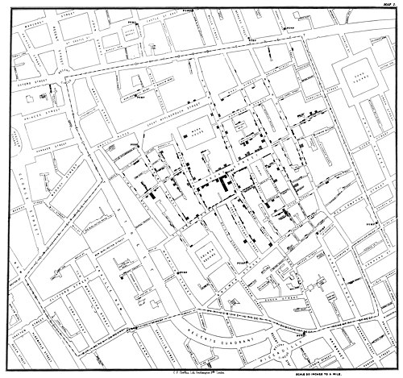

### Conoscete questa immagine?

Nel 1854 un’epidemia di colera colpisce il quartiere di Soho a Londra, causando decine di morti in pochi giorni. 

Il medico John Snow decide di mappare i casi, identificando ogni evento di contagio e morte per colera sotto forma di puntino su una mappa del quartiere.

Questa operazione permette alle autorità cittadine di rintracciare la fonte dell'epidemia fino a una singola pompa dell'acqua. 

---

<!-- footer: Gualandi, B., Pareschi, L., & Peroni, S. (2023). What do we mean by “data”? A proposed classification of data types in the arts and humanities. Journal of Documentation, 79(7), 51-71. https://doi.org/10.1108/JD-07-2022-0146 -->

### Cosa intendiamo con _dati_?

Nell’immaginario comune i dati sono legati al digitale, ma hanno radici più profonde: da sempre rappresentano qualcosa che usiamo per "provare", "misurare", "fattualizzare".

* Numeri e statistiche?
* Fonti primarie / secondarie?
* Fatti?
* Eventi storici?
* Interpretazioni?
* Testi / immagini / video / ...?

---

<!-- footer: Drucker, J. (2011). Humanities Approaches to Graphical Display. Digital Humanities Quarterly, 5(1). <a href="https://www.proquest.com/scholarly-journals/humanities-approaches-graphical-display/docview/2555208513/se-2">https://www.proquest.com/scholarly-journals/humanities-approaches-graphical-display/docview/2555208513/se-2</a> -->

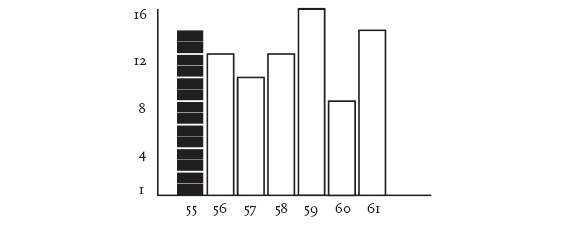

### Qualcosa che viene "dato"?

Il numero di nuovi romanzi pubblicati da un singolo editore tra il 1855 e il 1862.

Si tratta di un dato (_datum_, participio passato di _dare_): "qualcosa che viene dato" dalla natura all'osservatore.

Si tratta di un approccio "realista": secondo questa visione, i dati sono indipendenti dall'osservatore. 

⚠️ I dati sono neutrali, oggettivi, ed estranei a processi di intervento umano?

---

<!-- footer: Leonelli, S. (2016). Data-Centric Biology: A Philosophical Study. University of Chicago Press. <a href="https://doi.org/10.7208/chicago/9780226416502.001.0001">https://doi.org/10.7208/chicago/9780226416502.001.0001</a> -->

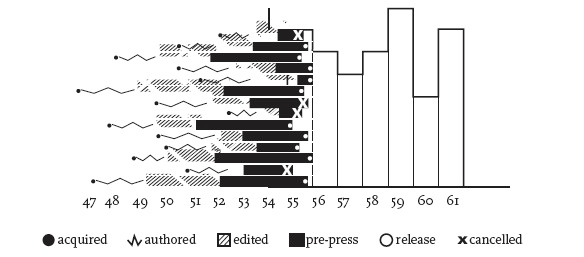

### Non è così semplice...

La comparsa nel 1855 di quattordici romanzi dipende da molteplici eventi che si sovrappongono e si influenzano a vicenda: stesura, acquisizione, revisione, pre-stampa e pubblicazione.

⚠️ Un dato non esiste di per sé, ma esiste nel momento in cui viene generato, raccolto e/o interpretato attraverso strumenti e sforzi umani.

💡 Ciò che è considerabile _dato_ dipende da chi lo usa, da come lo usa, e per quale scopo.

---

<!-- footer: Andersson, L., Huvila, I., & Sköld, O. (2024). An Introduction to Paradata. In "Perspectives on Paradata: Research and Practice of Documenting Process Knowledge" (pp. 1-14). Cham: Springer International Publishing. https://doi.org/10.1007/978-3-031-53946-6_1 -->

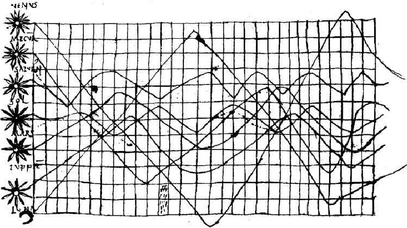

### Un dato è "qualcosa che viene preso"

➡️ I **dati** sono _rappresentazioni di entità usate come prova di fenomeni per scopi di ricerca, studio, o altre pratiche di creazione della conoscenza_.

‘Evidence’ may be intersubjective or subjective; physical or emotional; persistent or ephemeral; personal or public; explicit or tacit; and is consciously or unconsciously referenced by the researcher at some point during the course of their research.

Li usiamo come strumenti per comprendere il mondo e modificarlo a seconda delle nostre necessità.

Da sempre sono parte della nostra vita: li utilizziamo, li creiamo, li gestiamo quotidianamente.

---

<!-- paginate: False -->

<!-- footer: "" -->

---

<!-- paginate: True -->

<!-- footer: Ciston, S., & Mike Ananny, K. C. (2023). A critical field guide for working with machine learning datasets. Knowing Machines project. <a href="https://knowingmachines.org/critical-field-guide">https://knowingmachines.org/critical-field-guide</a> -->

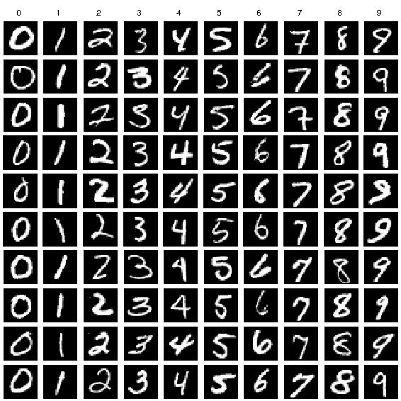

### I dati sono raccolti in dataset

As part of the research process, research data maybe collated in a structured way to create a dataset to substantiate a particular interpretation, analysis or argument. A dataset may or may not lead to a research output, which regardless of method of presentation, is a planned public statement of new knowledge or interpretation.

➡️ Un **dataset** è _una raccolta di dati organizzati secondo criteri precisi_.

⚠️ Riflette le circostanze che hanno portato alla sua creazione e gestione (strumenti, limiti, bias, responsabilità…).

🔎 Quanto sono importanti i dataset? [[1]](https://news.ucsc.edu/2023/08/t2iat.html), [[2]](https://www.reuters.com/article/world/insight-amazon-scraps-secret-ai-recruiting-tool-that-showed-bias-against-women-idUSKCN1MK0AG/), [[3]](https://www.abc.net.au/news/2023-04-26/hidden-dangers-of-artificial-intelligence/102264038), [[4]](https://www.esquire.com/news-politics/politics/a33994802/pasco-county-sheriff-pre-crime-harassment/)

---

<!-- footer: "" -->

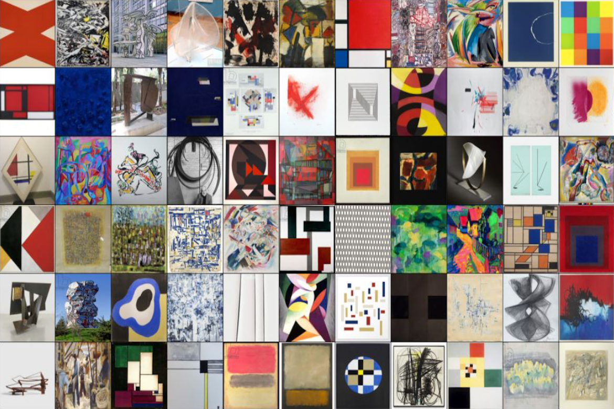

### Perché è importante parlare di dati anche in ambito umanistico?

Research data may be used during the project's lifetime in order to write a journal article or produce an exhibition. In the short term other colleagues and contemporaries may be interested to re-use your research data or collaborate to produce new works. In the longer term visual arts research data may be curated by national museums, archives and galleries, forming part of the historic record for future generations.

Visual arts research data, in the form of artwork, has the potential to transform and effect the public. Research data may also benefit the public by evidencing research integrity, for example in some cases ensuring that research conducted is reproducible.

 Many Higher Education institutions have Research Data Management (RDM) policies which demonstrate that they consider research data to be an important part of research and a valuable asset.

 Visual arts research data is not only an integral part of the research process, but is also a resource that researchers can re-use for future projects. Research Councils UK and other funding bodies have policies which require publicly funded research to be made available (with provisions for sensitive data).

---

<!-- paginate: True -->
<!-- footer: Andersson, L., Huvila, I., & Sköld, O. (2024). An Introduction to Paradata. In "Perspectives on Paradata: Research and Practice of Documenting Process Knowledge" (pp. 1-14). Cham: Springer International Publishing. https://doi.org/10.1007/978-3-031-53946-6_1 -->

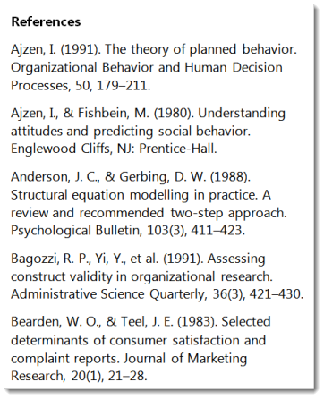

### Spesso il contesto è più importante

Nelle discipline umanistiche tendiamo ad avere dati descrittivi e interpretativi di altri dati: per descrivere opere culturali, eventi, collezioni bibliografiche lavoriamo più sulle relazioni, i contesti (sociali, geografici, storici, umani).

💡 In questa prospettiva, un ruolo fondamentale è svolto dai **metadati** che documentano _in maniera strutturata_ i _chi_, i _cosa_, i _come_, i _quando_, i _dove_, i _perché_ dei dati.

---

<!-- footer: "" -->

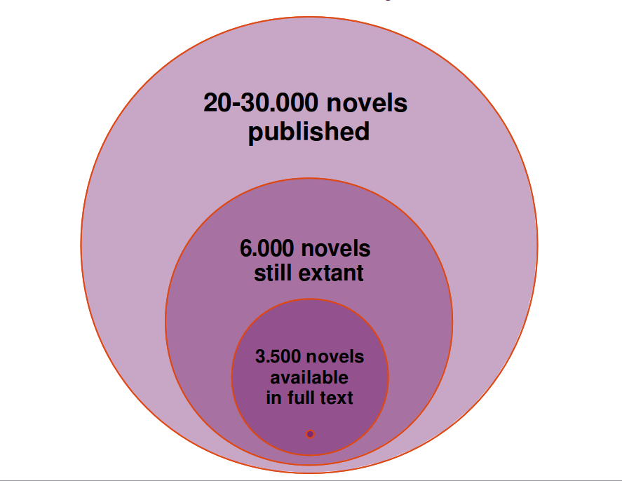
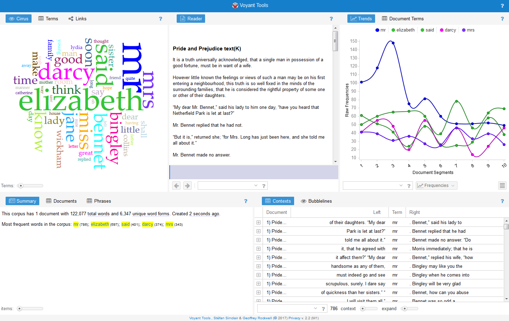

### I metadati di un oggetto

Ogni volta che viene scattata una foto con un dispositivo digitale, dei metadati vengono creati automaticamente, come:
* data e orario di creazione
* nome del file
* impostazioni del dispositivo
* geolocalizzazione

Anche un libro è ricco di metadati visibili sulla copertina e nel frontespizio, come:
* titolo
* autore
* editore

---

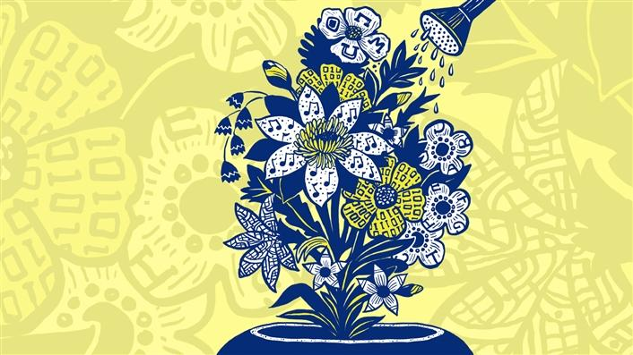

<!-- footer: Baca, M. (Ed.). (2016). Introduction to metadata. Getty Publications. <a href="https://www.getty.edu/publications/intrometadata/">https://www.getty.edu/publications/intrometadata/</a> -->

### Dati su dati

➡️ I **metadati** sono _dati che descrivono un oggetto informativo e ne documentano alcune caratteristiche_.

Esempi di metadati includono l'autore di un libro, il contenuto testuale, la data di pubblicazione, e così via.

💡 I metadati possono essere visti come l'insieme di tutto ciò che si può dire su un dato (oggetto informativo) in un determinato momento, a qualsiasi livello di aggregazione.

---

<!-- footer: Australian Research Data Commons (ARDC). (2020). ARDC Metadata Guide. Zenodo. <a href="https://doi.org/10.5281/zenodo.6459832">https://doi.org/10.5281/zenodo.6459832</a> -->

### I metadati possono _riferirsi a_ tante cose

I metadati costituiscono una forma di documentazione (di solito strutturata) che descrive o rappresenta le caratteristiche di un oggetto.

💡 Quindi, possono essere usati per descrivere tanto gli oggetti _fisici_ (per esempio, frammenti di vasi, reperti archeologici, quadri, libri, persone, ecc.), quanto gli oggetti _digitali_ (per esempio, software, foto, dataset, videogiochi, modelli 3D, ecc.).

---

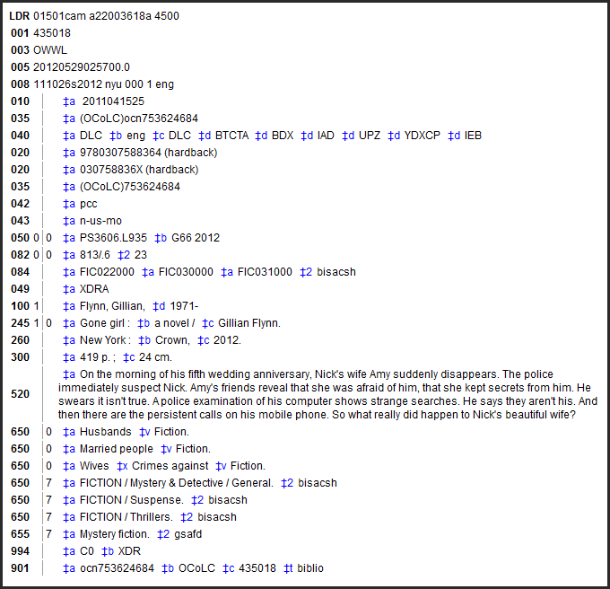

<!-- footer: Australian Research Data Commons (ARDC). (2020). ARDC Metadata Guide. Zenodo. <a href="https://doi.org/10.5281/zenodo.6459832">https://doi.org/10.5281/zenodo.6459832</a> -->

### I metadati possono _essere_ tante cose

I metadati possono assumere molte forme diverse.

💡 A partire da semplice testo libero (per esempio, l'etichetta di un'opera d'arte esposta in un museo), pensato per un utilizzatore umano, i metadati possono esistere anche sotto forma di contenuto codificato in un formato altamente strutturato, standardizzato e comprensibile dalle macchine (per esempio, un file MARC).

---

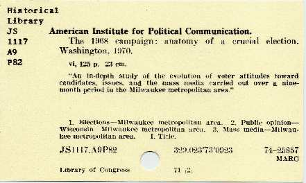

<!-- footer: Australian Research Data Commons (ARDC). (2020). ARDC Metadata Guide. Zenodo. <a href="https://doi.org/10.5281/zenodo.6459832">https://doi.org/10.5281/zenodo.6459832</a> -->

### I metadati sono sempre associati ai dati che descrivono

I metadati accompagnano ciò che descrivono in vari modi.

💡 Possono essere presenti direttamente nei dati stessi (per esempio, un file PDF o un'immagine digitale), oppure possono essere registrati in oggetti separati collegati in qualche maniera ai dati che descrivono (per esempio, file di testo, fogli di calcolo, ma anche una scheda di catalogo o l'etichetta di un'opera esposta in un museo).

---

### Esistono diversi tipi di metadati

* **Descrittivi**: descrivono dati usando dettagli sul contenuto che permettono a questi dati di essere rintracciabili, identificabili e selezionabili (es. `titolo`);
* **Strutturali**: forniscono informazioni sulla costruzione e sull'organizzazione dei dati all'interno della loro collezione (es. `indice`);
* **Amministrativi**: permettono la gestione dei dati nel tempo, fornendo informazioni sulle loro origini e le loro modalità di utilizzo (es. `licenza`). 

---

<!-- paginate: True -->

<!-- footer: Gualandi, B., Pareschi, L., & Peroni, S. (2023). What do we mean by “data”? A proposed classification of data types in the arts and humanities. Journal of Documentation, 79(7), 51-71. <a href="https://doi.org/10.1108/JD-07-2022-0146">https://doi.org/10.1108/JD-07-2022-0146</a> -->

### Anche gli umanisti usano e producono (meta)dati

Ogni tipo di attività basata sulla conoscenza comporta la produzione e/o il riutilizzo di dati, anche se il termine _dato_ non viene utilizzato in ogni contesto.

🔎 Esempio: uno studente che utilizza delle fonti (primarie o secondarie) per corroborare i contenuti della propria tesi di laurea produce _almeno_ una bibliografia.

🔎 Esempio con Zotero: [[1]](https://www.zotero.org/zagibaru/library)

---

<!-- footer: Tóth-Czifra, E. (2019). DARIAH Pathfinder to Data Management Best Practices in the Humanities. Version 1.0.0. DARIAH-Campus. [Pathfinder]. <a href="https://campus.dariah.eu/id/yR8mHfs3eW-ibu58LerCt">https://campus.dariah.eu/id/yR8mHfs3eW-ibu58LerCt</a> -->

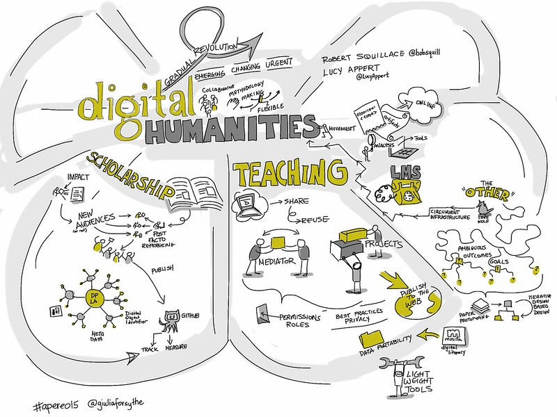

### Le discipline umanistiche sono dominate da paradigmi tradizionali

⚠️ Il modo in cui il linguaggio viene usato nelle discipline umanistiche tende ad essere ermetico, individualista, ambiguo.

⚠️ I dati umanistici sono spesso non accessibili a causa di licenze troppo stringenti.

⚠️ I dati umanistici sono complessi e raramente documentati nell'ottica di una loro gestione adeguata.

---

<!-- footer: Borgman, C. L. (2010). The digital future is now: A call to action for the humanities. Digital humanities quarterly, 3(4). <a href="https://escholarship.org/uc/item/0fp9n05s">https://escholarship.org/uc/item/0fp9n05s</a> -->

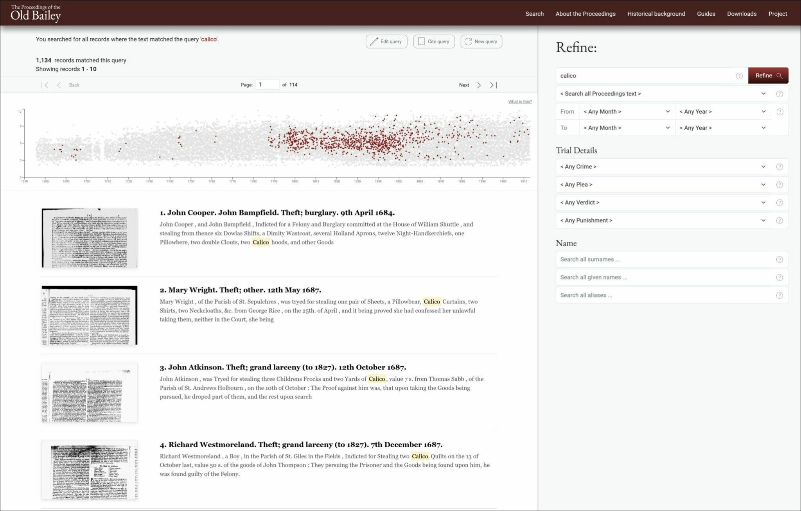

### La tradizione si (in/s)contra con il digitale

Le tecnologie digitali mettono in discussione paradigmi esistenti e permettono di sviluppare nuovi metodi di indagine, produzione e disseminazione scientifica dei dati umanistici.

Un paio di esempi:
* [Are Pop Lyrics Getting More Repetitive?](https://pudding.cool/2017/05/song-repetition/)
* [Mining the Dispatch](https://dsl.richmond.edu/dispatch/)
* [The Old Bailey Proceedings](https://www.oldbaileyonline.org)

---

<!-- paginate: False -->

<!-- footer: "" -->

---

<!-- paginate: True -->

<!-- footer: Fitzpatrick, K. (2012). The humanities, done digitally. Debates in the digital humanities, 12-15. <a href="https://doi.org/10.5749/minnesota/9780816677948.003.0002">https://doi.org/10.5749/minnesota/9780816677948.003.0002</a> -->

### Un nuovo paradigma

➡️ Col termine **Digital Humanities** (DH) ci si riferisce ad _un insieme di discipline in rapida espansione che esplora, sviluppa e applica metodi e strumenti digitali alle scienze umanistiche_.

Spesso vengono utilizzate tecnologie digitali per esplorare domande di ricerca in ambito umanistico.

In altri casi, vengono formulare domande di ricerca di natura umanistica su questioni riguardanti tecnologie digitali e il loro impatto.

---

<!-- paginate: False -->

<!-- footer: "" -->

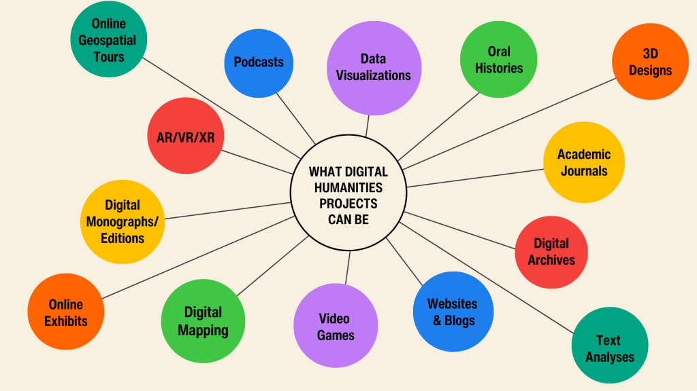

---

<!-- paginate: True -->

### Le diverse prospettive delle DH

1️⃣ Le DH nascono da una prospettiva _testuale_, focalizzata sulla digitalizzazione di fonti fisiche e sull'utilizzo di strumenti computazionali per organizzare ed analizzare materiali digitalizzati.

2️⃣ In seguito, le tipologie di fonti si moltiplicano (immagini, audio, video, ecc.), entrano in gioco anche i materiali nativamente digitali, e cresce un maggiore interesse verso l'epistemiologia (il _come_).

3️⃣ Ora, sta aumentando l'interesse verso l'impatto che la _digitalizzazione_, la _dataficazione_, l'_algoritmizzazione_ e l'_AI_ stanno avendo sulla società e sulla cultura.

---

<!-- footer: Lodi, M., & Martini, S. (2021). Computational thinking, between Papert and Wing. Science & education, 30(4), 883-908. https://doi.org/10.1007/s11191-021-00202-5. -->

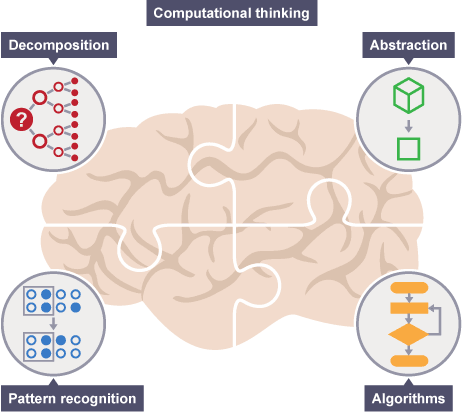

### I concetti computazionali chiave

* **Decomposizione**: dividere un problema in parti più piccole e gestibili;
* **Riconoscimento di pattern**: cercare somiglianze e tendenze nei componenti del problema;
* **Astrazione**: focalizzarsi solo sulle informazioni rilevanti, rimuovendo dettagli non necessari;
* **Algoritmi**: sviluppare una soluzione sequenziale al problema.

🔎 [Slide su Computational Thinking](https://sbrzt.netlify.app/it/slides/abinf-02/)

---

<!-- footer: Börner, K. (2011). Plug-and-play macroscopes. Communications of the ACM, 54(3), 60-69. https://doi.org/10.1145/1897852.1897871 -->

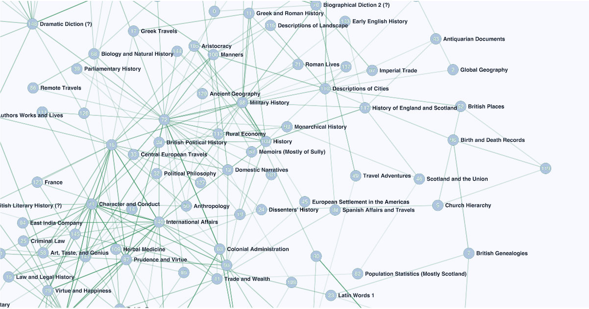

### Il tempo dei _macroscopi_

➡️ Per **macroscopio** ci si riferisce ad _un dispositivo (fisico, digitale, concettuale) che fornisce una visione d'insieme su qualcosa_, sintetizzando elementi in relazione l'uno con l'altro e individuando pattern, tendenze, casi particolari, eccezioni, dettagli. 

Ci permette di osservare ciò che è troppo grande, lento, o complesso per essere compreso dal solo occhio umano.

Può essere un dataset, un servizio, un software, una metodologia...

---

<!-- footer: Betik, B. & Cors, A. (2023). 5 Reasons Why All Graduate Education Should Include the Digital Humanities. Edinburgh University Press. https://euppublishingblog.com/2023/10/20/graduate-education-digital-humanities/ -->

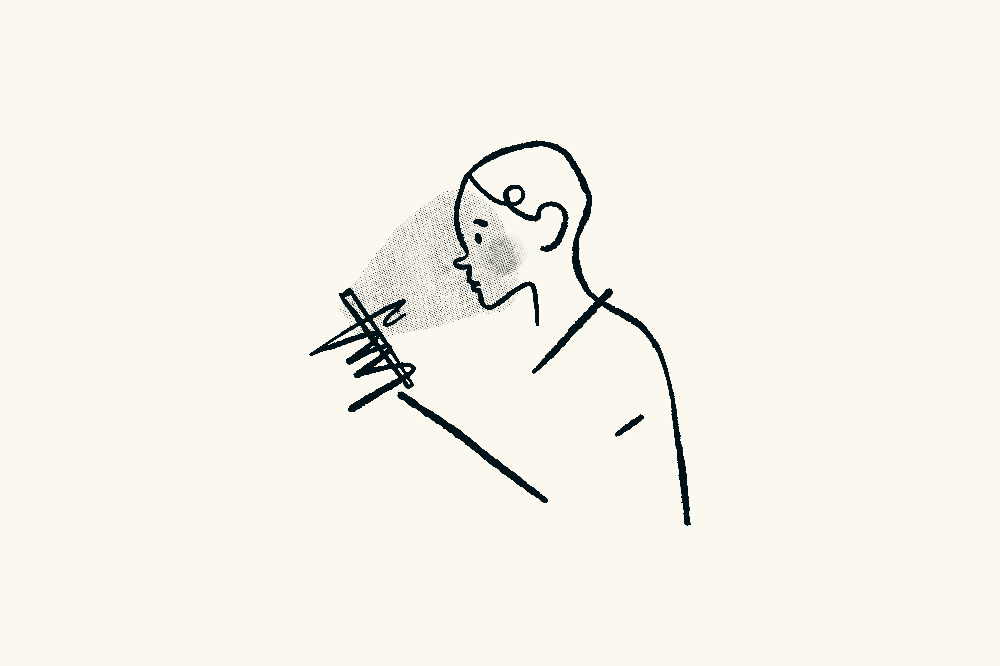

### Le DH sono un'emanazione della Digital Literacy

Opportunità di esplorare, sperimentare, e sviluppare abilità trasversali e desiderabili come:
* Pensiero computazionale;
* Gestione dei dati;
* Programmazione;
* Cooperazione interdisciplinare;
* Conoscenza su privacy dei dati, licenze, interazione con l'ecosistema Web e con le AI...

---

<!-- paginate: False -->
<!-- footer: "" -->

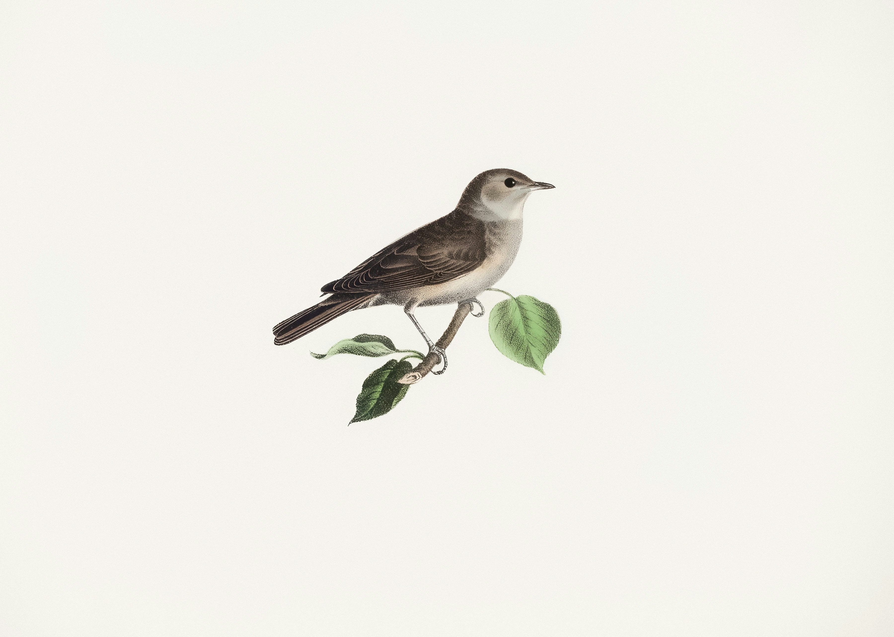

### Il progetto d'esame
#### Spiegazione preliminare

---

---

<!-- paginate: True -->

### Dataset storico-artistico: VAPOD

Dataset costituito da metadati descrittivi di dipinti che trattano di _mitologia classica_.

#### Obiettivo
Implementazione di un progetto di **gestione dei dati** che coinvolge: 
* 2 o 3 domande di ricerca;
* Esplorazione dei dati;
* [**Analisi dei dati culturali**](https://en.wikipedia.org/wiki/Cultural_analytics) sulla base delle domande scelte;
* Presentazione del processo e risultati.

---

### Dataset bibliografico: LiSPOD

Dataset costituito da metadati descrittivi di pubblicazioni scientifiche che trattano di _biblioteconomia_.

#### Obiettivo
Implementazione di un progetto di **gestione dei dati** che coinvolge: 
* 2 o 3 domande di ricerca;
* Esplorazione dei dati;
* [**Analisi bibliometrica**](https://it.wikipedia.org/wiki/Bibliometria) sulla base delle domande scelte;
* Presentazione del processo e risultati.

---

### Ne riparleremo, ma intanto questa è l'idea generale

* Scelta della modalità (in gruppo o individuale);
* Scelta di uno dei dataset;
* Raccolta, processamento e analisi dei dati tramite **Python** (usando **Colab** come ambiente di sviluppo);
* Documentazione non strutturata con **Markdown**;
* Documentazione strutturata con **metadati standardizzati**;
* Pubblicazione dei materiali su **GitHub** e **Zenodo**; 
* Presentazione orale.

---

<!-- paginate: False -->

<!-- footer: "" -->

# Digital Humanities e Data Management / Informatica per i Beni Culturali (2025/2026)

## 01. Introduzioni ✅

➡️ Mail: [sebastian.barzaghi2@unibo.it](mailto:sebastian.barzaghi2@unibo.it)
➡️ ORCID: [0000-0002-0799-1527](https://orcid.org/0000-0002-0799-1527)
➡️ Sito: [sebastian.barzaghi2](https://www.unibo.it/sitoweb/sebastian.barzaghi2/)

➡️ [Lezione successiva](https://dhdmch.github.io/2025-2026/lessons/02/02.html)