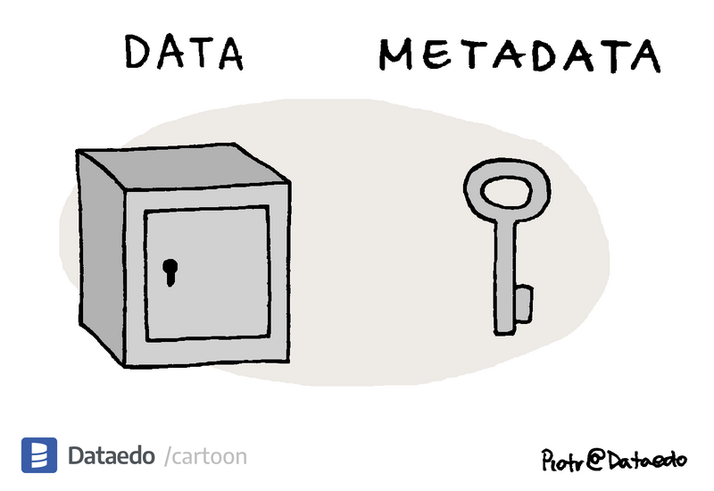
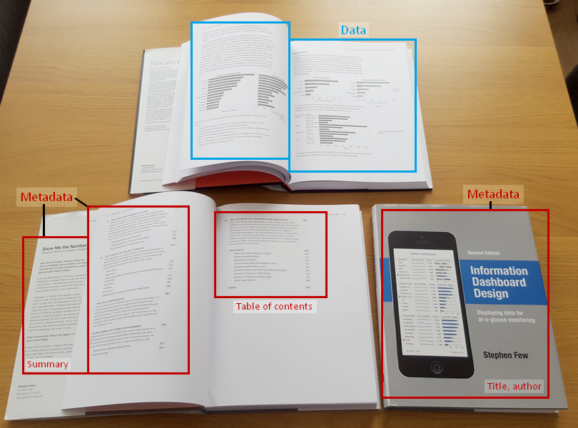

# Digital Humanities e Data Management per i Beni Culturali (2025/2026)

## 01. Sfide

➡️ Mail: [sebastian.barzaghi2@unibo.it](mailto:sebastian.barzaghi2@unibo.it)
➡️ ORCID: [0000-0002-0799-1527](https://orcid.org/0000-0002-0799-1527)
➡️ Sito: [sebastian.barzaghi2](https://www.unibo.it/sitoweb/sebastian.barzaghi2/)

---

<!-- _color: white -->

### Partiamo dai dati

---

### Conoscete questa immagine?

* Nel 1854 un’epidemia di colera colpì il quartiere di Soho a Londra, causando decine di morti in pochi giorni. 
* Il medico John Snow mappò i casi e identificò una pompa dell’acqua contaminata in Broad Street come origine del contagio. 
* La rimozione della leva della pompa fermò l’epidemia e segnò una svolta nella nascita dell’epidemiologia moderna.

---

### Cosa intendiamo con _dati_?

* Numeri?
* Statistiche?
* Oggetti digitali?
* Oggetti fisici?
* Testi?
* Immagini?
* Video?
* Fonti primarie?
* Fonti secondarie?
* Fatti?
* Interpretazioni?
* Software?

---

<!-- footer: Drucker, J. (2011). Humanities Approaches to Graphical Display. Digital Humanities Quarterly, 5(1). <a href="https://www.proquest.com/scholarly-journals/humanities-approaches-graphical-display/docview/2555208513/se-2">https://www.proquest.com/scholarly-journals/humanities-approaches-graphical-display/docview/2555208513/se-2</a> -->

### Qualcosa che viene "dato"?

Il numero di nuovi romanzi pubblicati da un singolo editore tra il 1855 e il 1862.

Si tratta di un dato (_datum_, participio passato di _dare_): "qualcosa che viene dato" dalla natura all'osservatore.

Si tratta di un approccio "realista": secondo questa visione, i dati sono indipendenti dall'osservatore. Non c'è differenza tra il fenomeno osservato e l'osservazione.

---

<!-- footer: Leonelli, S. (2016). Data-Centric Biology: A Philosophical Study. University of Chicago Press. <a href="https://doi.org/10.7208/chicago/9780226416502.001.0001">https://doi.org/10.7208/chicago/9780226416502.001.0001</a> -->

### Non è così semplice...

La comparsa nel 1855 di quattordici romanzi dipende da molteplici eventi che si sovrappongono e si influenzano a vicenda: stesura, acquisizione, revisione, pre-stampa e pubblicazione.

Un dato non esiste di per sé, ma esiste nel momento in cui viene generato, raccolto e/o interpretato attraverso strumenti e sforzi umani.

Ciò che è considerabile dato dipende da chi lo usa, come, e per quale scopo.

---

<!-- footer: Andersson, L., Huvila, I., & Sköld, O. (2024). An Introduction to Paradata. In "Perspectives on Paradata: Research and Practice of Documenting Process Knowledge" (pp. 1-14). Cham: Springer International Publishing. <a href="https://doi.org/10.1007/978-3-031-53946-6_1">https://doi.org/10.1007/978-3-031-53946-6_1</a> -->

### Un dato è "qualcosa che viene preso"

I dati sono entità usate come prova di fenomeni per scopi di ricerca, studio, o altre pratiche di creazione della conoscenza.

Li usiamo come strumenti per comprendere il mondo e modificarlo a seconda delle nostre necessità.

---

<!-- footer: Ciston, S., & Mike Ananny, K. C. (2023). A critical field guide for working with machine learning datasets. Knowing Machines project. <a href="https://knowingmachines.org/critical-field-guide">https://knowingmachines.org/critical-field-guide</a> -->

### I dati sono raccolti in dataset

Un dataset è una raccolta di dati organizzati secondo criteri precisi.

La sua corretta gestione garantisce l'efficienza, l'affidabilità e l'utilità dei dati.

Riflette le circostanze che hanno portato alla sua creazione e gestione (comunità, individui, organizzazioni, ambienti, strumenti, limiti, bias, responsabilità…).

Esempio: [Bias nelle GENAI](https://news.ucsc.edu/2023/08/t2iat.html)

---

<!-- footer: Gualandi, B., Pareschi, L., & Peroni, S. (2023). What do we mean by “data”? A proposed classification of data types in the arts and humanities. Journal of Documentation, 79(7), 51-71. <a href="https://doi.org/10.1108/JD-07-2022-0146">https://doi.org/10.1108/JD-07-2022-0146</a> -->

### Anche gli umanisti usano e producono dati

Ogni tipo di "lavoro basato sulla conoscenza" produce o riusa dei dati, anche se il termine "dato" non viene utilizzato sempre.

Esempio: una studentessa utilizza delle fonti (primarie o secondarie) per scrivere la propria tesi di laurea, producendo _almeno_ una bibliografia.

---

<!-- footer: Tóth-Czifra, E. (2019). DARIAH Pathfinder to Data Management Best Practices in the Humanities. Version 1.0.0. DARIAH-Campus. [Pathfinder]. <a href="https://campus.dariah.eu/id/yR8mHfs3eW-ibu58LerCt">https://campus.dariah.eu/id/yR8mHfs3eW-ibu58LerCt</a> -->

### Le discipline umanistiche sono dominate da paradigmi tradizionali

Il modo in cui il linguaggio viene usato nelle discipline umanistiche tende ad essere ermetico, individualista, ambiguo.

I dati umanistici sono spesso non accessibili a causa di licenze troppo stringenti.

I dati umanistici sono complessi e raramente documentati nell'ottica di una loro gestione adeguata.

---

<!-- footer: Borgman, C. L. (2010). The digital future is now: A call to action for the humanities. Digital humanities quarterly, 3(4). <a href="https://escholarship.org/uc/item/0fp9n05s">https://escholarship.org/uc/item/0fp9n05s</a> -->

### Il digitale conquista tutto

Le tecnologie digitali mettono in discussione paradigmi esistenti e permettono di sviluppare nuovi metodi di indagine, produzione e disseminazione scientifica dei dati umanistici.

---

<!-- footer: "" -->

### Cambio di paradigma

---

<!-- footer: Fitzpatrick, K. (2012). The humanities, done digitally. Debates in the digital humanities, 12-15. <a href="https://doi.org/10.5749/minnesota/9780816677948.003.0002">https://doi.org/10.5749/minnesota/9780816677948.003.0002</a> -->

### Digital Humanities

Il campo in rapida espansione che esplora, sviluppa e applica metodi e tecnologie digitali alle discipline umanistiche.

Costituito da più discipline in cui vengono utilizzate tecnologie digitali per esplorare domande di ricerca in ambito umanistico, o formulare domande di ricerca umanistiche su questioni riguardanti tecnologie digitali.

---

<!-- footer: Weingart, Scott B., Susan Grunewald, Matthew Lincoln et al. (eds.). The Digital Humanities Literacy Guidebook. Carnegie Mellon University, Updated November 11, 2022. <a href="https://cmu-lib.github.io/dhlg/">https://cmu-lib.github.io/dhlg/</a> -->

### Cosa facciamo nelle DH?

Copriamo una vasta gamma di attività, ma -- per farla breve -- creiamo risorse. Alcuni esempi:
* Dataset contenenti dati generati e/o utilizzati in studi e analisi;
* Modelli per organizzare e descrivere dati;
* Software per eseguire determinate operazioni sui dati.

---

<!-- footer: Smits, D.A.B., Teperek, M. (2020). Research Data Management for Master’s Students: From Awareness to Action. Data Science Journal, 19(1), p. 30. <a href="http://doi.org/10.5334/dsj-2020-030">http://doi.org/10.5334/dsj-2020-030</a> -->

### DH e gestione dei dati

Nelle DH c'è sicuramente una maggior consapevolezza della centralità dei dati.

Per essere utili e produrre un impatto concreto, i dati devono essere ben strutturati, documentati, accessibili, sostenibili, utilizzabili.

Per farlo, è necessario seguire una serie di attività rigorose, orientate ad una consapevole gestione dei dati.

---

<!-- footer: "" -->

### Un'impresa necessaria

---

<!-- footer: Smits, D.A.B., Teperek, M. (2020). Research Data Management for Master’s Students: From Awareness to Action. Data Science Journal, 19(1), p. 30. <a href="http://doi.org/10.5334/dsj-2020-030">http://doi.org/10.5334/dsj-2020-030</a> -->

### Una lettera d’amore ai propri dati

La gestione dei dati è l’organizzazione critica dei dati durante l’intero loro ciclo di vita.

---

<!-- footer: Gualandi, B. (2024). Data stewardship e open science nelle discipline umanistiche. Zenodo. <a href="https://doi.org/10.5281/zenodo.12937887">https://doi.org/10.5281/zenodo.12937887</a> -->

### Una serie di attività complesse

---

<!-- footer: Gualandi, B. (2024). Data stewardship e open science nelle discipline umanistiche. Zenodo. <a href="https://doi.org/10.5281/zenodo.12937887">https://doi.org/10.5281/zenodo.12937887</a> -->

### Pianificazione

Azioni principali: identificare i tipi di dati, identificare i metadati, pianificare la loro organizzazione in dataset, e redigere un piano di gestione dei dati.

---

<!-- footer: Gualandi, B. (2024). Data stewardship e open science nelle discipline umanistiche. Zenodo. <a href="https://doi.org/10.5281/zenodo.12937887">https://doi.org/10.5281/zenodo.12937887</a> -->

### Produzione, raccolta, analisi

Azioni principali: raccogliere o creare i dati, elaborare i dati per renderli utilizzabili (pulizia, combinazione, trasformazione, controllo qualità), analizzare i dati per generare risultati utili, produrre la documentazione dei dati e delle metodologie utilizzate.

---

<!-- footer: Gualandi, B. (2024). Data stewardship e open science nelle discipline umanistiche. Zenodo. <a href="https://doi.org/10.5281/zenodo.12937887">https://doi.org/10.5281/zenodo.12937887</a> -->

### Conservazione, condivisione

Azioni principali: valutare quali dati depositare, scegliere la repository, depositare i dati, applicare una licenza ai dati.

---

<!-- footer: "" -->

# Digital Humanities e Data Management per i Beni Culturali (2025/2026)

## 01. Sfide ✅

➡️ Mail: [sebastian.barzaghi2@unibo.it](mailto:sebastian.barzaghi2@unibo.it)
➡️ ORCID: [0000-0002-0799-1527](https://orcid.org/0000-0002-0799-1527)
➡️ Sito: [sebastian.barzaghi2](https://www.unibo.it/sitoweb/sebastian.barzaghi2/)
