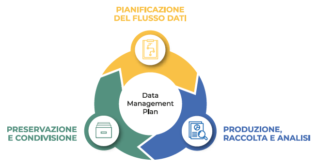
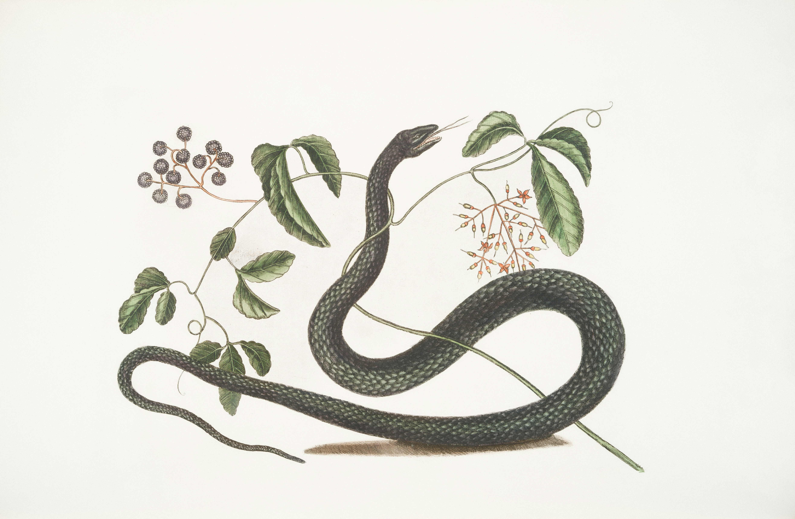

<!-- paginate: False -->

# Digital Humanities e Data Management per i Beni Culturali (2025/2026)

## 02. Pianificazione I

➡️ Mail: [sebastian.barzaghi2@unibo.it](mailto:sebastian.barzaghi2@unibo.it)
➡️ ORCID: [0000-0002-0799-1527](https://orcid.org/0000-0002-0799-1527)
➡️ Sito: [sebastian.barzaghi2](https://www.unibo.it/sitoweb/sebastian.barzaghi2/)

---

<!-- paginate: True -->

<!-- footer: "Bevan, A. (2015). The data deluge. Antiquity, 89(348), 1473-1484. https://doi.org/10.15184/aqy.2015.102" -->

### efefefeffe

Data are collected from sensors, sensor networks, remote sensing, observations, and more. This calls for increased attention to data management and stewardship.

The amount of available storage is not keeping up with the amount of data flooding in daily. How do we decide what data we keep?

---

<!-- footer: "" -->

### Perché gestire i dati: prospettiva di chi fa ricerca

Successfully managing your data throughout a research project helps ensures its preservation for future use. It also facilitates collaboration within your team, and it helps advance your scientific outcomes.

Manage your data for yourself:

    Organize your files (data inputs, analytic scripts, outputs) at various stages of the analytic process
    Track your science processes for reproducibility – match your outputs with exact inputs and transformations that produced them
    Better control versions of data – identify easily versions that can be periodically purged
    Quality control your data more efficiently

    Make backups to avoid data loss
    Format your data for re-use (by yourself or others)
    Be prepared: Document your data for your own recollection, accountability, and re-use (by yourself or others)
    Prepare it to share it – gain credibility and recognition for your science efforts!

---

<!-- footer: "" -->

### Perché gestire i dati: prospettiva istituzionale

    Data are a valuable asset – expensive and time consuming to collect

Data should be managed to:

    Maximize the effective use and value of data & information assets
    Continually improve quality including: accuracy, integrity, integration, timeliness of capture, presentation, relevance & usefulness
    Ensure appropriate use of data and information
    Facilitate data sharing
    Ensure sustainability and accessibility in long term for re-use in science

---

<!-- footer: "" -->

### Perché i dati ben gestiti sono importanti

Here are a few reasons (from the UK Data Archive):

    Increases the impact and visibility of research
    Promotes innovation and potential new data uses
    Leads to new collaborations between data users and creators
    Maximizes transparency and accountability

    Enables scrutiny of research findings
    Encourages improvement and validation of research methods
    Reduces cost of duplicating data collection
    Provides important resources for education and training

---

<!-- footer: "" -->

### Come gestiamo i dati?

A research data lifecycle illustrates stages through which well-managed data passes from the inception of a research project to its conclusion.

---

<!-- footer: Gualandi, B. (2024). Data stewardship e open science nelle discipline umanistiche. Zenodo. <a href="https://doi.org/10.5281/zenodo.12937887">https://doi.org/10.5281/zenodo.12937887</a> -->

### La gestione dei dati 

La gestione dei dati è il processo di organizzazione critica dei dati durante il loro ciclo di vita.

Obiettivo: produrre dataset autodescritti, sostenibili e utilizzabili.

Motivi: reperibilità e usabilità dei dati.

---

<!-- footer: Smits, D.A.B., Teperek, M. (2020). Research Data Management for Master’s Students: From Awareness to Action. Data Science Journal, 19(1), p. 30. http://doi.org/10.5334/dsj-2020-030 -->

### Pianificazione

Map out the processes and resources for all activities related to the handling of the project’s data assets. 

Start with the project goals (desired outputs, outcomes, and impacts) and work backwards to build a data management plan, supporting data policies, and sustainability plans for each step.

---

<!-- footer: Gualandi, B. (2024). Data stewardship e open science nelle discipline umanistiche. Zenodo. <a href="https://doi.org/10.5281/zenodo.12937887">https://doi.org/10.5281/zenodo.12937887</a> -->

### Raccolta, processamento, analisi

Activities needed to collect new or existing data. 

Every step needed to prepare new or existing data to be able to use it as an input for synthesis.  Data from multiple sources are combined into a form that can be readily analyzed.

Create analyses and visualizations to identify patterns, test hypotheses, and illustrate findings. 

---

<!-- footer: Gualandi, B. (2024). Data stewardship e open science nelle discipline umanistiche. Zenodo. <a href="https://doi.org/10.5281/zenodo.12937887">https://doi.org/10.5281/zenodo.12937887</a> -->

### Conservazione e Pubblicazione

Plan on how you are going to store your data for long-term use and accessibility so others can access, interpret, and use the data in the future. Decide what data to preserve, where to preserve it, and what documentation needs to accompany the data.

Publication and distribution of your data through the web or in data catalogs, social media or other venues to increase the chances of your data being discovered.

---

### Nel frattempo: Documentazione

Document data and each of the data stages by describing the why, who, what, when, where, and how of the data and processes through documentation and metadata.

Employ quality assurance and quality control procedures that enhance the quality of data.

Plan to preserve data in the short term to minimize potential losses (e.g., via software failure, human error, natural disaster).

---

<!-- footer: Peels, R. (2019). Replicability and replication in the humanities. Research Integrity and Peer Review, 4(1), 2. https://doi.org/10.1186/s41073-018-0060-4 -->

### Riproducibilità e replicazione

**Riproducibilità**: essere in grado di rifare la propria analisi e ottenere gli stessi risultati

**Replicazione**: qualcun altro rifà l’intero lavoro (con stessi o altri dati)

Obiettivo: avere un **workflow tracciabile**, **pulito**, **riusabile**

Serve:
- script documentati
- dati organizzati
- tracciabilità delle modifiche

---

<!-- footer: Schöch, C. (2023). Repetitive research: a conceptual space and terminology of replication, reproduction, revision, reanalysis, reinvestigation and reuse in digital humanities. International Journal of Digital Humanities, 5(2), 373-403. https://doi.org/10.1007/s42803-023-00073-y -->

### Automazione: perché ci serve?

Automatizzare = evitare errori ripetitivi, risparmiare tempo, rendere il lavoro più robusto

Un buon workflow:

→ Traccia tutto → Riduci errori → Ripeti tutto facilmente → Documenti meglio

Il primo passo? Un linguaggio semplice, leggibile e potente come **Python**

---

<!-- paginate: False -->
<!-- footer: "" -->

---

<!-- footer: "" -->

### Python è un linguaggio di programmazione

Python is a popular language for scientific computing, and great for general-purpose programming as well.

---

<!-- footer: "" -->

### Python è un linguaggio di programmazione

---

<!-- footer: "" -->

### Python è un linguaggio di programmazione

---

<!-- footer: "" -->

### Sessione pratica: Introduzione a Python con Google Colab

Data Carpentry’s teaching is hands-on, so participants are encouraged to use their own computers to insure the proper setup of tools for an efficient workflow.
These lessons assume no prior knowledge of the skills or tools.

This lesson requires a working copy of Python. 

https://colab.research.google.com/drive/1c3qzlB5QA-IuQ68xo05Ih38J0ks-8Sms?usp=sharing

---

<!-- paginate: False -->
<!-- footer: "" -->

# Digital Humanities e Data Management per i Beni Culturali (2025/2026)

## 02. Pianificazione I

➡️ Mail: [sebastian.barzaghi2@unibo.it](mailto:sebastian.barzaghi2@unibo.it)
➡️ ORCID: [0000-0002-0799-1527](https://orcid.org/0000-0002-0799-1527)
➡️ Sito: [sebastian.barzaghi2](https://www.unibo.it/sitoweb/sebastian.barzaghi2/)
