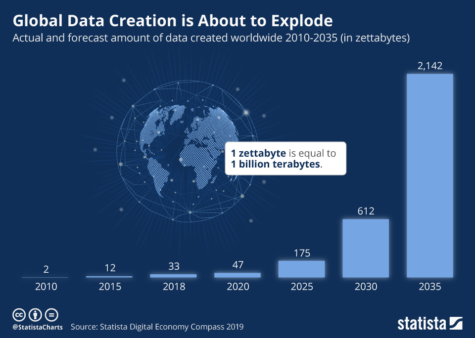
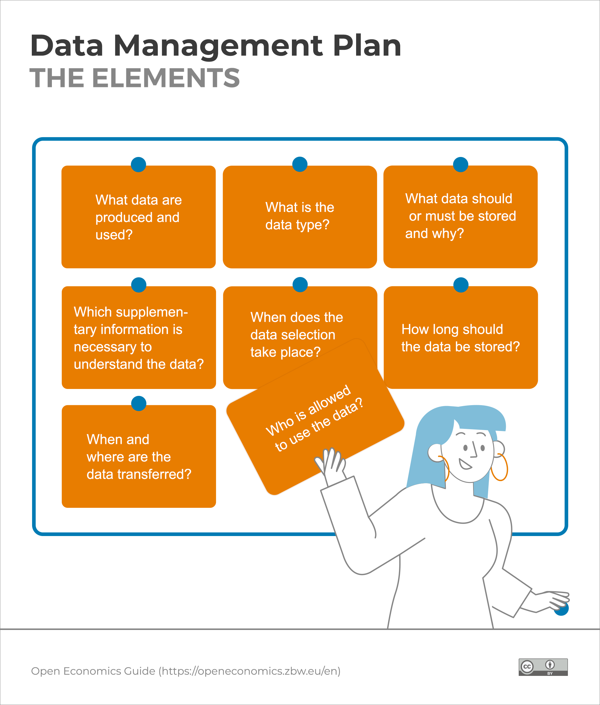

<!-- footer: "" -->

### Troppi dati

---

<!-- footer: Smits, D.A.B., Teperek, M. (2020). Research Data Management for Master’s Students: From Awareness to Action. Data Science Journal, 19(1), p. 30. <a href="http://doi.org/10.5334/dsj-2020-030">http://doi.org/10.5334/dsj-2020-030</a> -->

### Una lettera d’amore ai propri dati

La gestione dei dati è l’organizzazione critica dei dati durante l’intero loro ciclo di vita.

Obiettivo: produrre dataset autodescritti, sostenibili e utilizzabili.

Motivi: reperibilità e usabilità dei dati.

---

<!-- paginate: False -->

<!-- footer: Gualandi, B. (2024). Data stewardship e open science nelle discipline umanistiche. Zenodo. <a href="https://doi.org/10.5281/zenodo.12937887">https://doi.org/10.5281/zenodo.12937887</a> -->

### Una serie di attività complesse

---

<!-- paginate: True -->

<!-- footer: Gualandi, B. (2024). Data stewardship e open science nelle discipline umanistiche. Zenodo. <a href="https://doi.org/10.5281/zenodo.12937887">https://doi.org/10.5281/zenodo.12937887</a> -->

### Pianificazione

Azioni principali: 
* identificare i tipi di dati;
* identificare i metadati;
* pianificare la loro organizzazione in dataset;
* redigere un piano di gestione dei dati.

---

<!-- footer: Gualandi, B. (2024). Data stewardship e open science nelle discipline umanistiche. Zenodo. <a href="https://doi.org/10.5281/zenodo.12937887">https://doi.org/10.5281/zenodo.12937887</a> -->

### Produzione, raccolta, analisi

Azioni principali: 
* raccogliere o creare i dati;
* elaborare i dati per renderli utilizzabili (pulizia, combinazione, trasformazione, controllo qualità);
* analizzare i dati per generare risultati utili;
* produrre la documentazione dei dati e delle metodologie utilizzate.

---

<!-- footer: Gualandi, B. (2024). Data stewardship e open science nelle discipline umanistiche. Zenodo. <a href="https://doi.org/10.5281/zenodo.12937887">https://doi.org/10.5281/zenodo.12937887</a> -->

### Conservazione, condivisione

Azioni principali: 
* valutare quali dati depositare;
* scegliere la _repository_ per i dati;
* depositare i dati;
* applicare una licenza ai dati.
