<!-- paginate: False -->

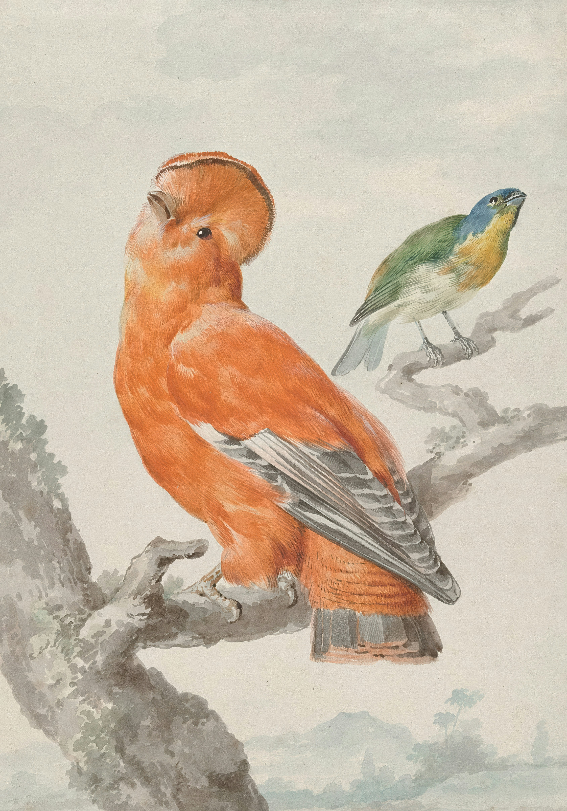

# Digital Humanities e Data Management / Informatica per i Beni Culturali (2025/2026)

## 02. Pianificazione I

➡️ Mail: [sebastian.barzaghi2@unibo.it](mailto:sebastian.barzaghi2@unibo.it)
➡️ ORCID: [0000-0002-0799-1527](https://orcid.org/0000-0002-0799-1527)
➡️ Sito: [sebastian.barzaghi2](https://www.unibo.it/sitoweb/sebastian.barzaghi2/)

---

<!-- paginate: True -->
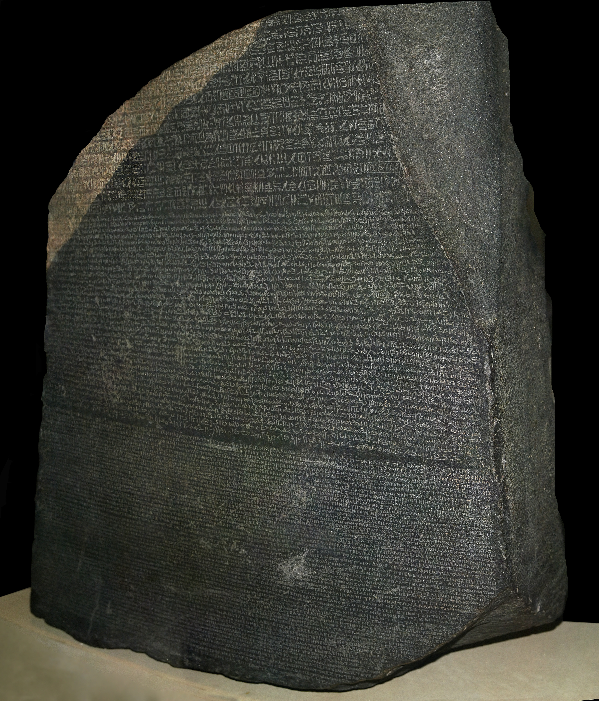
<!-- footer: Schoville, K. (2001). The Rosetta Stone in historical perspective. Journal of the Adventist Theological Society, 12(1), 1. https://digitalcommons.andrews.edu/cgi/viewcontent.cgi?article=1277&context=jats -->

### C'era una volta un ufficiale...

During Napoleon's expedition to Egypt, the French officer Pierre François Xavier Bouchard discovered the Rosetta Stone in the Nile River Delta in 1799. 

It is the fragment of a high stele on which a decree is carved in three different languages (ancient Greek, demotic script and Egyptian hieroglyphics). 

---

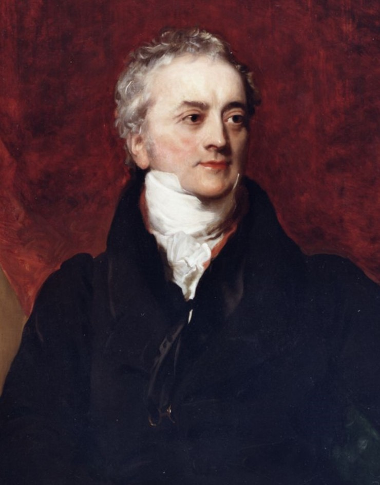

### Dai Francesi agli Inglesi

Immediately after the discovery, French scientists made numerous transcripts of the inscriptions on site. 

After the defeat by the British, the Rosetta Stone fell into British possession and the researcher Thomas Young began to study the texts.

---

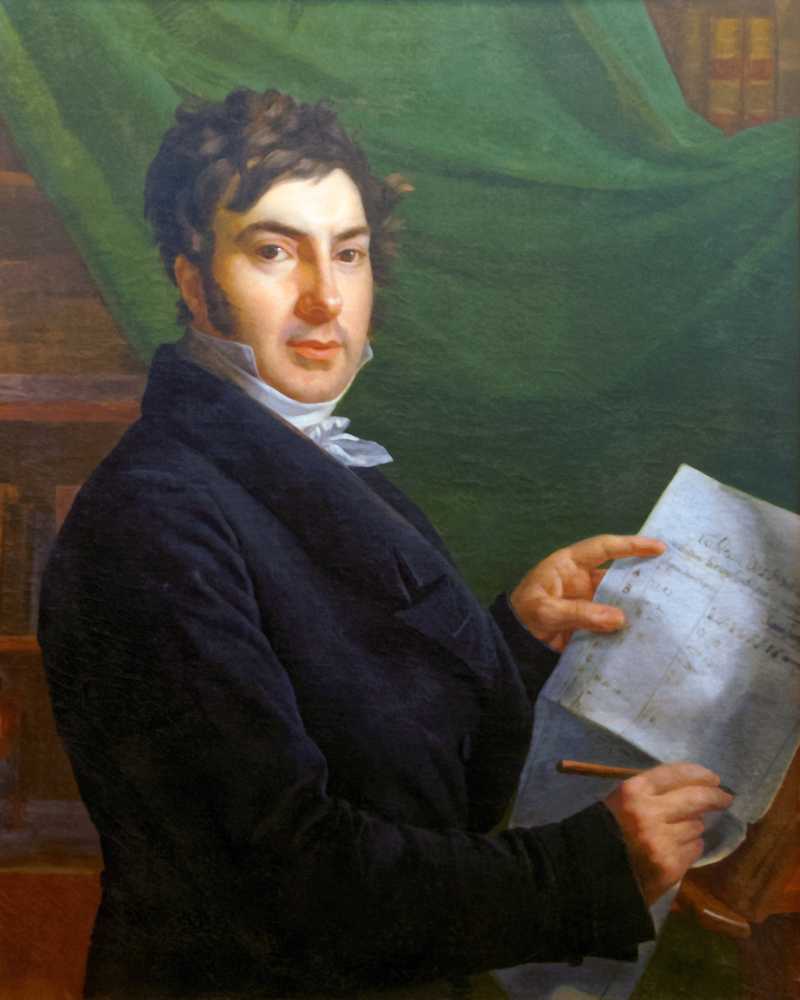

### Nasce l'Egittologia

Fortunately, the French had made copies, so that in 1822 Jean-François Champillion succeeded in deciphering the demotic script and hieroglyphics using the ancient Greek language he knew. 

After his discovery was published, further hieroglyphics were deciphered and the basis for modern Egyptology was laid.

---

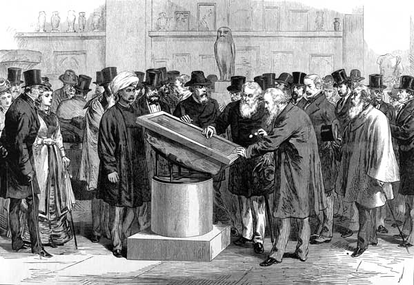

### Un esempio di gestione dei dati

The story shows that, thanks to the transcripts, two ideas of research data management were implemented. 

On the one hand, there were copies in case the original was lost (backup) and, on the other hand, other scientists were given access to the texts and conduct research on them (open data).

---

<!-- footer: Briney, K. (2023). The Research Data Management Workbook. Caltech Library. https://doi.org/10.7907/z6czh-7zx60 -->

### Perchè gestire i dati

A grandi linee (perché poi dipende dal contesto), una buona gestione dei dati significa: 
* Sapere sempre cosa sono i dati e come sono stati raccolti;
* Trovarli facilmente;
* Non perderli anche in caso di guasti;
* Conoscere cosa si può fare o non fare con questi dati;
* Poterli riutilizzare in futuro senza (troppe) difficoltà.

---

<!-- footer: Gualandi, B. (2024). Data stewardship e open science nelle discipline umanistiche. Zenodo. <a href="https://doi.org/10.5281/zenodo.12937887">https://doi.org/10.5281/zenodo.12937887</a> -->

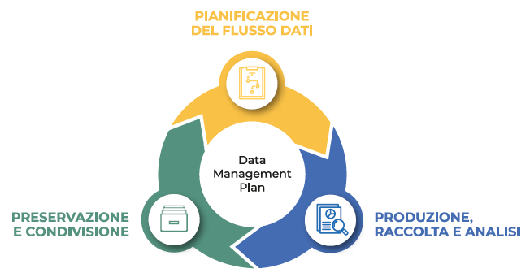

### Cosa intendiamo con _gestione dei dati_? 

➡️ La **gestione dei dati** è _un insieme di pratiche e processi di organizzazione critica dei dati durante il loro ciclo di vita_.

Queste pratiche e processi rendono più facile per tutte le persone trovare, capire, e usare i dati, anche nel lungo periodo.

💡 Non esiste una formula magica che risolve tutti i problemi: la gestione dei dati è anche e soprattutto un lavoro di adattamento ai problemi.

---

<!-- footer: "Briney, K. A., Coates, H., Goben, A. (2020) Foundational Practices of Research Data Management. Research Ideas and Outcomes, 6: e56508. https://doi.org/10.3897/rio.6.e56508" -->

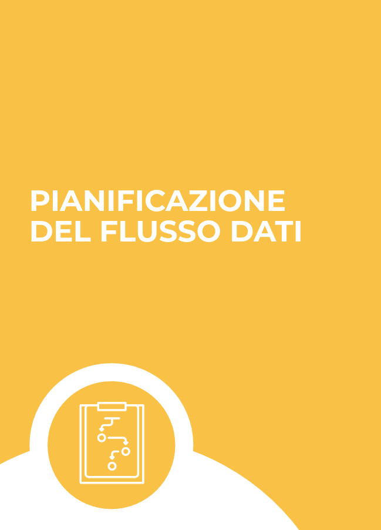

### Pianificazione

➡️ Questa fase include le attività per la _definizione dei processi e delle risorse necessarie alla gestione dei dati_.

Tra le attività, troviamo:
* **Individuare gli obiettivi** (per esempio, i risultati attesi, o gli impatti);
* **Identificare i (meta)dati** (da generare o da riutilizzare), avendo consapevolezza della privacy e delle licenze;
* **Redigere un Data Management Plan**.

---

<!-- footer: "Briney, K. A., Coates, H., Goben, A. (2020) Foundational Practices of Research Data Management. Research Ideas and Outcomes, 6: e56508. https://doi.org/10.3897/rio.6.e56508" -->

### Raccolta, processamento, analisi

Queste fasi includono:
* Attività necessarie per **raccogliere dati già esistenti** o **crearne di nuovi**;
* Attività utili a preparare i dati per l'analisi, incluse la **pulizia**, la **trasformazione** e l'**integrazione** tra dati diversi;
* Attività necessarie per **analizzare i dati** ed **estrarre nuova conoscenza**, incluse elaborazioni e visualizzazioni per identificare pattern, verificare ipotesi e comunicare i risultati.

---

<!-- footer: "Briney, K. A., Coates, H., Goben, A. (2020) Foundational Practices of Research Data Management. Research Ideas and Outcomes, 6: e56508. https://doi.org/10.3897/rio.6.e56508" -->

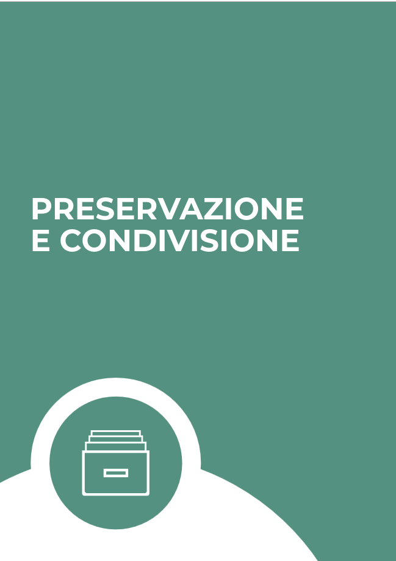

### Preservazione e condivisione

Queste fasi includono:
* Attività necessarie a **pianificare come conservare i dati a lungo termine**, in modo che siano comprensibili e riutilizzabili anche in futuro, e **decidere quali dati preservare** e **quale documentazione includere**;
* Attività necessarie a **pubblicare e distribuire i dati online** (cataloghi, social media, repository) per aumentarne la visibilità e facilitarne la scoperta da parte di altri.

---

<!-- footer: "Briney, K. A., Coates, H., Goben, A. (2020) Foundational Practices of Research Data Management. Research Ideas and Outcomes, 6: e56508. https://doi.org/10.3897/rio.6.e56508" -->

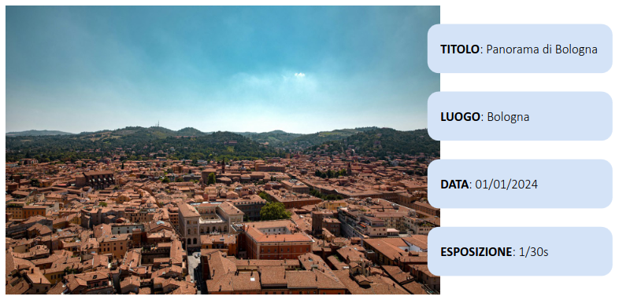

### Nel frattempo: Documentazione

➡️ Questa fase, parallela al resto del processo, include _attività necessarie a rendere i dati intelligibili e riutilizzabili da persone interne ed eventualmente esterne_ al progetto.

Tra le attività troviamo la produzione di documentazione e protocolli metodologici, e la loro archiviazione assieme ai dati.

💡 Esempi di documentazione includono **_file README_** (documenti testuali di spiegazione) e **metadati** che descrivono i dati, il loro contesto e la loro provenienza.

---

<!-- footer: Bevan, A. (2015). The data deluge. Antiquity, 89(348), 1473–1484. https://doi.org/10.15184/aqy.2015.102  -->

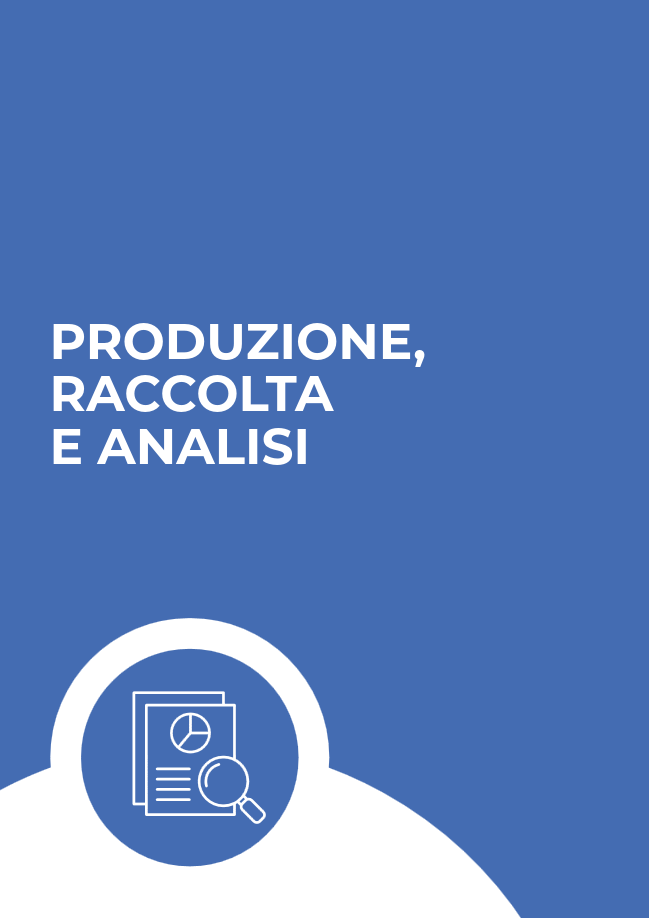

### DH e DM all'ombra dei _Big Data_

⚠️ Il passaggio da fonti analogiche a grandi collezioni digitali ha ampliato le potenzialità del nostro lavoro, ma ha posto anche nuove sfide: 
* Come accedere, raccogliere, processare e analizzare milioni di documenti (testi, immagini, video, metadati)? 
* Come documentare, conservare e pubblicare questi dati?
* Come traslare questi dati in conoscenza utile?

---

<!-- footer: Boyd Davis, S., Vane, O., & Kräutli, F. (2021). Can I believe what I see? Data visualization and trust in the humanities. Interdisciplinary Science Reviews, 46(4), 522-546. https://doi.org/10.1080/03080188.2021.1872874 -->

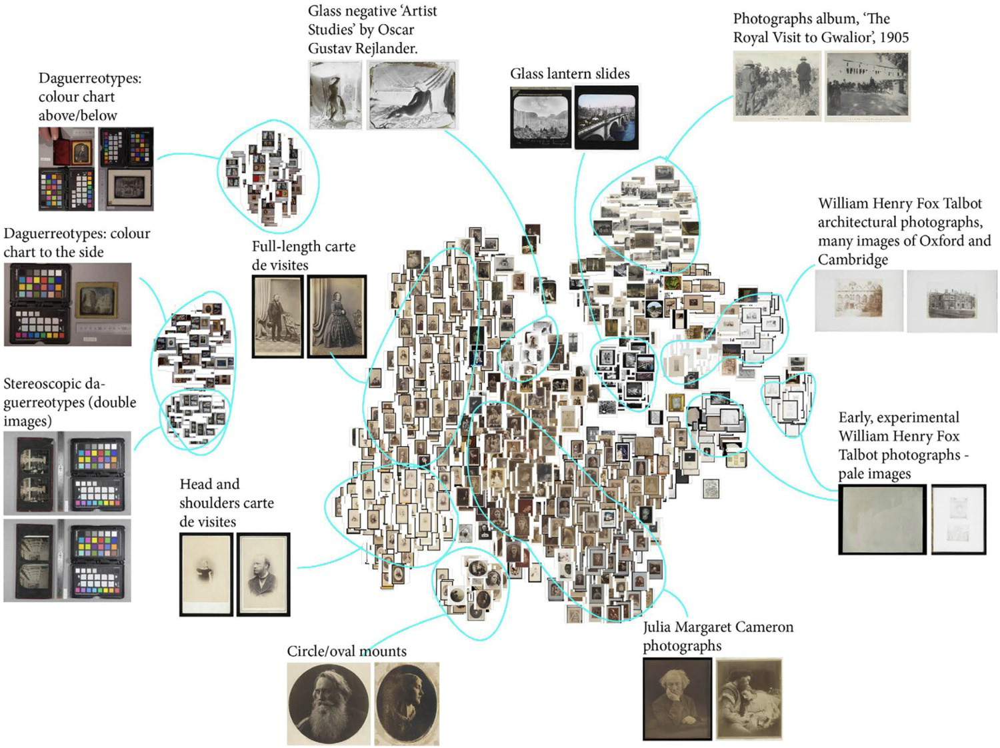

### Come gestire questi dati?

⚠️ Così come in ambito scientifico, anche in ambito umanistico abbiamo sempre più bisogno di:
* **Automatizzare** compiti ripetitivi;
* **Estendere l'analisi** in maniera esponenziale a molti più oggetti e visualizzare relazioni complesse esistenti tra i dati;
* **Saper porre (e rispondere a) nuove domande** -- di interesse non solo settoriale, ma anche trans-disciplinare e soprattutto pubblico.

---

<!-- paginate: False -->
<!-- footer: "" -->

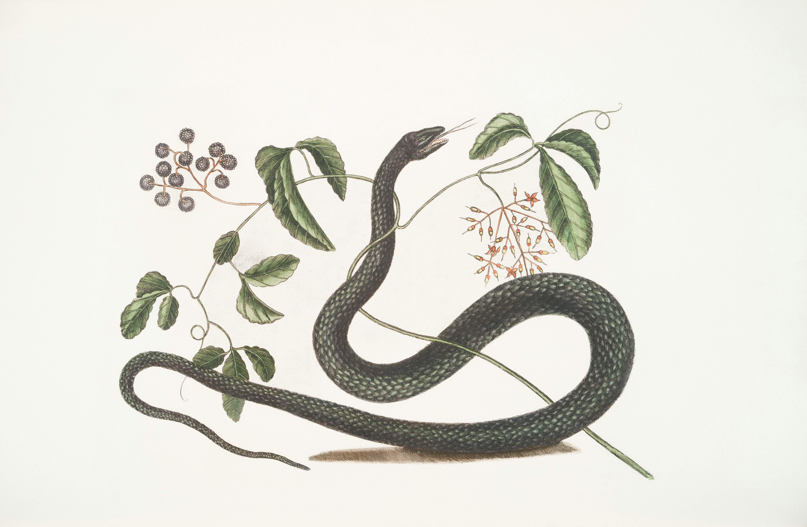

---

<!-- paginate: True -->
<!-- footer: Mattingly, W. Python or R? Getting Started with Programming for Humanists. COMPENDIUM COMPUTATIONAL THEOLOGY, 177. https://d-nb.info/1354716094/34#page=179 -->

### Uno strumento può essere Python

➡️ **Python** è _un linguaggio di programmazione, usato moltissimo per la computazione scientifica e per lo sviluppo software in generale_.

Viene ideato e implementato nel 1991 da Guido van Rossum, che lo chiama _Python_ in onore della serie _Monty Python's Flying Circus_.

Come tutti gli altri linguaggi di programmazione, serve a **scrivere istruzioni per un computer, affinché questo faccia qualcosa**. 

---

<!-- footer: Mattingly, W. Python or R? Getting Started with Programming for Humanists. COMPENDIUM COMPUTATIONAL THEOLOGY, 177. https://d-nb.info/1354716094/34#page=179 -->

### Perché imparare a programmare?

💡 Programmare permette di **automatizzare** attività ripetitive, risparmiando tempo ed evitando errori.

💡 Inoltre, la programmazione consente di **lavorare su vasta scala**, applicando soluzioni a enormi quantità di dati in tempi ridotti.

💡 Infine, conoscere la programmazione **cambia il modo di lavorare** con la conoscenza: aiuta a formulare nuove domande, trovare soluzioni inaspettate e individuare pattern significativi.

---

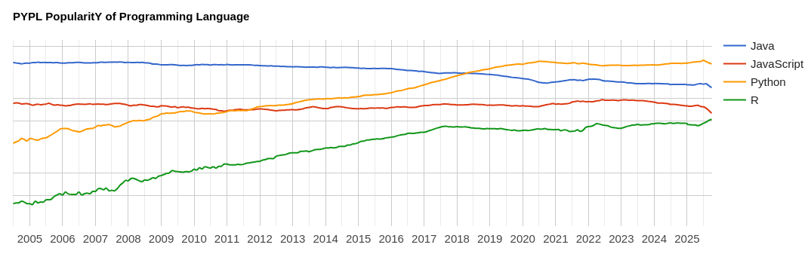
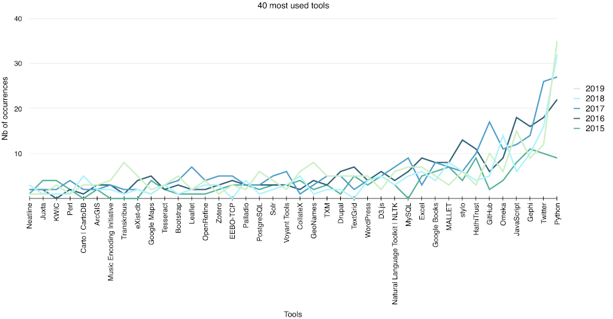

### Perché imparare Python?

- Semplice e conciso;
- Uno dei linguaggi più utilizzati al mondo;
- Lo strumento _de facto_ più utilizzato nelle DH;
- _General purpose_;
- Di _alto livello_ e _interpretato_;
- Multipiattaforma;
- _Open source_ e gratuito;
- Enorme community;
- Eccellente nella raccolta, nel processamento e nell'analisi dei dati.

---

<!-- footer: "" -->

### Sessione pratica: Introduzione a Python con Google Colab

⚠️ Questo corso è pensato per essere _pratico_.

Vi incoraggio a mettervi in gioco: fate domande, sperimentate, collaborate.

Date una lettura alla bibliografia, ma usatela solo come il contesto di ciò che faremo nella pratica.

Potete usare il computer che volete; avrete bisogno solo di un profilo Google.

## [Link alla sessione pratica](https://colab.research.google.com/drive/1c3qzlB5QA-IuQ68xo05Ih38J0ks-8Sms?usp=sharing)

---

<!-- paginate: False -->
<!-- footer: "" -->

# Digital Humanities e Data Management / Informatica per i Beni Culturali (2025/2026)

## 02. Pianificazione I ✅

➡️ Mail: [sebastian.barzaghi2@unibo.it](mailto:sebastian.barzaghi2@unibo.it)
➡️ ORCID: [0000-0002-0799-1527](https://orcid.org/0000-0002-0799-1527)
➡️ Sito: [sebastian.barzaghi2](https://www.unibo.it/sitoweb/sebastian.barzaghi2/)

➡️ [Lezione successiva](https://dhdmch.github.io/2025-2026/lessons/03/03.html)