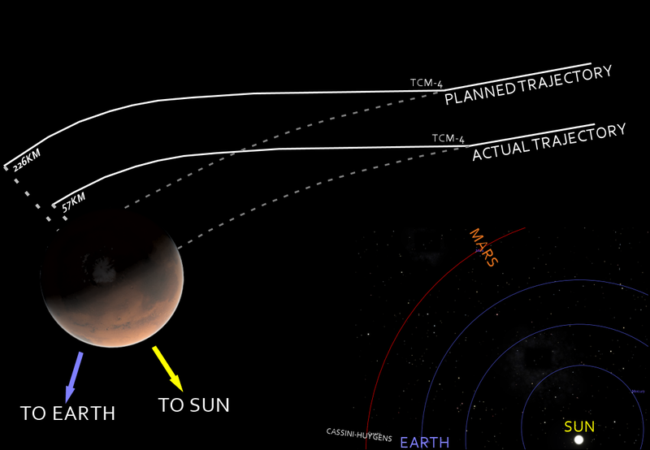

<!-- paginate: False -->

# Digital Humanities e Data Management / Informatica per i Beni Culturali (2025/2026)

## 02. Pianificazione I

➡️ Mail: [sebastian.barzaghi2@unibo.it](mailto:sebastian.barzaghi2@unibo.it)
➡️ ORCID: [0000-0002-0799-1527](https://orcid.org/0000-0002-0799-1527)
➡️ Sito: [sebastian.barzaghi2](https://www.unibo.it/sitoweb/sebastian.barzaghi2/)

---

<!-- paginate: True -->

<!-- footer: Novelli, A. (2023). Il disastro del Mars Climate Orbiter. Astrospace. https://www.astrospace.it/2022/09/23/il-disastro-del-mars-climate-orbiter/. -->

### C'era una volta una sonda...

1998, Cape Canaveral, 2 settimane a Natale.

La NASA lancia la missione Mars Climate Orbiter, con l'obiettivo di inserire una sonda nell'orbita di Marte per effettuare investigazioni scientifiche sul clima del pianeta rosso e per fare da ponte radio con la Terra.

Dopo 283 giorni di viaggio, la sonda esegue una manovra ad alta quota nell'orbita di Marte con 49 secondi di anticipo.

---

### L’errore da 125 milioni di dollari

In altre parole, la sonda non sta seguendo la traiettoria prevista.

Alle 2:27 del mattino, la sonda scompare dietro Marte per _non riapparire mai più_.

Una settimana dopo la perdita della sonda, la NASA rilascia una dichiarazione.

L'incidente viene attribuito a un errore legato al sistema usato per scambiare dati con la sonda e ricalcolare in continuazione la sua posizione e traiettoria nello spazio.

---

### Due lingue diverse

La Lockheed Martin, azienda collaboratrice del progetto, aveva adottato la libbra-forza per secondo come unità di misura per il ricalcolo.

La NASA, invece, utilizzava il Newton per secondo.

I comandi di navigazione dovevano essere codificati correttamente nelle unità appropriate per essere compresi da entrambi i sistemi: senza le unità di misura, i dati numerici non hanno significato.

---

### Cosa succede quando i dati non vengono documentati, condivisi o gestiti correttamente

La sonda è andata distrutta a causa di un errore di unità di misura.

Questo problema era legato non tanto al calcolo in sé, quanto alla mancata gestione e comunicazione coerente dei dati.

Anche dati perfettamente corretti, se non gestiti e descritti bene, portano a conseguenze catastrofiche.

---

<!-- footer: Briney, K. (2023). The Research Data Management Workbook. Caltech Library. https://doi.org/10.7907/z6czh-7zx60 -->

### Perchè gestire i dati

A grandi linee (perché poi dipende dal contesto), una buona gestione dei dati significa: 
* Sapere sempre cosa sono i dati e come sono stati raccolti;
* Trovarli facilmente;
* Non perderli anche in caso di guasti;
* Conoscere cosa si può fare o non fare con questi dati;
* Poterli riutilizzare in futuro senza difficoltà.

---

<!-- footer: Gualandi, B. (2024). Data stewardship e open science nelle discipline umanistiche. Zenodo. <a href="https://doi.org/10.5281/zenodo.12937887">https://doi.org/10.5281/zenodo.12937887</a> -->

### Cosa intendiamo con _gestione dei dati_? 

La **gestione dei dati** è _un insieme di pratiche e processi di organizzazione critica dei dati durante il loro ciclo di vita_.

Queste pratiche e processi rendono più facile per tutte le persone trovare, capire, e usare i dati, anche nel lungo periodo.

Non esiste una formula magica che risolve tutti i problemi: la gestione dei dati è anche e soprattutto un lavoro di adattamento ai problemi.

---

<!-- footer: "Briney, K. A., Coates, H., Goben, A. (2020) Foundational Practices of Research Data Management. Research Ideas and Outcomes, 6: e56508. https://doi.org/10.3897/rio.6.e56508" -->

### Pianificazione

Questa fase include la definizione dei processi e delle risorse necessari per tutte le attività legate alla gestione dei dati del progetto.

Una buona pratica è quella di partire dagli obiettivi finali (risultati attesi, impatti) e lavorare a ritroso per costruire un piano di gestione dei dati (DMP), definire le politiche da adottare e pianificare la sostenibilità in ogni fase del lavoro.

---

<!-- footer: "Briney, K. A., Coates, H., Goben, A. (2020) Foundational Practices of Research Data Management. Research Ideas and Outcomes, 6: e56508. https://doi.org/10.3897/rio.6.e56508" -->

### Raccolta, processamento, analisi

Queste fasi includono:
* Attività necessarie per raccogliere dati già esistenti o crearne di nuovi;
* Attività utili a preparare i dati per l'analisi, incluse la pulizia, la trasformazione e l'integrazione tra dati diversi;
* Attività necessarie per analizzare i dati ed estrarre nuova conoscenza, incluse elaborazioni e visualizzazioni per identificare pattern, verificare ipotesi e comunicare i risultati.

---

<!-- footer: "Briney, K. A., Coates, H., Goben, A. (2020) Foundational Practices of Research Data Management. Research Ideas and Outcomes, 6: e56508. https://doi.org/10.3897/rio.6.e56508" -->

### Preservazione e condivisione

Queste fasi includono:
* Attività necessarie a pianificare come conservare i dati a lungo termine, in modo che siano accessibili, comprensibili e riutilizzabili anche in futuro, e decidere quali dati preservare e quale documentazione includere;
* Attività necessarie a pubblicare e distribuire i dati online (cataloghi, social media, repository) per aumentarne la visibilità e facilitarne la scoperta da parte di altri.

---

<!-- footer: "Briney, K. A., Coates, H., Goben, A. (2020) Foundational Practices of Research Data Management. Research Ideas and Outcomes, 6: e56508. https://doi.org/10.3897/rio.6.e56508" -->

### Nel frattempo: Documentazione

Questa fase, parallela al resto del processo, include attività necessarie a rendere i dati intelligibili e riutilizzabili da persone interne ed eventualmente esterne al progetto.

Tra le attività troviamo la produzione di documentazione e protocolli metodologici, e la loro archiviazione assieme ai dati.

Esempi di documentazione includono **_file README_** (documenti testuali di spiegazione) e **metadati** che descrivono i dati, il loro contesto e la loro provenienza.

---

<!-- footer: Bevan, A. (2015). The data deluge. Antiquity, 89(348), 1473–1484. https://doi.org/10.15184/aqy.2015.102  -->

### DH e DM all'ombra dei _Big Data_

Il passaggio da fonti analogiche a grandi collezioni digitali ha ampliato le potenzialità del nostro lavoro, ma ha posto anche nuove sfide: 
* Come accedere, raccogliere, processare e analizzare milioni di documenti (testi, immagini, video, metadati)? 
* Come documentare, conservare e pubblicare questi dati?
* Come traslare questi dati in qualcosa di utile?

---

<!-- footer: Boyd Davis, S., Vane, O., & Kräutli, F. (2021). Can I believe what I see? Data visualization and trust in the humanities. Interdisciplinary Science Reviews, 46(4), 522-546. https://doi.org/10.1080/03080188.2021.1872874 -->

### Come gestire questi dati?

Così come in ambito scientifico, anche in ambito umanistico abbiamo sempre più bisogno di:
* Automatizzare compiti ripetitivi;
* Estendere l'analisi in maniera esponenziale a molti più oggetti e visualizzare relazioni complesse esistenti tra i dati;
* Saper porre (e rispondere a) nuove domande -- di interesse non solo settoriale, ma anche trans-disciplinare e soprattutto pubblico.

---

<!-- paginate: False -->
<!-- footer: "" -->

---

<!-- paginate: True -->
<!-- footer: Mattingly, W. Python or R? Getting Started with Programming for Humanists. COMPENDIUM COMPUTATIONAL THEOLOGY, 177. https://d-nb.info/1354716094/34#page=179 -->

### Python è un linguaggio di programmazione

Python è un linguaggio popolarissimo per la computazione scientifica e, più in generale, per lo sviluppo software.

Viene ideato e implementato nel 1991 da Guido van Rossum, che lo chiama _Python_ in onore della serie _Monty Python's Flying Circus_.

Come tutti gli altri linguaggi di programmazione, serve a scrivere istruzioni per un computer, affinché questo faccia qualcosa. 

---

<!-- footer: Mattingly, W. Python or R? Getting Started with Programming for Humanists. COMPENDIUM COMPUTATIONAL THEOLOGY, 177. https://d-nb.info/1354716094/34#page=179 -->

### Perché imparare a programmare?

Programmare permette di automatizzare attività ripetitive, risparmiando tempo ed evitando errori.

Inoltre, la programmazione consente di lavorare su vasta scala, applicando soluzioni a enormi quantità di dati in tempi ridotti.

Infine, conoscere la programmazione cambia il modo di lavorare con la conoscenza: aiuta a formulare nuove domande, trovare soluzioni inaspettate e individuare pattern significativi.

---

### Perché imparare Python?

- Semplice e conciso;
- Uno dei linguaggi più utilizzati al mondo;
- Lo strumento _de facto_ più utilizzato nelle DH;
- _General purpose_;
- Di _alto livello_ e _interpretato_;
- Multipiattaforma;
- _Open source_ e gratuito;
- Enorme community;
- Eccellente nella raccolta, nel processamento e nell'analisi dei dati.

---

<!-- footer: "" -->

### Sessione pratica: Introduzione a Python con Google Colab

Questo corso è pensato per essere _pratico_.

Vi incoraggio a mettervi in gioco: fate domande, sperimentate, collaborate.

Date una lettura alla bibliografia, ma usatela solo come il contesto di ciò che faremo nella pratica.

Potete usare il computer che volete; avrete bisogno solo di un profilo Google.

## [Link alla sessione pratica](https://colab.research.google.com/drive/1c3qzlB5QA-IuQ68xo05Ih38J0ks-8Sms?usp=sharing)

---

<!-- paginate: False -->
<!-- footer: "" -->

# Digital Humanities e Data Management / Informatica per i Beni Culturali (2025/2026)

## 02. Pianificazione I

➡️ Mail: [sebastian.barzaghi2@unibo.it](mailto:sebastian.barzaghi2@unibo.it)
➡️ ORCID: [0000-0002-0799-1527](https://orcid.org/0000-0002-0799-1527)
➡️ Sito: [sebastian.barzaghi2](https://www.unibo.it/sitoweb/sebastian.barzaghi2/)
