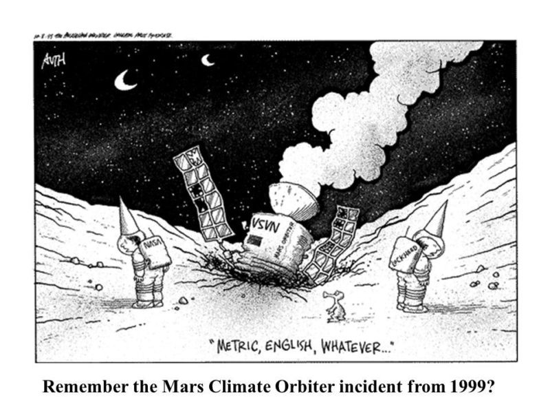
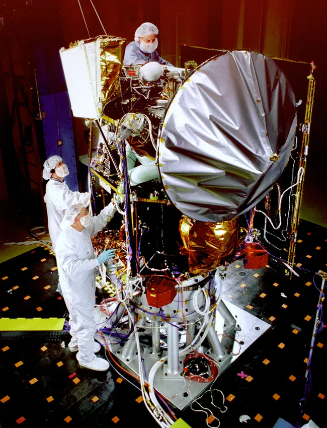
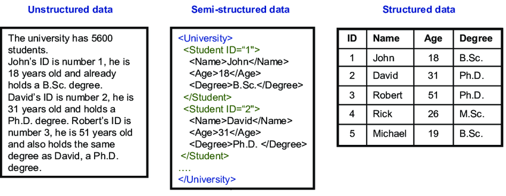
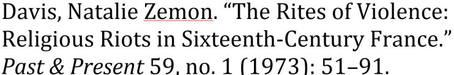
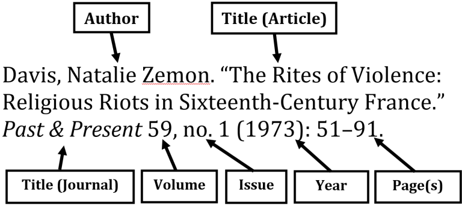
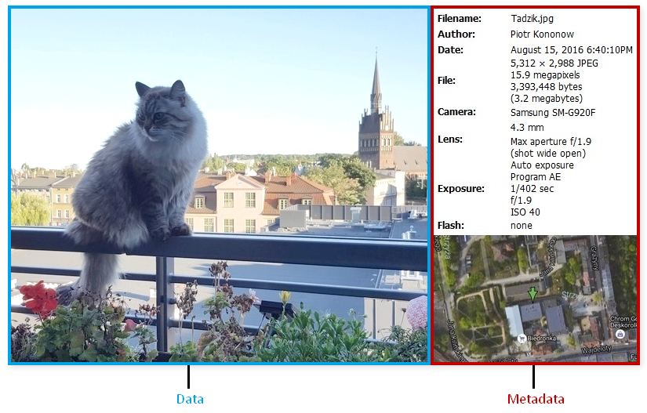
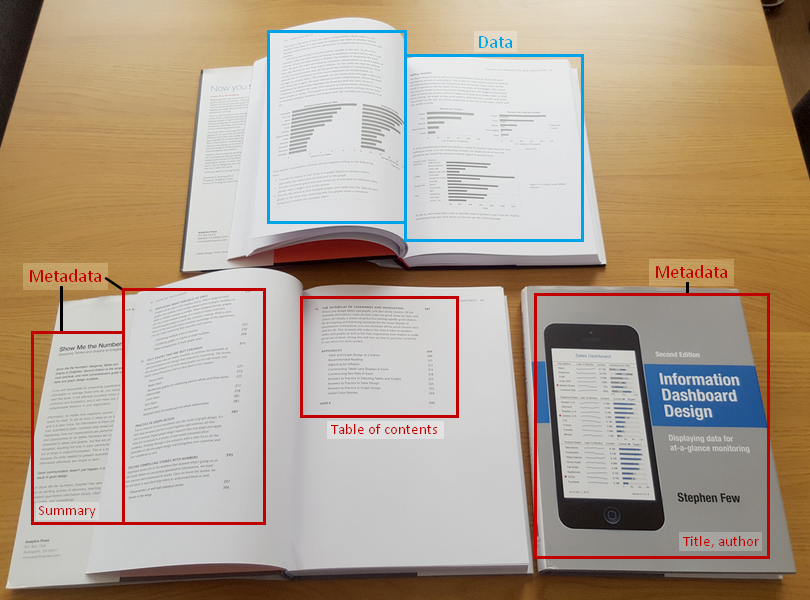
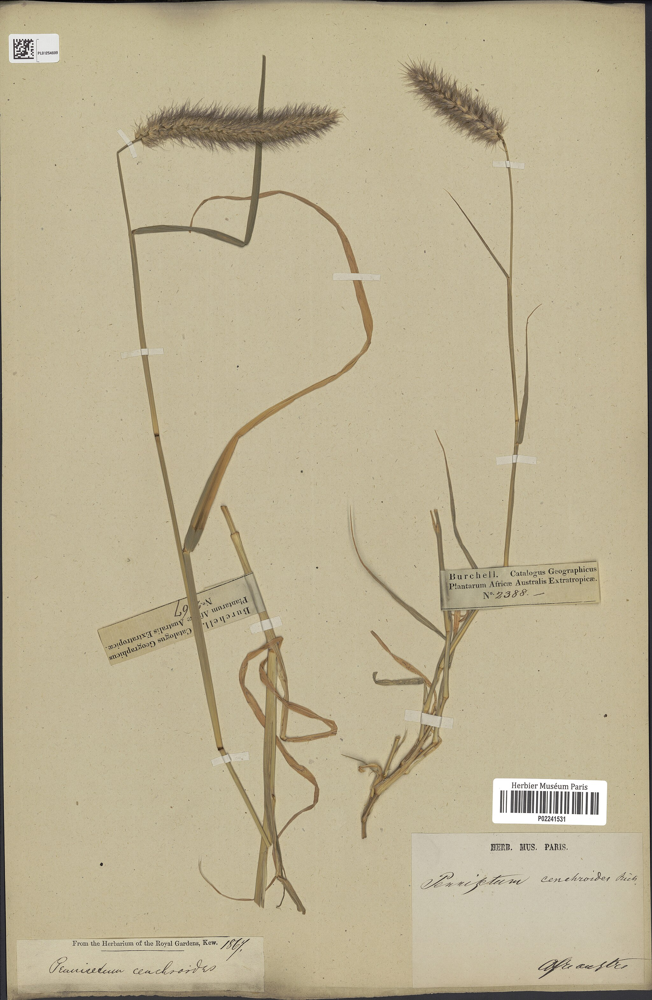
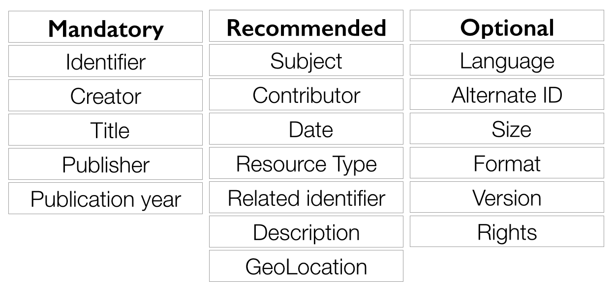
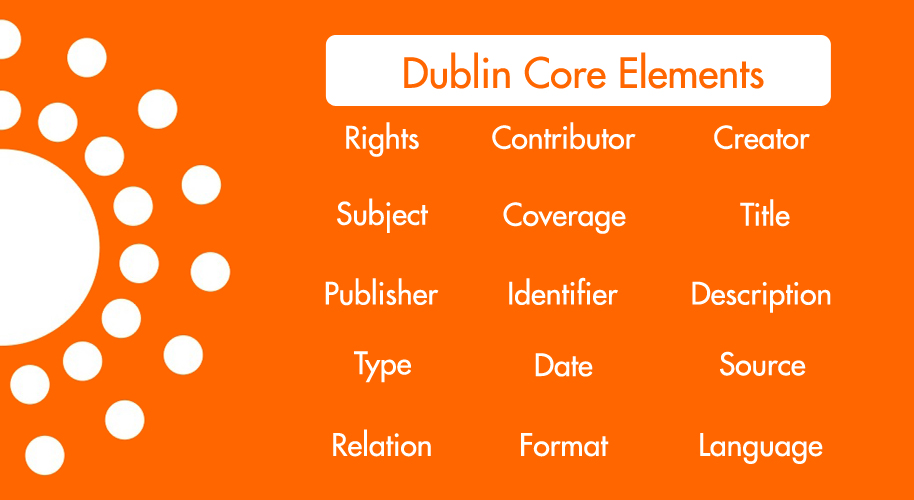

<!-- paginate: False -->

# Digital Humanities e Data Management / Informatica per i Beni Culturali (2025/2026)

## 03. Pianificazione II

➡️ Mail: [sebastian.barzaghi2@unibo.it](mailto:sebastian.barzaghi2@unibo.it)
➡️ ORCID: [0000-0002-0799-1527](https://orcid.org/0000-0002-0799-1527)
➡️ Sito: [sebastian.barzaghi2](https://www.unibo.it/sitoweb/sebastian.barzaghi2/)

---

<!-- paginate: True -->

<!-- footer: Novelli, A. (2023). Il disastro del Mars Climate Orbiter. Astrospace. https://www.astrospace.it/2022/09/23/il-disastro-del-mars-climate-orbiter/. -->

### C'era una volta una sonda...

1998, Cape Canaveral, 2 settimane a Natale.

La NASA lancia la missione _Mars Climate Orbiter_, con l'obiettivo di inserire una sonda nell'orbita di Marte per effettuare investigazioni scientifiche sul clima del pianeta rosso e per fare da ponte radio con la Terra.

⚠️ Dopo 283 giorni di viaggio, la sonda esegue una manovra ad alta quota nell'orbita di Marte _con 49 secondi di anticipo_.

---

### L’errore da 125 milioni di dollari

⚠️ In altre parole, la sonda _non sta seguendo la traiettoria prevista_.

Alle 2:27 del mattino, la sonda scompare dietro Marte per _non riapparire mai più_.

Una settimana dopo la perdita della sonda, la NASA rilascia una dichiarazione.

⚠️ L'incidente viene attribuito a un errore legato al _sistema usato per scambiare dati_ con la sonda e ricalcolare in continuazione la sua posizione e traiettoria nello spazio.

---

### Due lingue diverse

La _Lockheed Martin_, azienda collaboratrice del progetto, aveva adottato il **pound per secondo** come unità di misura dell'impulso totale, necessario per il ricalcolo.

La NASA, invece, utilizzava il **newton per secondo**.

⚠️ I comandi di navigazione non codificavano nella stessa maniera gli stessi dati: in pratica, i sistemi che gestivano la sonda stavano parlando **due lingue diverse**.

---

### Cosa succede quando i dati non vengono documentati, condivisi e gestiti correttamente

La sonda è andata distrutta perché non è stata considerata la necessità di convertire i dati dal sistema metrico a quello anglosassone e viceversa: quindi, alla _mancata gestione, comunicazione e descrizione coerente dei dati_.

💡 Anche dati perfettamente corretti, se non organizzati, comunicati e descritti in mainera coerente, portano a conseguenze catastrofiche.

---

<!-- paginate: True -->

<!-- footer: Sint, R., Schaffert, S., Stroka, S., & Ferstl, R. (2009, June). Combining unstructured, fully structured and semi-structured information in semantic wikis. In CEUR workshop proceedings (Vol. 464, No. 12, pp. 73-87). Crete, Greece: Heraklion. https://ceur-ws.org/Vol-464/paper-14.pdf. -->

### Gli stessi dati possono essere organizzati in maniera diversa

1️⃣ I dati **non-strutturati** mancano formalmente di una struttura organizzata (es. testo libero, immagini, video).

2️⃣ I dati **semi-strutturati** hanno una struttura parziale e flessibile (es. XML).

3️⃣ I dati **strutturati** sono organizzati in uno schema rigido e predefinito (es. database).

(Ma [non è proprio vero](https://www.techtarget.com/searchdatamanagement/blog/The-Wondrous-World-of-Data/Unstructured-data-is-a-misnomer)...).

---

<!-- footer: Prescott, A. (2013, October). Bibliographic records as humanities big data. In 2013 IEEE International Conference on Big Data (pp. 55-58). IEEE. https://doi.org/10.1109/BigData.2013.6691670 -->

### Esempio interessante: i dati bibliografici

I dati bibliografici (come i **riferimenti** o le **citazioni**) sono ampiamente analizzati e utilizzati in tutti gli ambiti di ricerca, dalla biologia all'informatica, fino ad arrivare ovviamente alla biblioteconomia e alle DH.

💡 Sono dati caratterizzati da un volume gigantesco, un'applicabilità trasversale, una molteplicità di strutture più o meno coerenti, e una natura variegata e stratificata.

---

### I dati hanno strutture nascoste

A tutti gli effetti, questo riferimento bibliografico è una **stringa** (in informatica, è il termine utilizzato per riferirsi al testo), quindi un dato _non-strutturato_.

⚠️ Ma sappiamo che in realtà un riferimento bibliografico (come anche altre tipologie di testo "semplice") ha una struttura _implicita_, determinata dallo stile citazionale scelto, che ci permette di dire una serie di _cose_ su questo dato...

Cosa sono queste _cose_?

---

<!-- footer: Ulrich, H., Kock-Schoppenhauer, A. K., Deppenwiese, N., Gött, R., Kern, J., Lablans, M., ... & Ingenerf, J. (2022). Understanding the nature of metadata: systematic review. "Journal of medical Internet research", 24(1), e25440. https://doi.org/10.2196/25440 -->

### Sono metadati!

➡️ Se ricordate, i **metadati** sono _rappresentazioni formali (e possibilmente standardizzate) di tutto ciò che si può dire su dei dati in un determinato momento, a qualsiasi livello di aggregazione_.

Possono assumere forme diverse, riferirsi a oggetti diversi, essere di diversi tipi...

Permettono l'identificazione, l'organizzazione, la descrizione, l'autenticazione, la ricerca, l'utilizzo e la conservazione dei dati.

---

<!-- footer: Ram, Sudha & Liu, Jun. (2008). A Semiotics Framework for Analyzing Data Provenance Research. JCSE. 2. 221-248. http://dx.doi.org/10.5626/JCSE.2008.2.3.221 -->

### Con i metadati, la situazione può sfuggire di mano velocemente

🔎 Questo esemplare fisico d’erbario di _Cenchrus ciliaris_ è composto sia dai campioni sia dai metadati che li descrivono. Il codice a barre rimanda a un record digitale contenente metadati relativi al reperto fisico.

⚠️ La metadatazione è una questione complessa: possiamo descrivere tutto, come vogliamo, e pure su diversi livelli... A quel punto, a cosa serve?

Come ci regoliamo?

---

<!-- footer: Ulrich, H., Kock-Schoppenhauer, A. K., Deppenwiese, N., Gött, R., Kern, J., Lablans, M., ... & Ingenerf, J. (2022). Understanding the nature of metadata: systematic review. "Journal of medical Internet research", 24(1), e25440. https://doi.org/10.2196/25440 -->

### I metadati seguono schemi

➡️ Gli **schemi di metadati** sono _strutture concettuali che specificano quali metadati utilizzare e secondo quali regole_.

Stabiliscono termini, definizioni, regole comuni per facilitare l'interpretazione, la comunicazione, la coerenza, la prevedibilità dei dati.

💡 Uno schema è composto da **elementi**, accompagnati dalle relative definizioni e regole di utilizzo (per esempio, se va utilizzata una stringa o un numero).

---

<!-- footer: Ulrich, H., Kock-Schoppenhauer, A. K., Deppenwiese, N., Gött, R., Kern, J., Lablans, M., ... & Ingenerf, J. (2022). Understanding the nature of metadata: systematic review. "Journal of medical Internet research", 24(1), e25440. https://doi.org/10.2196/25440 -->

### Esempio: Dublin Core

➡️ **Dublin Core** (DC) è uno degli standard di metadati più semplici e utilizzati, una sorta di minimo comune denominatore.

Viene pensato per descrivere risorse Web (ma è applicabile anche a risorse fisiche), ed è composto da 15 elementi _core_: _**Titolo**_, _**Autore**_, _**Soggetto**_, _**Descrizione**_, _**Editore**_, _**Autore secondario**_, _**Data**_, _**Tipo**_, *_**Formato**_*, _**Identificatore**_, _**Fonte**_, _**Lingua**_, _**Relazione**_, _**Copertura**_, _**Diritti**_.

Viene poi esteso in [DC Terms](https://www.dublincore.org/specifications/dublin-core/dcmi-terms/).

---

<!-- footer: Ulrich, H., Kock-Schoppenhauer, A. K., Deppenwiese, N., Gött, R., Kern, J., Lablans, M., ... & Ingenerf, J. (2022). Understanding the nature of metadata: systematic review. "Journal of medical Internet research", 24(1), e25440. https://doi.org/10.2196/25440 -->

### Altre tipologie di standard rilevanti per noi ora

➡️ Standard per i **contenuti** dei dati: definiscono come rappresentare uno specifico tipo di dati a partire dal formato (es. ISO 8601 per le date, o ISO 639-1 per le lingue);

➡️ Standard per i **valori** dei dati: definiscono come rappresentare uno specifico tipo di dati a partire da un insieme finito e controllato di opzioni (es. AAT).

---

<!-- footer: Ulrich, H., Kock-Schoppenhauer, A. K., Deppenwiese, N., Gött, R., Kern, J., Lablans, M., ... & Ingenerf, J. (2022). Understanding the nature of metadata: systematic review. "Journal of medical Internet research", 24(1), e25440. https://doi.org/10.2196/25440 -->

### Come usare in maniera efficace i metadati?

* Consistenza con **standard già esistenti** dove possibile;
* Fornire tutte le informazioni necessarie a **identificare** i dati;
* Fornire tutte le informazioni necessarie a **descrivere** i dati;
* Fornire tutte le informazioni necessarie a **ricostruire la storia** dei dati;
* Fornire tutte le informazioni necessarie ad **accedere** e **utilizzare** i dati.

---

<!-- paginate: False -->
<!-- footer: "" -->

---

<!-- paginate: True -->
<!-- footer: "" -->

### Sessione pratica: i _datatypes_
Abbiamo parlato di alcune tipologie di dati e soprattutto di metadati. Iniziamo a vedere, nella pratica, l'importanza di capire perché:

* "A. Manzoni" e "Manzoni, Alessandro" _**non sono la stessa cosa**_;

* "42" e 42 _**non sono la stessa cosa**_;

* "14 novembre 2025", "14/11/2025" e "2025-11-14" **_non sono la stessa cosa_**.

Non per il computer, almeno.

## [Link alla sessione pratica](https://colab.research.google.com/drive/1c3qzlB5QA-IuQ68xo05Ih38J0ks-8Sms?usp=sharing)

---

<!-- paginate: False -->
<!-- footer: "" -->

# Digital Humanities e Data Management / Informatica per i Beni Culturali (2025/2026)

## 03. Pianificazione II ✅

➡️ Mail: [sebastian.barzaghi2@unibo.it](mailto:sebastian.barzaghi2@unibo.it)
➡️ ORCID: [0000-0002-0799-1527](https://orcid.org/0000-0002-0799-1527)
➡️ Sito: [sebastian.barzaghi2](https://www.unibo.it/sitoweb/sebastian.barzaghi2/)

➡️ [Lezione successiva](https://dhdmch.github.io/2025-2026/lessons/04/04.html)