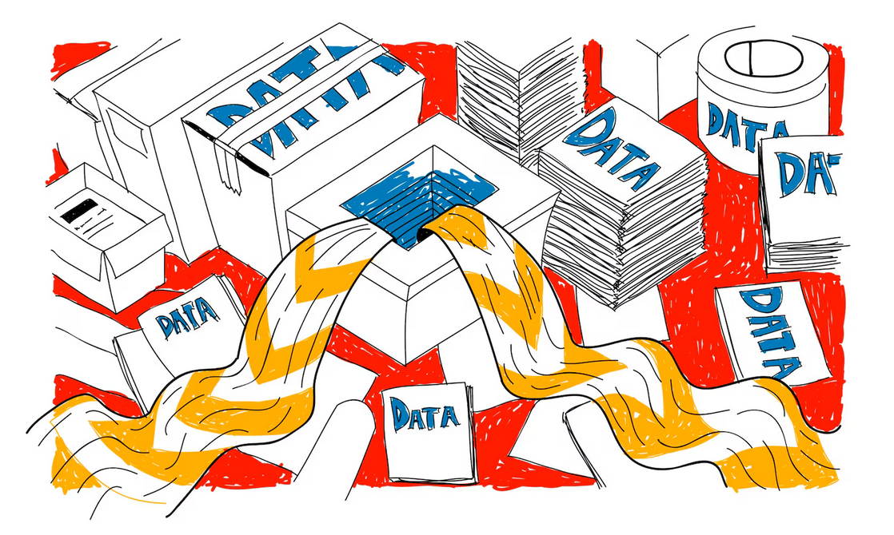

<!-- paginate: False -->

# Digital Humanities e Data Management / Informatica per i Beni Culturali (2025/2026)

## 04. Pianificazione III

➡️ Mail: [sebastian.barzaghi2@unibo.it](mailto:sebastian.barzaghi2@unibo.it)
➡️ ORCID: [0000-0002-0799-1527](https://orcid.org/0000-0002-0799-1527)
➡️ Sito: [sebastian.barzaghi2](https://www.unibo.it/sitoweb/sebastian.barzaghi2/)

---

<!-- paginate: True -->

<!-- footer: -->

### C'era una volta un gioco...

The PlayStation 1 RPG games Final Fantasy VII, VIII and IX developed by SquareEnix (at that time still Squaresoft) are considered the "golden era" of Final Fantasy history and many new games still have to compete with them. 

Nevertheless, SquareEnix has been silent for a long time about why the eighth installment of the series was never properly set up for PC or a current generation of consoles - although this was done with almost every other part of the series.

---

### Se nessuno di interessa dei dati...

The answer was easy and emerged through a series of interviews: The raw data (background images, music, 3D models etc.) and the finished source code of the game had simply not been archived. 

In the 90s there were fewer AAA titles (large projects that ran over several years) and games were produced at shorter intervals. 

As with Square, this meant that space had to be freed up again and again for new projects and little attention was paid to old project data. 

---

### ... I dati non esistono

As a result, all Final Fantasy VIII project data was lost and a new version of the game could only be released in 2019 in collaboration with other companies.

Although there are now many "remastered" versions of the Final Fantasy games at that time, most of which have been re-programmed, the lack of raw data is still a problem for the developers and the gaming community. For example, the background graphics of the games were created in high resolution, but only the compressed versions for the consoles of the time were stored. Due to today's HD displays, those are no longer up-to-date.

---

### Regola n. 1: _avere un piano_

This example shows how important it is to archive both the raw data and the actual project data. 

Publishing or completing a project should not mean the end of the data life cycle. 

Only when the raw and result data is properly organized can follow-up projects re-use the data and previous work be appreciated.

---

<!-- footer: -->

### Cosa intendiamo con _Data Management Plan_?

As you can see there is a lot happening around the Data Life Cycle. This is why PLANNING is a key first step. It is advisable to initiate your data management planning at the beginning of your research process before any data has been collected or discovered.

In order to better plan and keep track of all the moving pieces when working with data, a good place to start is creating a Data Management Plan. 

---

<!-- footer: -->

### Cosa intendiamo con _Data Management Plan_?

➡️ Un **Data Management Plan** (DMP) è _un documento che delinea il processo di gestione dei dati durante e dopo il progetto_.

Si tratta di un _documento vivente_ che deve essere consultato e aggiornato durante lo svolgimento del progetto.

Può sembrare lavoro in più, ma in realtà un DMP (anche uno molto semplice e minimale) fa risparmiare tempo.

---

<!-- footer: -->

### Perché fare un DMP?

Infatti, un DPM aumenta l'efficienza del singolo e/o del gruppo nel lungo periodo, poiché permette di: 
* Rimanere organizzati dall'inizio alla fine;
* Definire chiaramente ruoli e responsabilità;
* Riflettere sui dati e scoprire nuovi dettagli e potenzialità interessanti;
* Allineare le varie persone coinvolte; 
* Condividere i materiali per facilitare e nutrire di nuova linfa l'ecosistema dei dati.

---

<!-- footer: Michener, W. K. (2015). Ten simple rules for creating a good data management plan. PLoS computational biology, 11(10), e1004525. https://doi.org/10.1371/journal.pcbi.1004525 -->

### I componenti di un DMP generico

Fermo restando che esistono numerosi _template_ di DMP [1] [2] (e software per produrli [3] [4] [5]), generalmente un DMP deve contenere informazioni su:
* Quali requisiti sono necessari?
* Quali dati vengono usati?
* Come sono organizzati e documentati?
* Come viene vautata la loro qualità?
* Come vengono conservati?
* Quali sono le _policy_ d'uso e d'accesso?
* Chi è responsabile di cosa?

---

<!-- footer: Michener, W. K. (2015). Ten simple rules for creating a good data management plan. PLoS computational biology, 11(10), e1004525. https://doi.org/10.1371/journal.pcbi.1004525 -->

### Quali dati vengono utilizzati?

Data is the ultimate reason why we create a DMP. Identifying what data will be use is crucial to planning. Key aspects of the data to consider are:

    Type (text, spatial, images, tabular, etc)

    Source (where does the data currently live?, is it proprietary data?)

    Volume (10 terabytes, 10 megabytes?)

    Format (csv, xlsx, shapefiles, etc)

---

<!-- footer: Michener, W. K. (2015). Ten simple rules for creating a good data management plan. PLoS computational biology, 11(10), e1004525. https://doi.org/10.1371/journal.pcbi.1004525 -->

### Define how the data will be organized

Once you know the data you will be using (rule #2) it is time to define how are you going to work with your data. Where will the raw data live? How are the different collaborators going to access the data? The needs vary widely from one project to another depending on the data. When drafting your DMP is helpful to focus on identifying what products and software you will be using. When collaborating with a team it is important to identify f there are any limitations to accessing any software or tool.

---

<!-- footer: Michener, W. K. (2015). Ten simple rules for creating a good data management plan. PLoS computational biology, 11(10), e1004525. https://doi.org/10.1371/journal.pcbi.1004525 -->

### Explain how the data will be documented

    We know documenting data is very important. To successfully achieve this we need a plan in place. Three main steps to plan accordingly are:

        Identifying the type of information you want/need to collect to document your data thoroughly

        Determine if the is a metadata standard or schema (organized set of elements) you will follow (eg. EML, Dublin Core, ISO 19115, ect). In many cases this relates with what data repository you intend to archive your data.

        Establish tools that can help you create and manage metadata content.

---

<!-- footer: -->

### Describe how data quality will be assured

    Quality assurance and quality control (QA/QC) are the procedures taken to ensure data looks how we expect it to be. The ultimate goal is to improve the quality of the data products. Some fields of study, data types or funding organizations have specific set of guidelines for QA/QCing data. However, when writing your DMP it is important to describe what measures you plan to take to QA/QC the data (e.g: instrument calibration, verification tests, visualization approaches for error detection, etc.)

---

<!-- footer: -->

### Have a data storage strategy (short and long term)

    Papers get lost, hardware disk crash, URLs break, different media format degrade. It’s inevitable! Plan ahead and think on where your data will live in the short and long-term to ensure the access and use of this data during and long after the project. It is important to have a backup mechanism in place during the project to avoid losing any information.

---

### Define the project’s data policies

    Many organizations and institutions require to include an explicit policy statement about how data will be managed and shared. Including licensing or sharing arrangements and legal and ethical restrictions on access and use of human subject and other sensitive data. It is valuable to establish a shared agreement around handling of data when embarking on collaborative projects. Collaborative research brings together data from across research projects with different data management plans and can include publicly accessible data from repositories where no management plan is available. For these reasons, a discussion and agreement around the handling of data brought into and resulting from the collaboration is warranted, and management of this new data may benefit from going through a data management planning process.

---

### What data products will be made available and how?

    This portion of the DMP tries to ensure that the data products of your project will be disseminated. This can be achieved by stating how, when and where these products will be available. We encourage open data practices, this means making data extensively available and with the least restrictions possible.

---

### Attenzione ai metadati!

Another way to think about metadata is to answer the following questions with the documentation:

    What was measured?
    Who measured it?
    When was it measured?
    Where was it measured?
    How was it measured?
    How is the data structured?
    Why was the data collected?
    Who should get credit for this data (researcher AND funding agency)?
    How can this data be reused (licensing)?

---

### Bibliographic guideline

The details that will help your data be cited correctly are:

    Global identifier like a digital object identifier (DOI)
    Descriptive title that includes information about the topic, the geographic location, the dates, and if applicable, the scale of the data
    Descriptive abstract that serves as a brief overview off the specific contents and purpose of the data package
    Funding information like the award number and the sponsor
    People and organizations like the creator of the dataset (i.e. who should be cited), the person to contact about the dataset (if different than the creator), and the contributors to the dataset

---

### Discovery guidelines

The details that will help your data be discovered correctly are:

    Geospatial coverage of the data, including the field and laboratory sampling locations, place names and precise coordinates
    Temporal coverage of the data, including when the measurements were made and what time period (ie the calendar time or the geologic time) the measurements apply to
    Taxonomic coverage of the data, including what species were measured and what taxonomy standards and procedures were followed
    Any other contextual information as needed

---

### Interpretation Guidelines

The details that will help your data be interpreted correctly are:

    Collection methods for both field and laboratory data the full experimental and project design as well as how the data in the dataset fits into the overall project
    Processing methods for both field and laboratory samples
    All sample quality control procedures
    Provenance information to support your analysis and modelling methods
    Information about the hardware and software used to process your data, including the make, model, and version
    Computing quality control procedures like testing or code review

---

### Data Structure and Contents

    Everything needs a description: the data model, the data objects (like tables, images, matrices, spatial layers, etc), and the variables all need to be described so that there is no room for misinterpretation.
    Variable information includes the definition of a variable, a standardized unit of measurement, definitions of any coded values (i.e. 0 = not collected), and any missing values (i.e. 999 = NA).

Not only is this information helpful to you and any other researcher in the future using your data, but it is also helpful to search engines. The semantics of your dataset are crucial to ensure your data is both discoverable by others and interoperable (that is, reusable).

For example, if you were to search for the character string “carbon dioxide flux” in a data repository, not all relevant results will be shown due to varying vocabulary conventions (i.e., “CO2 flux” instead of “carbon dioxide flux”) across disciplines — only datasets containing the exact words “carbon dioxide flux” are returned. With correct semantic annotation of the variables, your dataset that includes information about carbon dioxide flux but that calls it CO2 flux WOULD be included in that search.

---

### Rights and Attribution

Correctly assigning a way for your datasets to be cited and reused is the last piece of a complete metadata document. This section sets the scientific rights and expectations for the future on your data, like:

    Citation format to be used when giving credit for the data
    Attribution expectations for the dataset
    Reuse rights, which describe who may use the data and for what purpose
    Redistribution rights, which describe who may copy and redistribute the metadata and the data
    Legal terms and conditions like how the data are licensed for reuse.

---

<!-- paginate: False -->
<!-- footer: "" -->

---

<!-- footer: -->

### Sessione pratica: le strutture dati

Abbiamo parlato di DMP e dell'importanza di organizzare i dati.

Sulla scia della lezione di ieri, continuiamo a ragionare sui dati e vediamo assieme le ricadute che questo tipo di considerazioni "teoriche" possono avere da un punto di vista tecnico (e viceversa).

Oggi vedremo le principali strutture dati usate in Python (e, in forme diverse, condivise anche da altri linguaggi di programmazione): le liste, gli insiemi, e i dizionari. 

## [Link alla sessione pratica](https://colab.research.google.com/drive/1c3qzlB5QA-IuQ68xo05Ih38J0ks-8Sms?usp=sharing)

---

<!-- paginate: False -->
<!-- footer: "" -->

# Digital Humanities e Data Management / Informatica per i Beni Culturali (2025/2026)

## 04. Pianificazione III ✅

➡️ Mail: [sebastian.barzaghi2@unibo.it](mailto:sebastian.barzaghi2@unibo.it)
➡️ ORCID: [0000-0002-0799-1527](https://orcid.org/0000-0002-0799-1527)
➡️ Sito: [sebastian.barzaghi2](https://www.unibo.it/sitoweb/sebastian.barzaghi2/)

➡️ [Lezione successiva](https://dhdmch.github.io/2025-2026/lessons/03/03.html)