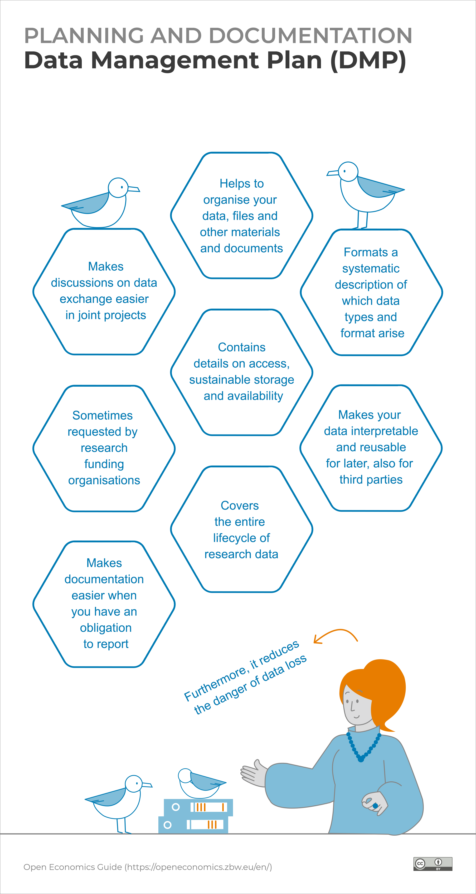
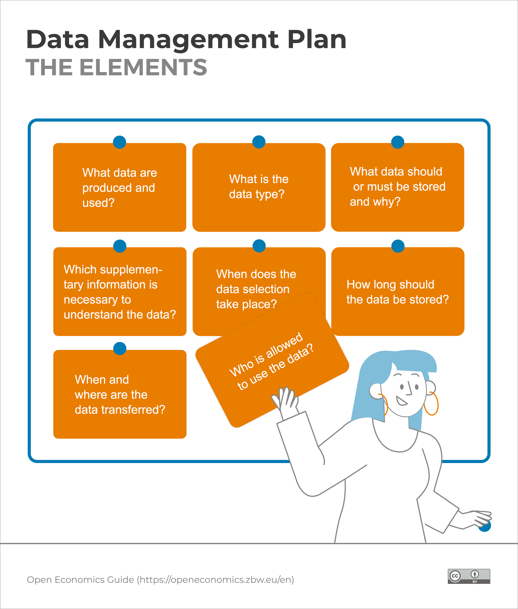

<!-- paginate: False -->

# Digital Humanities e Data Management / Informatica per i Beni Culturali (2025/2026)

## 04. Pianificazione III

➡️ Mail: [sebastian.barzaghi2@unibo.it](mailto:sebastian.barzaghi2@unibo.it)
➡️ ORCID: [0000-0002-0799-1527](https://orcid.org/0000-0002-0799-1527)
➡️ Sito: [sebastian.barzaghi2](https://www.unibo.it/sitoweb/sebastian.barzaghi2/)

---

<!-- paginate: True -->

### C'era una volta un gioco...

I giochi di ruolo per PlayStation 1 _Final Fantasy VII_, _VIII_ e _IX_, sviluppati da _SquareEnix_ (all’epoca ancora _Squaresoft_), sono considerati i capitoli dell'epoca d'oro della storia di Final Fantasy (1997-2000).

⚠️ Tuttavia, SquareEnix è rimasta in silenzio per molto tempo sul motivo per cui l’ottavo capitolo della serie non sia mai stato adeguatamente adattato per PC o per le console di attuale generazione – cosa che invece è stata fatta per quasi tutti gli altri episodi della saga.

---

### Se nessuno si occupa dei dati...

⚠️ La risposta era semplice: i dati grezzi (immagini di sfondo, musiche, modelli 3D, ecc.) e il codice sorgente completo del gioco _non erano stati archiviati_.

Negli anni '90 c'erano meno titoli AAA (grandi progetti che si sviluppano nell’arco di diversi anni) e i giochi venivano prodotti a intervalli più brevi e serrati.

Come accadeva spesso a quei tempi (ma anche adesso...), bisognava liberare spazio continuamente per i nuovi progetti, e si prestava poca attenzione ai dati dei progetti precedenti.

---

### ...I dati non esistono

⚠️ Di conseguenza, tutti i dati del progetto di Final Fantasy VIII sono andati perduti.

Una nuova versione del gioco ha potuto essere pubblicata solo nel 2019, in collaborazione con altre aziende.

⚠️ Sebbene oggi esistano molte versioni _rimasterizzate_ dei giochi di Final Fantasy di quell’epoca (riprogrammate da zero o quasi), la mancanza dei dati grezzi rappresenta ancora un problema per gli sviluppatori e per la community videoludica. 

---

### Regola n. 1: _avere un piano_

💡 La pubblicazione o il completamento di un progetto non dovrebbe segnare la fine del ciclo di vita dei dati.

💡 Quando i dati grezzi e i vari prodotti sono organizzati correttamente, i progetti successivi possono riutilizzarli e il lavoro precedente può essere valorizzato.

💡 Per pianificare meglio e tenere traccia di tutti gli elementi in movimento quando si lavora con i dati, un buon punto di partenza è la creazione di un **Piano di Gestione dei Dati** (**Data Management Plan**).

---

<!-- footer: Michener, W. K. (2015). Ten simple rules for creating a good data management plan. PLoS computational biology, 11(10), e1004525. https://doi.org/10.1371/journal.pcbi.1004525 -->

### Cosa intendiamo con _Data Management Plan_?

➡️ Un **Data Management Plan** (DMP) è _un documento che delinea il processo di gestione dei dati durante e dopo il progetto_.

Si tratta di un _documento vivente_ che deve essere consultato e aggiornato durante lo svolgimento del progetto.

💡 Può sembrare lavoro in più, ma in realtà un DMP (anche uno molto semplice e minimale) fa risparmiare tempo e fatica.

---

<!-- footer: Michener, W. K. (2015). Ten simple rules for creating a good data management plan. PLoS computational biology, 11(10), e1004525. https://doi.org/10.1371/journal.pcbi.1004525 -->

### Perché fare un DMP?

Infatti, un DPM aumenta l'efficienza del singolo e/o del gruppo nel lungo periodo, poiché permette di: 
* **Rimanere organizzati** con tutte le persone coiunvolte dall'inizio alla fine;
* Definire chiaramente **ruoli e responsabilità**;
* **Riflettere** sui dati e **scoprire** nuovi dettagli e potenzialità interessanti;
* **Facilitare le buone pratiche** necessarie alla scienza fatta bene.

---

<!-- footer: Michener, W. K. (2015). Ten simple rules for creating a good data management plan. PLoS computational biology, 11(10), e1004525. https://doi.org/10.1371/journal.pcbi.1004525 -->

### I componenti di un DMP

Fermo restando che esistono numerosi _template_ di DMP [[1]](https://ec.europa.eu/info/funding-tenders/opportunities/docs/2021-2027/horizon/temp-form/report/data-management-plan_he_en.docx) [[2]](https://scienceeurope.org/media/411km040/se-rdm-template-3-researcher-guidance-for-data-management-plans.docx) (e software per produrli [[3]](https://dmptool.org/) [[4]](https://argos.openaire.eu/home) [[5]](https://dmponline.dcc.ac.uk/)), un DMP deve contenere informazioni su:

* Quali **requisiti** sono necessari?
* Quali **dati** verranno usati?
* Come saranno **organizzati**, **documentati** e **conservati**?
* Come verrà valutata la loro **qualità**?
* Quali saranno le **_policy_ d'uso e d'accesso**?
* Chi saranno i **responsabili** di cosa?

---

<!-- footer: Michener, W. K. (2015). Ten simple rules for creating a good data management plan. PLoS computational biology, 11(10), e1004525. https://doi.org/10.1371/journal.pcbi.1004525 -->

### Quali dati verranno utilizzati?

⚠️ I dati sono il motivo principale per cui creiamo un DMP.

Gli aspetti chiave dei dati da considerare sono:

* **Tipo** (I dati sono testo, immagini, tabelle, numeri? Cosa sono?)
* **Fonte** (Da dove abbiamo preso i dati? Sono dati proprietari?)
* **Volume** (Quanti dati abbiamo? 10 terabyte, 10 megabyte?)
* **Formato** (`.docx`, `.csv`, `.pdf`?)

---

<!-- footer: Michener, W. K. (2015). Ten simple rules for creating a good data management plan. PLoS computational biology, 11(10), e1004525. https://doi.org/10.1371/journal.pcbi.1004525 -->

### Come organizzeremo i dati?

Una volta che sappiamo quali dati utilizzare, possiamo definire come lavorare con questi dati. Dobbiamo chiederci:

* **Dove** risiederanno i dati grezzi? 
* **Come accederanno** i diversi collaboratori ai dati?
* **Quali strumenti** utilizzeremo? 

⚠️ Le esigenze variano notevolmente da un progetto all'altro in base ai dati generati e/o raccolti e agli strumenti che vengono utilizzati. 

---

<!-- footer: Michener, W. K. (2015). Ten simple rules for creating a good data management plan. PLoS computational biology, 11(10), e1004525. https://doi.org/10.1371/journal.pcbi.1004525 -->

### Come documenteremo i dati?

Due passaggi principali per documentare i dati in modo adeguato sono:

* **Identificare il tipo di informazioni** per decrivere i dati (_cosa_, _chi_, _quando_, _dove_, _come_, _perché_);
* **Determinare se esiste uno schema di metadati** che si intende seguire (es. Dublin Core, MARC21, ecc.). 

⚠️ In molti casi, queste considerazioni sono legate alla **_repository_** in cui si prevede di archiviare i dati.

---

<!-- footer: -->

### Come assicureremo la qualità dei dati?

➡️ Il **controllo qualità** è _l'insieme di procedure adottate per garantire che i dati si presentino come ci si aspetta_. 

L’obiettivo finale è migliorare la qualità dei prodotti derivati dai dati. 

A volte esistono linee guida specifiche, ma in genere è sufficiente descrivere **quali misure** si intendono adottare per eseguire il controllo qualità dei propri dati (es. calibrazione degli strumenti, test di verifica, ecc.).

---

<!-- footer: -->

### Come preserveremo i dati?

Gli articoli si perdono, i dischi rigidi si guastano, gli URL smettono di funzionare, i diversi formati si degradano. È inevitabile! 

💡 È fondamentale pianificare in anticipo dove risiederanno i dati, **sia nel breve che nel lungo termine**, per garantirne l’accesso e l’utilizzo durante e dopo il progetto. 

⚠️ È importante predisporre **un meccanismo di backup** per evitare la perdita di qualsiasi informazione.

---

### Secondo quali _policy_ permetteremo l'accesso e l'utilizzo dei dati e dei risultati?

⚠️ Molte organizzazioni e istituzioni richiedono l'inclusione di **licenze** o accordi di condivisione, nonché eventuali restrizioni legali ed etiche. Al contempo, bisogna garantire che i prodotti derivati dai dati del  progetto vengano possibilmente diffusi.

💡 In genere, è molto incoraggiata la massima della _scienza aperta_: [_as open as possible, as closed as necessary_](https://rea.ec.europa.eu/open-science_en).

---

<!-- paginate: False -->
<!-- footer: "" -->

---

<!-- paginate: True -->

### Sessione pratica: le strutture dati

Abbiamo parlato di DMP e dell'importanza di organizzare i dati.

Sulla scia della lezione di ieri, continuiamo a ragionare sui dati e vediamo assieme le ricadute che questo tipo di considerazioni "teoriche" possono avere da un punto di vista tecnico (e viceversa).

Oggi vedremo le principali strutture dati usate in Python (e, in forme diverse, condivise anche da altri linguaggi di programmazione): le liste, gli insiemi, e i dizionari. 

## [Link alla sessione pratica](https://colab.research.google.com/drive/1c3qzlB5QA-IuQ68xo05Ih38J0ks-8Sms?usp=sharing)

---

<!-- paginate: False -->
<!-- footer: "" -->

# Digital Humanities e Data Management / Informatica per i Beni Culturali (2025/2026)

## 04. Pianificazione III ✅

➡️ Mail: [sebastian.barzaghi2@unibo.it](mailto:sebastian.barzaghi2@unibo.it)
➡️ ORCID: [0000-0002-0799-1527](https://orcid.org/0000-0002-0799-1527)
➡️ Sito: [sebastian.barzaghi2](https://www.unibo.it/sitoweb/sebastian.barzaghi2/)
