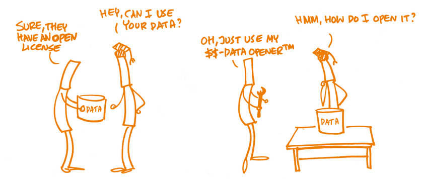

<!-- paginate: False -->

# Digital Humanities e Data Management / Informatica per i Beni Culturali (2025/2026)

## 05. Acquisizione I

➡️ Mail: [sebastian.barzaghi2@unibo.it](mailto:sebastian.barzaghi2@unibo.it)
➡️ ORCID: [0000-0002-0799-1527](https://orcid.org/0000-0002-0799-1527)
➡️ Sito: [sebastian.barzaghi2](https://www.unibo.it/sitoweb/sebastian.barzaghi2/)

---

<!-- paginate: True -->

### C'era una volta una tabella...

2020, Regno Unito.

⚠️ Per diversi giorni, i numeri dei casi di Coronavirus vengono _sottostimati_ a causa di _un errore nei dati legato all'utilizzo del programma Microsoft Excel_.

⚠️ Si ritiene che la perdita dei dati dei test sia stata causata da _un foglio Excel troppo pieno_. Com'è potuto accadere?

L'unità _test and trace_ del NHS (National Health Service) è responsabile dell'invio dei dati delle persone risultate positive al Covid-19 all'autorità sanitaria competente, la PHE (Public Health England).

---

### I limiti di Excel?

Come riportato dal _Guardian_, fin dall'inizio della pandemia l'autorità raccoglie e gestisce i dati sui contagi tramite fogli di calcolo Excel.

⚠️ Excel, però, può essere utilizzato come strumento di gestione dei dati solo _in misura limitata_, poiché _il numero di righe (e colonne) disponibili è ristretto_. 

⚠️ Nella versione attuale di Excel è possibile inserire fino a 1,048,576 righe, ma in questo caso il limite era di sole 65,000 righe a causa dell’uso di _un formato Excel obsoleto_.

---

### Effetto cascata

Sarebbe stato possibile aggirare questo limite implementando un sistema automatico (es. tramite [VBA](https://it.wikipedia.org/wiki/Visual_Basic_for_Applications)), ma non è stato fatto.

⚠️ Di conseguenza, durante l’importazione del file inviato dal NHS (originariamente in formato CSV) e contenente i dati dei casi di Covid-19, le righe in eccesso sono state eliminate in maniera automatica e irreversibile, per _un totale di 15,841 casi persi_. 

⚠️ Questo ha portato a una _sottostima_ dei dati e all’_interruzione del tracciamento_ di molte catene di contagio.

---

### Regola n. 2: _essere strategici e metodici fin da subito_

⚠️ Non aggiornare la versione di Excel ha portato a questo errore, ma aggiornarla avrebbe potuto introdurre modifiche ai dati o altri imprevisti critici.

➡️ Il vero problema è stata _**la mancata progettazione di un sistema adeguato di acquisizione dei dati** che potesse sopportare quella mole di dati e il loro formato_.

➡️ Durante l'acquisizione dei dati, è fondamentale progettare **una strategia** ed **essere metodici**.

---

<!-- footer: Borer, E. T., Seabloom, E. W., Jones, M. B., & Schildhauer, M. 2009. Some Simple Guidelines for Effective Data Management. Bull. of ESA 90: 209-214. https://doi.org/10.1890/0012-9623-90.2.205 -->

### In cosa consiste la fase di acquisizione dei dati?

➡️ L'**acquisizione** è _la creazione di dati o la loro raccolta da fonti esistenti_, inclusi dataset, database, sensori, API, web scraping, e altro. 

L'obiettivo dell'acquisizione è _assicurare che i dati necessari al progetto siano raccolti in una maniera sistematica e consistente_, in modo da avere uno o più dataset che siano quanto più validi e organizzati possibili per supportarne l'uso e il riuso per analisi.

---

<!-- footer: "" -->

### Esempio: Acquisizione fatta male
---

### Esempio: Acquisizione fatta bene

---

### Buone pratiche: decidere i formati

In un'ottica a lungo termine, dobbiamo conservare i dati in _un formato che ne assicura la lettura e la gestione nel futuro e su più sistemi e applicazioni_ possibili. 

Quando possibile, i formati scelti dovrebbero essere: **non proprietari**, **non criptati**, **non compressi**, e **di uso comune**.

| ✅ | ❌ |
| --- | --- |
| `.txt`, `.md`, `.odt` | `.docx` |
| `.csv`, `.json`, `.xml` | `.xlsx` |

---

<!-- footer: Borer, E. T., Seabloom, E. W., Jones, M. B., & Schildhauer, M. 2009. Some Simple Guidelines for Effective Data Management. Bull. of ESA 90: 209-214. https://doi.org/10.1890/0012-9623-90.2.205 -->

### Buone pratiche: decidere la struttura delle cartelle

* Raggruppa i file con proprietà comuni in cartelle;
* Usa nomi di cartelle significativi e chiari;
* Mantieni un numero gestibile di sottocartelle;
* Struttura le cartelle in modo gerarchico;
* Conserva i dati grezzi separatamente da quelli elaborati.

---

<!-- footer: Borer, E. T., Seabloom, E. W., Jones, M. B., & Schildhauer, M. 2009. Some Simple Guidelines for Effective Data Management. Bull. of ESA 90: 209-214. https://doi.org/10.1890/0012-9623-90.2.205 -->

### Buone pratiche: stabilire convenzioni di nomenclatura

* Mantieni nomi brevi ma significativi e rilevanti;
* Includi date in un formato standard (es. `YYYYMMDD`);
* Evita spazi, punti e caratteri speciali (es. `/`, `\`, `:`, `*`, `?`, `"`, `<`, `>`).

Esempio: _[progetto]\_[tipo]\_[data]\_[versione].[formato]_

_DHDMCH_lezione_20251112_v1.docx_

---

<!-- footer: Schweinberger, Martin. 2022. Data Management, Version Control, and Reproducibility. Brisbane: The University of Queensland. url: https://slcladal.github.io/repro.html (Version 2022.10.10) -->

### Buone pratiche: applicare la regola del 3-2-1

Conserva almeno **tre copie** dei tuoi dati. 

Archivia le copie di backup su **due supporti di archiviazione** differenti (es. computer, chiavetta, ecc.).

Conserva una copia di backup su **un servizio esterno** (es. Google Drive, OneDrive, GitHub, ecc.).

Questa semplice accortezza riduce drasticamente il rischio di perdere dati.

---

<!-- paginate: False -->
<!-- footer: "" -->

---

<!-- paginate: True -->

### Sessione pratica: Flussi di controllo

Come abbiamo visto, durante l'acquisizione dei dati dobbiamo fare attenzione ad una serie di fattori che determineranno la qualità del nostro lavoro.

Questo implica fare _iterazioni_ su una mole variabile di dati e specificare determinate condizioni (es. voglio questo tipo di dato, ma non quest'altro).

In Python, questo si chiama **_control flow_**.

## [Link alla sessione pratica](https://colab.research.google.com/drive/1c3qzlB5QA-IuQ68xo05Ih38J0ks-8Sms?usp=sharing)

---

<!-- paginate: False -->
<!-- footer: "" -->

# Digital Humanities e Data Management / Informatica per i Beni Culturali (2025/2026)

## 05. Acquisizione I ✅

➡️ Mail: [sebastian.barzaghi2@unibo.it](mailto:sebastian.barzaghi2@unibo.it)
➡️ ORCID: [0000-0002-0799-1527](https://orcid.org/0000-0002-0799-1527)
➡️ Sito: [sebastian.barzaghi2](https://www.unibo.it/sitoweb/sebastian.barzaghi2/)
