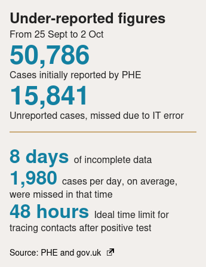
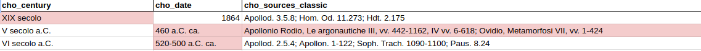
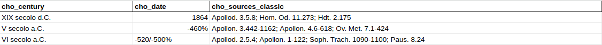
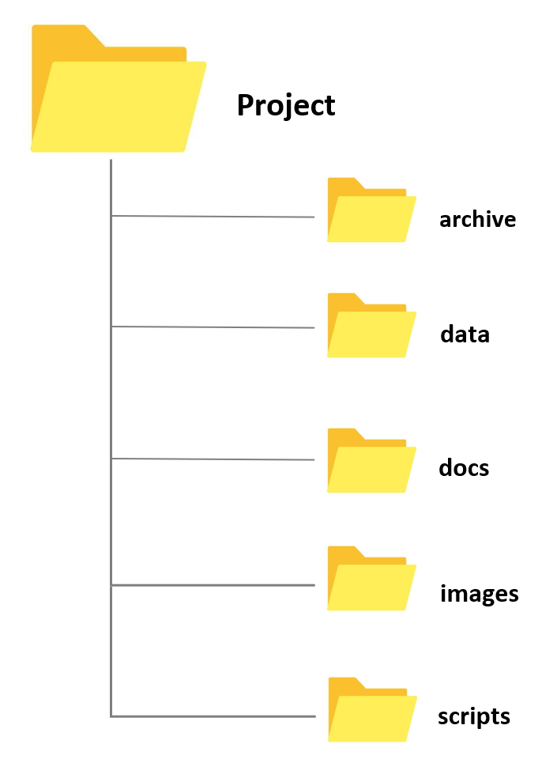
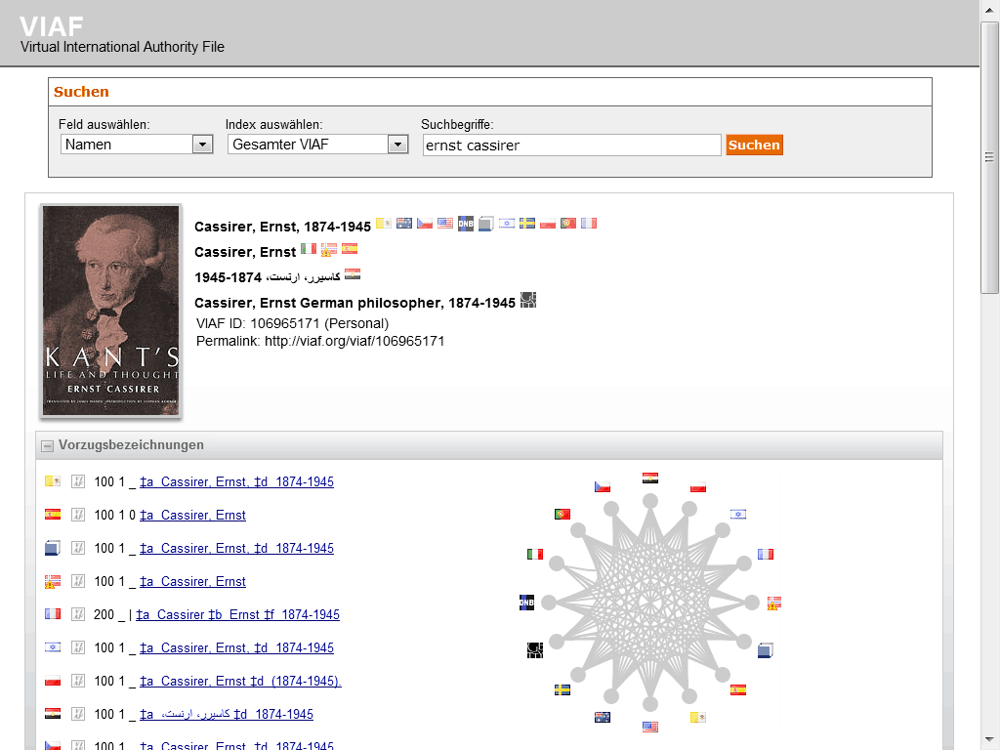

<!-- paginate: False -->

# Digital Humanities e Data Management / Informatica per i Beni Culturali (2025/2026)

## 05. Acquisizione I

➡️ Mail: [sebastian.barzaghi2@unibo.it](mailto:sebastian.barzaghi2@unibo.it)
➡️ ORCID: [0000-0002-0799-1527](https://orcid.org/0000-0002-0799-1527)
➡️ Sito: [sebastian.barzaghi2](https://www.unibo.it/sitoweb/sebastian.barzaghi2/)

---

<!-- paginate: True -->

### C'era una volta una tabella...

Nel Regno Unito, nel 2020, per diversi giorni i numeri dei casi di Coronavirus sono stati sottostimati a causa di un errore nei dati legato all'utilizzo del programma Microsoft Excel.

Si ritiene che la perdita dei dati dei test sia stata causata da un foglio Excel troppo pieno. Com'è potuto accadere?

L'unità "test and trace" del NHS (National Health Service) è responsabile dell'invio dei dati delle persone risultate positive al Covid-19 all'autorità sanitaria competente, la PHE (Public Health England).

---

### I limiti di Excel?

Come riportato dal quotidiano britannico The Guardian, fin dall'inizio della pandemia l'autorità aveva raccolto e gestito i dati sui contagi tramite fogli di calcolo Excel.

Excel, però, può essere utilizzato come strumento di gestione dei dati solo in misura limitata, poiché il numero di righe disponibili è ristretto. 

Nella versione attuale di Excel è possibile inserire fino a 1,048,576 righe, ma in questo caso il limite era di sole 65,000 righe a causa dell’uso di un formato Excel obsoleto.

---

### Effetto cascata

Sarebbe stato possibile aggirare questo limite implementando un sistema automatico (es. tramite VBA), ma non è stato fatto.

Di conseguenza, durante l’importazione del file inviato dal NHS (originariamente in formato CSV) e contenente i dati di 16,000 casi di Covid-19, le righe in eccesso sono state eliminate in maniera automatica e irreversibile, per un totale di 15,841 casi persi. 

Questo ha portato, da un lato, a una sottostima temporanea dei dati nel Regno Unito e, dall’altro, all’interruzione del tracciamento di molte catene di contagio.

---

### Regola n. 2: fare attenzione fin dall'inizio

È una trappola: non aggiornare la versione di Excel ha portato a questo errore, ma aggiornarla avrebbe potuto introdurre modifiche ai dati o altri imprevisti critici.

Il vero problema è stata la mancata progettazione di un sistema adeguato di acquisizione dei dati che potesse sopportare quella mole di dati e il loro formato.

Durante l'acquisizione dei dati, è fondamentale progettare una strategia ed essere metodici.

---

<!-- footer:  -->

### In cosa consiste la fase di acquisizione dei dati?

L'acquisizione consiste nella creazione di dati o la loro raccolta da varie fonti, inclusi dataset, database, sensori, API, web scraping, e altro. 

L'obiettivo dell'acquisizione è assicurare che i dati necessari al progetto siano raccolti in una maniera sistematica e consistente, in modo da avere uno o più dataset che siano quanto più validi e organizzati possibili per supportare uso e riuso.

---

Scelta delle fonti

---

### Esempio: Acquisizione fatta male
---

### Esempio: Acquisizione fatta bene

---

For the long term, store data in a consistent format that can be read well in to the future and that can be used by any application now or in the future
Appropriate file types include:

    Non-proprietary: use an open, documented standard
    Common usage by research community: standard representation (ASCII, Unicode)
    Unencrypted
    Uncompressed

---

<!-- footer: Borer, E. T., Seabloom, E. W., Jones, M. B., & Schildhauer, M. 2009. Some Simple Guidelines for Effective Data Management. Bull. of ESA 90: 209-214. https://doi.org/10.1890/0012-9623-90.2.205 -->

### Buone pratiche: struttura delle cartelle

* Raggruppa i file con proprietà comuni in cartelle;
* Usa nomi di cartelle significativi e chiari;
* Mantieni un numero gestibile di sottocartelle;
* Struttura le cartelle in modo gerarchico;
* Conserva i dati grezzi separatamente da quelli elaborati.

---

<!-- footer: Borer, E. T., Seabloom, E. W., Jones, M. B., & Schildhauer, M. 2009. Some Simple Guidelines for Effective Data Management. Bull. of ESA 90: 209-214. https://doi.org/10.1890/0012-9623-90.2.205 -->

### Buone pratiche: stabilire convenzioni di nomenclatura

* Mantieni nomi brevi ma significativi e rilevanti;
* Includi date in un formato standard (es. `YYYY-MM-DD`);
* Evita spazi, punti e caratteri speciali (es. `/`, `\`, `:`, `*`, `?`, `"`, `<`, `>`).

Esempio: _[progetto]\_[tipo]\_[data]\_[versione].[formato]_

_DHDMCH_lezione_20251112_v1.docx_

---

<!-- footer: Schweinberger, Martin. 2022. Data Management, Version Control, and Reproducibility. Brisbane: The University of Queensland. url: https://slcladal.github.io/repro.html (Version 2022.10.10) -->

### Buone pratiche: regola del 3-2-1

* Conserva almeno tre (3) copie dei tuoi dati,
* archiviando le copie di backup su due (2) supporti di archiviazione differenti (es. computer, chiavetta, ecc.), 
* con una (1) di esse situata su un servizio esterno (es. OneDrive, GitHub, ecc.).

---

<!-- paginate: False -->
<!-- footer: "" -->

---

<!-- paginate: True -->

### Sessione pratica: Flussi di controllo

Come abbiamo visto, durante l'acquisizione dei dati dobbiamo fare attenzione ad una serie di fattori che determineranno il nostro lavoro.

Questo implica fare _iterazioni_ su una mole variabile di dati e specificare determinate condizioni (es. voglio questo tipo di dato, ma non quest'altro).

In Python, questo si chiama **_control flow_**. Vediamolo.

## [Link alla sessione pratica](https://colab.research.google.com/drive/1c3qzlB5QA-IuQ68xo05Ih38J0ks-8Sms?usp=sharing)

---

<!-- paginate: False -->
<!-- footer: "" -->

# Digital Humanities e Data Management / Informatica per i Beni Culturali (2025/2026)

## 05. Acquisizione I ✅

➡️ Mail: [sebastian.barzaghi2@unibo.it](mailto:sebastian.barzaghi2@unibo.it)
➡️ ORCID: [0000-0002-0799-1527](https://orcid.org/0000-0002-0799-1527)
➡️ Sito: [sebastian.barzaghi2](https://www.unibo.it/sitoweb/sebastian.barzaghi2/)

➡️ [Lezione successiva](https://dhdmch.github.io/2025-2026/lessons/06/06.html)