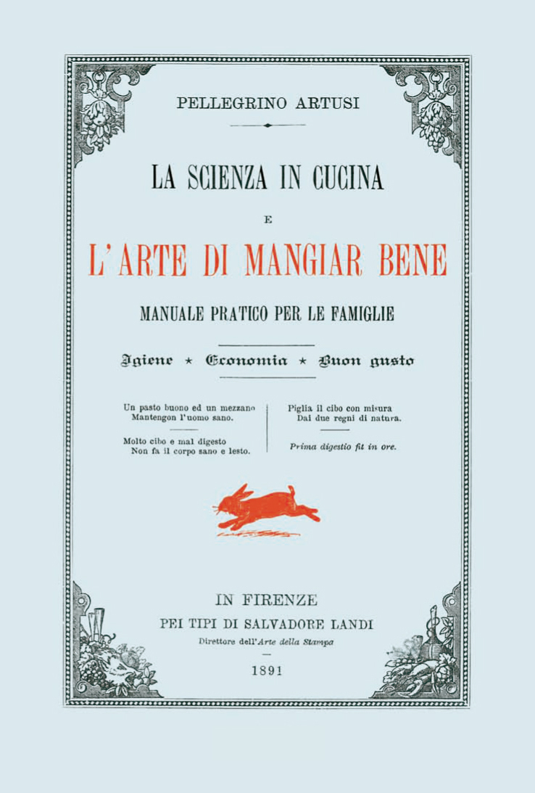
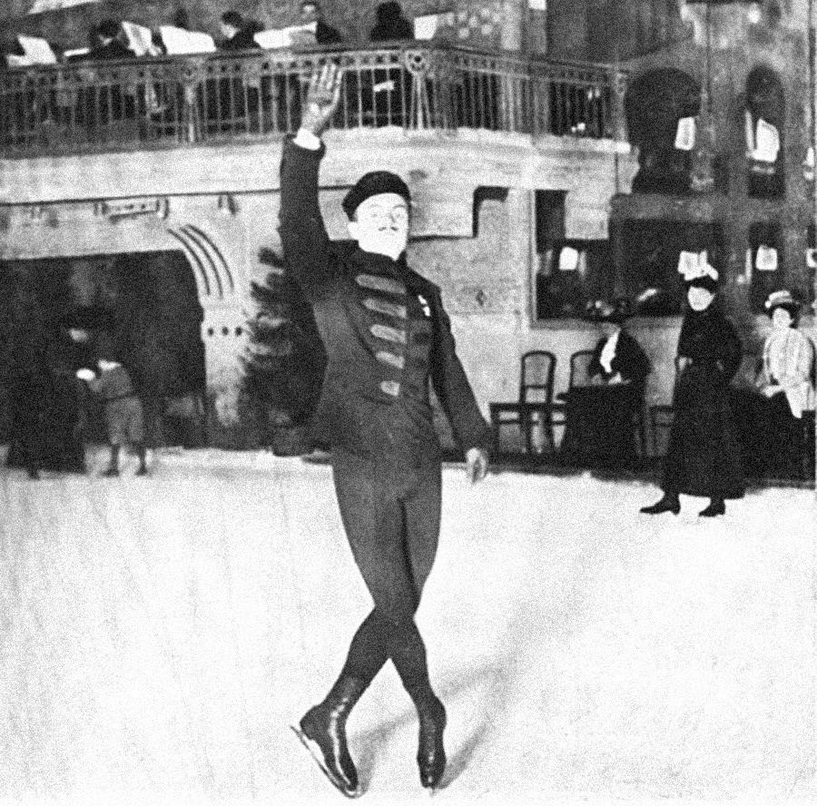
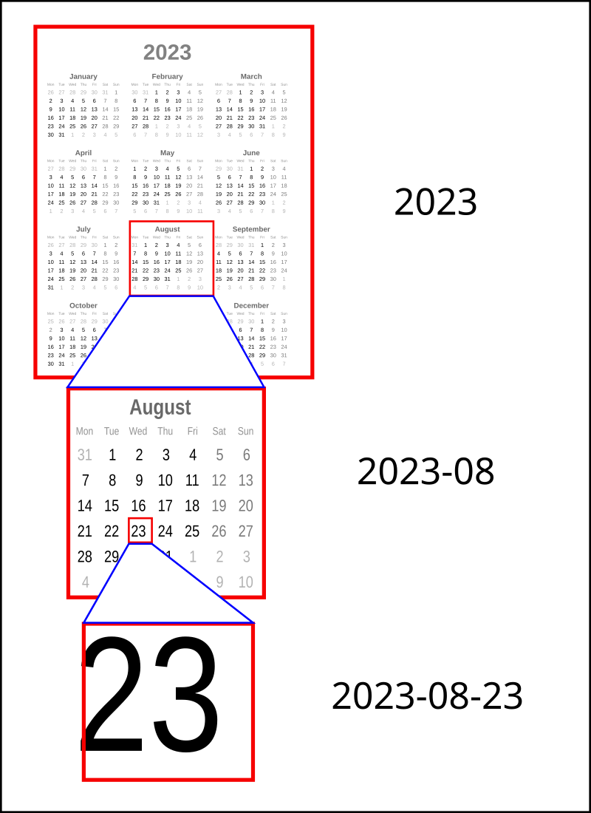
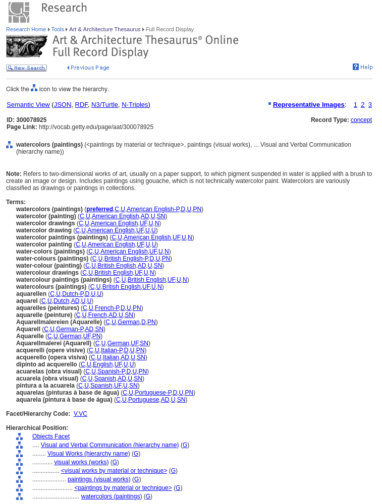
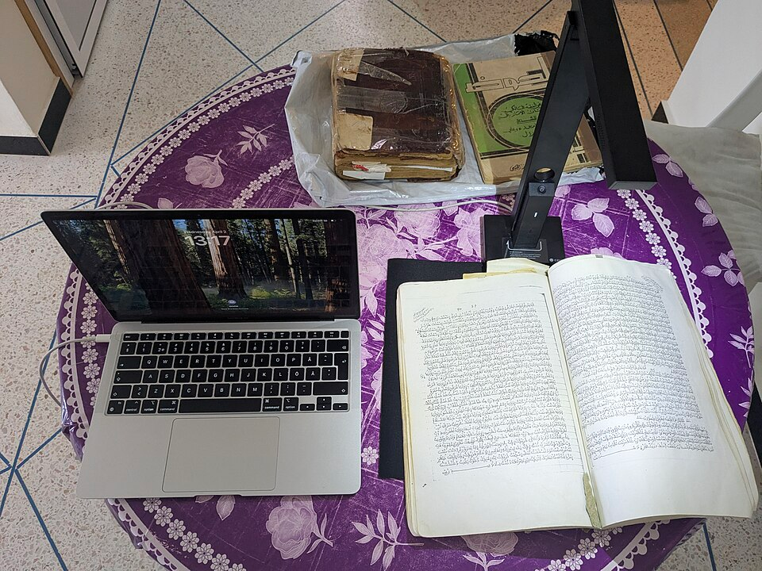
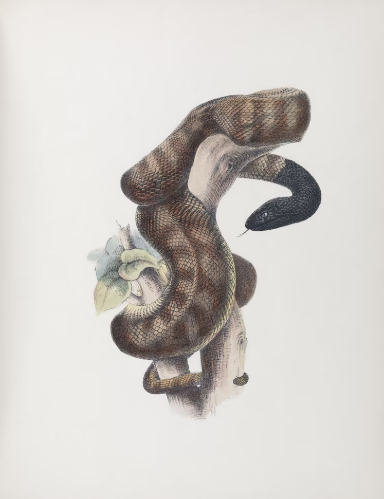

<!-- paginate: False -->

# Digital Humanities e Data Management / Informatica per i Beni Culturali (2025/2026)

## 06. Acquisizione II

➡️ Mail: [sebastian.barzaghi2@unibo.it](mailto:sebastian.barzaghi2@unibo.it)
➡️ ORCID: [0000-0002-0799-1527](https://orcid.org/0000-0002-0799-1527)
➡️ Sito: [sebastian.barzaghi2](https://www.unibo.it/sitoweb/sebastian.barzaghi2/)

---

<!-- paginate: True -->

### C'era una volta una squadra olimpionica...

(Questa è più che altro una leggenda metropolitana, ma facciamo finta che sia vera 🤫)

1908, Londra.

⚠️ Durante i Giochi Olimpici, che a quel tempo duravano circa sei mesi, _la squadra russa non si presenta_ alla cerimonia di apertura né alla gara di tiro dell’11 luglio.

Per capirne il motivo, dobbiamo però tornare indietro di circa 1,953 anni.

---

### Due calendari diversi

Nel 46 a.C., Giulio Cesare introduce il **calendario giuliano**, il quale stabilisce la durata di un anno pari a 365 giorni, con un anno bisestile ogni 4 anni, per una media di 365.25 giorni all'anno.

Il calendario giuliano resta il sistema dominante in Europa per 1,600 anni,  fino al 1582, anno in cui Papa Gregorio ordina di sostituirlo con il **calendario gregoriano**. Questa operazione però richiede un intervento immediato.

⚠️ In poche parole, Gregorio propone di tagliare 10 giorni dal calendario giuliano. 

---

### Due date differenti

Il resto del mondo si adatta con ritmi differenti.

⚠️ Nel 1908, l'Inghilterra segue il calendario gregoriano, mentre la Russia segue ancora quello giuliano. 

⚠️ Quindi, la leggenda vuole che -- per via della _differente misurazione del tempo_ -- i Russi siano arrivati in ritardo rispetto alle date comunicate dalla commissione olimpica in Inghilterra.

Quando arrivano, i Russi riescono a competere e a vincere in alcune discipline (come il pattinaggio sul ghiaccio).

---

### Regola n. 3: _stabilire e usare convenzioni_

➡️ Quando si lavora con i dati, usare e stabilire convenzioni e standard condivisi è fondamentale per capirsi.

⚠️ Se ognuno si limita ad usare le proprie regole senza condividerle né spiegarle, i dati esistono, ma sono inutilizzabili, inutili, praticamente inesistenti.

⚠️ Senza una chiara definizione delle convenzioni utilizzate, i dati provenienti da terze parti potrebbero non essere interpretati o replicati correttamente.

---

<!-- footer: Rocca-Serra, P., Sansone, S.-A., Gu, W., Welter, D., Abbassi Daloii, T., & Portell-Silva, L. (2022). D2.1 FAIR Cookbook. Zenodo. https://doi.org/10.5281/zenodo.6783564 -->

### Buone pratiche: occhio alla documentazione esistente

💡 Se riutilizziamo dati esistenti, dobbiamo capirne il **contesto** (e quindi i **metadati** e la **documentazione**, se esistono). Cosa sono i dati che sto riutilizzando? Per quale scopo sono stati creati? Come sono stati creati?

Dobbiamo anche assicurarci la _compatibilità_ di questi dati rispetto ai nostri obiettivi, ed effettuare determinate operazioni (es. normalizzare valori nulli). Lo vedremo meglio nella prossima lezione.

---

<!-- footer: Rocca-Serra, P., Sansone, S.-A., Gu, W., Welter, D., Abbassi Daloii, T., & Portell-Silva, L. (2022). D2.1 FAIR Cookbook. Zenodo. https://doi.org/10.5281/zenodo.6783564 -->

### Buone pratiche: usare schemi dei contenuti

➡️ Gli **schemi dei contenuti** stabiliscono _come formattare i dati in un modo standardizzato_ per garantirne l'interoperabilità e facilitarne il trattamento automatico.

Esempio: [ISO 8601](https://it.wikipedia.org/wiki/ISO_8601) (per il tempo).

* `2025-11-24` (24 novembre 2025)
* `14:30:00` (due e mezza PM)
* `2025-11-24T14:30:00` (24 novembre 2025, alle due e mezza PM)

---

<!-- footer: Rocca-Serra, P., Sansone, S.-A., Gu, W., Welter, D., Abbassi Daloii, T., & Portell-Silva, L. (2022). D2.1 FAIR Cookbook. Zenodo. https://doi.org/10.5281/zenodo.6783564 -->

### Buone pratiche: Usare record di autorità

➡️ I **record di autorità** sono _elenchi strutturati di forme di superficie che vengono utilizzati come riferimenti autoritativi_ per garantire l’accuratezza e la coerenza dei dati.

Esempio: [VIAF](https://viaf.org/) viene usato per controllare le forme di superficie dei nomi di persone, organizzazioni, luoghi, e opere.

[Leopardi, Giacomo](https://viaf.org/viaf/12311353)

[Zibaldone](http://viaf.org/viaf/310503073)

---

<!-- footer: Rocca-Serra, P., Sansone, S.-A., Gu, W., Welter, D., Abbassi Daloii, T., & Portell-Silva, L. (2022). D2.1 FAIR Cookbook. Zenodo. https://doi.org/10.5281/zenodo.6783564 -->

### Buone pratiche: usare vocabolari controllati

➡️ I **vocabolari controllati** sono _liste strutturate di termini organizzati in un esplicito sistema di relazioni_.

Servono per la descrizione coerente dei dati e per controllare i possibili valori applicabili ad un elemento.

Esempio: [AAT](https://www.getty.edu/research/tools/vocabularies/aat/) viene usato per controllare i termini relativi all'ambito dell'arte e dell'architettura.

[watercolors (paintings)](http://vocab.getty.edu/page/aat/300078925)

---

<!-- footer: White, E. P., Baldridge, E., Brym, Z. T., Locey, K. J., McGlinn, D. J., & Supp, S. R. (2013). Nine simple ways to make it easier to (re)use your data (e7v2). PeerJ Inc. https://doi.org/10.7287/peerj.preprints.7v2 -->

### Buone pratiche: usare flussi di lavoro riproducibili

💡 Se il processo di acquisizione è automatizzabile o semi-automatizzabile, _facciamolo_: meno tempo investito in lavoro di copia-incolla tedioso e tendente all'errore.

💡 Se invece non è automatizzabile e bisogna farlo a mano, documentiamo tutto nel DMP: *provenance*, eventuali incertezze e problemi noti, sistemi di nomenclatura, organizzazione di file e cartelle, schemi di metadati utilizzati.

---

<!-- paginate: False -->
<!-- footer: "" -->

---

### Sessione pratica: Funzioni

## [Link alla sessione pratica](https://colab.research.google.com/drive/1c3qzlB5QA-IuQ68xo05Ih38J0ks-8Sms?usp=sharing)

---

<!-- paginate: False -->
<!-- footer: "" -->

# Digital Humanities e Data Management / Informatica per i Beni Culturali (2025/2026)

## 06. Acquisizione II ✅

➡️ Mail: [sebastian.barzaghi2@unibo.it](mailto:sebastian.barzaghi2@unibo.it)
➡️ ORCID: [0000-0002-0799-1527](https://orcid.org/0000-0002-0799-1527)
➡️ Sito: [sebastian.barzaghi2](https://www.unibo.it/sitoweb/sebastian.barzaghi2/)
