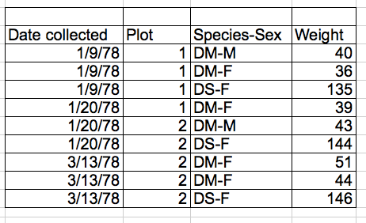
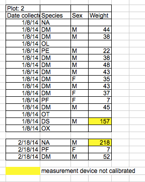

<!-- paginate: False -->

# Digital Humanities e Data Management / Informatica per i Beni Culturali (2025/2026)

## 06. Processamento I

➡️ Mail: [sebastian.barzaghi2@unibo.it](mailto:sebastian.barzaghi2@unibo.it)
➡️ ORCID: [0000-0002-0799-1527](https://orcid.org/0000-0002-0799-1527)
➡️ Sito: [sebastian.barzaghi2](https://www.unibo.it/sitoweb/sebastian.barzaghi2/)

---

<!-- paginate: True -->

### C'era una volta un dipartimento di polizia...

The online crime map of the Los Angeles Police Department showed that between October 2008 and March 2009, over 1,380 entries came from the area surrounding the police station itself. 

That accounts for almost 4% of all recorded crimes in this city during this period. 

It was only when the LA Times (which base is also in the neighbourhood) complained that the police station noticed the error in the system. But what had happened?

---

### blu

All police reports were written by hand at the time and the majority of them were automatically entered into the database. 

It also happened often that the location of the crime was not recognized. In this case, the location of the police station itself was simply taken as the default value. 

This was not checked, which led to a major falsification of crime statistics. 

---

### bla

The LAPD corrected the error by setting missing location information to a "null" value (information for missing value in computer science). 

Of course, null values can also render certain parts of data records unusable if the values have to be used for certain visualizations or calculations. One, therefore, speaks of "Null Island - where bad data goes to die".

---

### blo

how important it is to correctly determine the attributes of tables and databases, especially if they might also have missing values. 

If you simply set a value that appears to be logically readable for machines (such as "Null" as comment text or (0.0,0.0) as location), the data is not interpreted correctly and can falsify the subsequent results.

 You should always ensure that all possible values of a data set are well documented and that programs can recognize exceptional cases if necessary.

---

<!-- footer: University of York (2024). Data: A Practical Guide. https //subjectguides.york.ac.uk/data -->

### Il caos regna

Formati eterogenei nella stessa colonna, dati mancanti, nomi varianti delle colonne...

Dobbiamo avere i dati in un formato utile per le nostre necessità: se stiamo analizzando o visualizzando dati, quali informazioni (e tipi di dati) richiede quell’analisi o visualizzazione?

L'80% del lavoro sui dati è dedicato al processo di pulizia dei dati e alla loro preparazione per ulteriori manipolazioni e analisi.

---

<!-- footer: Wickham, H., Çetinkaya-Rundel, M., & Grolemund, G. (2023). R for data science. O'Reilly Media, Inc. https://r4ds.had.co.nz/tidy-data.html -->

### blblblbl

Ogni valore appartiene a una variabile e a un’osservazione.

Ogni variabile forma una colonna.

Ogni osservazione forma una riga.

---

### Una colonna per ogni variabile

---

### Una riga per ogni osservazione

---

### Una cella per ogni valore

---

<!-- footer: UiT The Arctic University of Norway. (2023). Data Cleaning. Zenodo. https://doi.org/10.5281/zenodo.8375643 -->

### Cosa intendiamo per _data cleaning_?

La pulizia dei dati è un processo che consiste in una serie di attività volte ad individuare, gestire ed eventualmente eliminare le aberrazioni individuate nei dati, con l'obiettivo di rendere questi pronti alle successive fasi del processo della loro gestione.

Tra queste attività troviamo: eliminare ridondanze; separare o combinare valori nelle stesse celle; gestire valori nulli, errori di ortografia, errori di formattazione...

---

<!-- footer: UiT The Arctic University of Norway. (2023). Data Cleaning. Zenodo. https://doi.org/10.5281/zenodo.8375643 -->

### Buone pratiche: evitare le aggregazioni

L'inserimento di più di un tipo di informazione nella stessa cella (es. commenti, unità di misura, metadati, ecc.) è _**tendenzialmente**_ da evitare.

Se possibile, aggiungiamo le informazioni aggiuntive al titolo della colonna o in una colonna separata.

---

<!-- footer: UiT The Arctic University of Norway. (2023). Data Cleaning. Zenodo. https://doi.org/10.5281/zenodo.8375643 -->

### Buone pratiche: evitare la formattazione come strumento informativo

L'utilizzo di colori, stili ortografici, celle vuote, ecc. per esprimere informazioni sui dati stessi è un'attività da evitare.

Invece, aggiungiamo le informazioni aggiuntive nei titoli delle colonne o in colonne separate.

---

    Esempio 1: date visualizzate in molti formati diversi (“12 luglio 2024”, “12/07/2024”, “12-07-2024”, ecc.);
        Utilizza standard internazionali (es. EDTF, ISO-8601);
    Esempio 2: nomi visualizzati in molte varianti diverse (“Alessandro Manzoni”, “A. Manzoni”, “Manzoni”, “Manzoni, Alessandro”, ecc.);
        Utilizza record di autorità (es. VIAF, possibilmente inserendo sia il nome leggibile per gli esseri umani sia l’URI al record, se esistente);
    Sii coerente anche nella capitalizzazione delle parole, nella scelta dei delimitatori e nelle convenzioni di denominazione per le variabili;
    Evita di utilizzare il delimitatore usato dal dataset (es. ,, ;, /, ecc.) nei dati stessi;
    Fai attenzione agli spazi!

---

<!-- footer: White, E. P., Baldridge, E., Brym, Z. T., Locey, K. J., McGlinn, D. J., & Supp, S. R. (2013). Nine simple ways to make it easier to (re)use your data (e7v2). PeerJ Inc. https://doi.org/10.7287/peerj.preprints.7v2 -->

Usa un metodo coerente che sia compatibile e che non causi errori (come lasciare la cella vuota).

Considera che:

    Può essere difficile sapere se un valore è mancante o è stato trascurato durante l’inserimento dei dati;
    Gli spazi vuoti possono essere confusi quando spazi ( ) o tabs (/) sono usati come delimitatori;
    NA e NULL sono valori nulli ragionevoli.

---

<!-- paginate: False -->
<!-- footer: "" -->

---

### Sessione pratica: Introduzione a Pandas

## [Link alla sessione pratica](https://colab.research.google.com/drive/1c3qzlB5QA-IuQ68xo05Ih38J0ks-8Sms?usp=sharing)

---

<!-- paginate: False -->
<!-- footer: "" -->

# Digital Humanities e Data Management / Informatica per i Beni Culturali (2025/2026)

## 06. Processamento I ✅

➡️ Mail: [sebastian.barzaghi2@unibo.it](mailto:sebastian.barzaghi2@unibo.it)
➡️ ORCID: [0000-0002-0799-1527](https://orcid.org/0000-0002-0799-1527)
➡️ Sito: [sebastian.barzaghi2](https://www.unibo.it/sitoweb/sebastian.barzaghi2/)

➡️ [Lezione successiva](https://dhdmch.github.io/2025-2026/lessons/07/07.html)