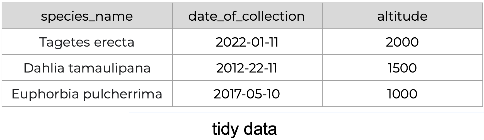
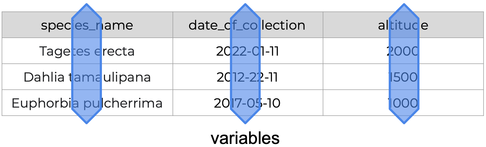
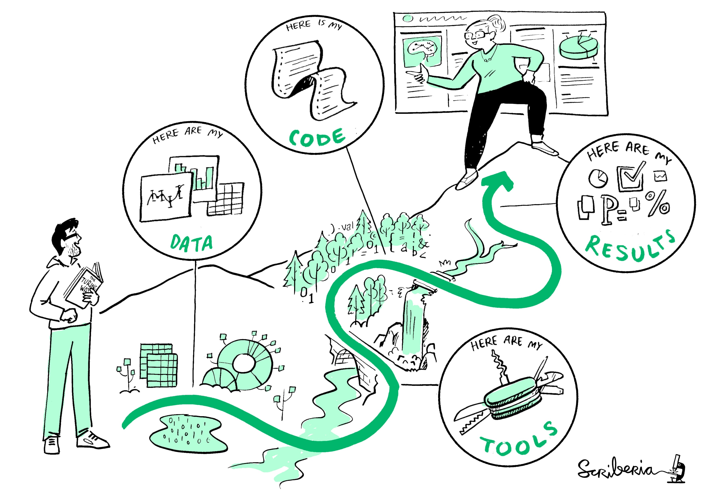
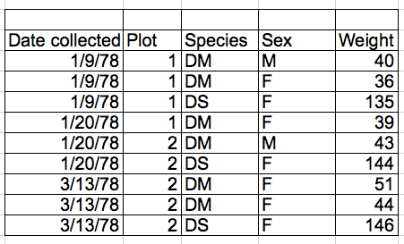
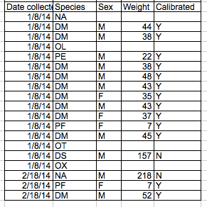
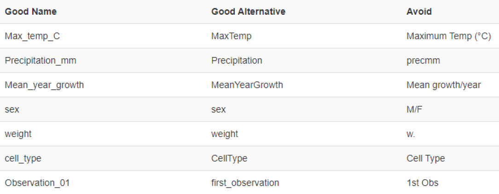
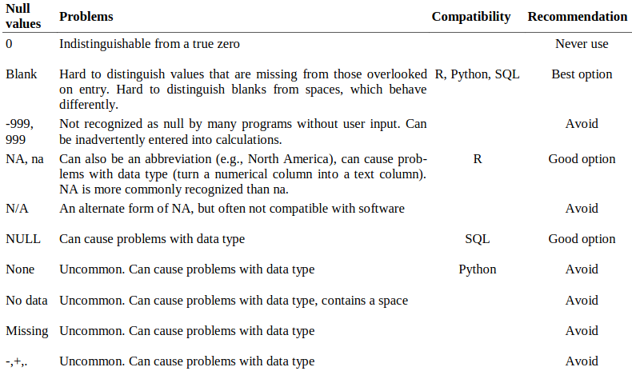

<!-- paginate: False -->

# Digital Humanities e Data Management / Informatica per i Beni Culturali (2025/2026)

## 07. Processamento I

➡️ Mail: [sebastian.barzaghi2@unibo.it](mailto:sebastian.barzaghi2@unibo.it)
➡️ ORCID: [0000-0002-0799-1527](https://orcid.org/0000-0002-0799-1527)
➡️ Sito: [sebastian.barzaghi2](https://www.unibo.it/sitoweb/sebastian.barzaghi2/)

---

<!-- paginate: True -->

### C'era una volta un dipartimento di polizia...

Los Angeles.

⚠️ La mappa online della criminalità del Dipartimento di Polizia di Los Angeles mostra _oltre 1.380 segnalazioni provenienti dall'area intorno alla stessa stazione di polizia_, in un intervallo di tempo compreso tra ottobre 2008 e marzo 2009.

Ciò rappresenta quasi il 4% dei crimini registrati in città durante quel periodo.

La stazione di polizia si accorge dell’errore nel sistema solo più tardi.

---

### Nessun dove

A quel tempo, tutti i rapporti di polizia vengono scritti a mano e la maggior parte di essi viene poi inserita automaticamente nel database del Dipartimento.

Inoltre, capita spesso che il luogo del crimine non venga riconosciuto. 

⚠️ In tal caso, _per qualche motivo_, viene semplicemente utilizzata _la posizione della stazione di polizia stessa come valore predefinito_.

⚠️ Questo ha portato a _una grave falsificazione_ delle statistiche sulla criminalità.

---

### Regola n. 4: i dati nascondono _sempre_ degli errori

Il Dipartimento ha corretto l’errore impostando le informazioni mancanti sulla posizione a un valore _null_. Naturalmente, i valori _null_ possono anche rendere inutilizzabili alcuni dati, se tali valori devono essere utilizzati per determinate visualizzazioni o calcoli.

➡️ Per questo motivo è così importante **determinare correttamente gli attributi dei dati**, soprattutto se possono presentare valori mancanti. Dobbiamo sempre assicurarci che i dati siano ben documentati e che gli eventuali casi problematici siano gestibili.

---

<!-- footer: University of York (2024). Data: A Practical Guide. https //subjectguides.york.ac.uk/data -->

### Il caos regna

Formati eterogenei nella stessa colonna, dati mancanti, nomi varianti delle colonne...

💡 Dobbiamo avere i dati in un formato utile per le nostre necessità: se stiamo analizzando o visualizzando dati, quali informazioni (e tipi di dati) richiede quell’analisi o visualizzazione?

⚠️ Nota: in media, l'80% del lavoro sui dati è dedicato al processo di pulizia dei dati e alla loro preparazione per ulteriori manipolazioni e analisi.

---

<!-- footer: University of York (2024). Data: A Practical Guide. https //subjectguides.york.ac.uk/data -->

### Termini del _data cleaning_

➡️ _**Variabile**_: _una caratteristica misurata, contata o descritta con i dati_. Esempi: specie di pianta, peso, altezza...

➡️ _**Osservazione**_: _un singolo punto dati per cui la misura, il conteggio o la descrizione di una o più variabili viene registrato_. Esempio: se stiamo raccogliendo le variabili sopracitate, ogni pianta è un'osservazione.

➡️ _**Valore**_:  _La misura, il conteggio o la descrizione di una variabile_. Esempi: _cucurbitacea_, 15kg, 1.5m. 

---

<!-- footer: Wickham, H. (2014). Tidy data. Journal of statistical software, 59, 1-23. https://doi.org/10.18637/jss.v059.i10 -->

### Cosa intendiamo per _data cleaning_?

➡️ La **_bonifica dei dati_** è _il processo di identificazione e correzione di errori e incongruenze presenti nei dati_. 

Ha l'obiettivo di garantire, con una certa soglia di affidabilità, la fattibilità della manipolazione e dell'analisi dei dati.

* **Ogni valore appartiene a una variabile e a un’osservazione**;
* **Ogni variabile forma una colonna**;
* **Ogni osservazione forma una riga**.

---

<!-- footer: UiT The Arctic University of Norway. (2023). Data Cleaning. Zenodo. https://doi.org/10.5281/zenodo.8375643 -->

### Buone pratiche: evitare le aggregazioni

⚠️ L'inserimento di più di un tipo di informazione nella stessa cella (es. commenti, unità di misura, metadati, ecc.) è _**tendenzialmente**_ da evitare.

💡 Se possibile, aggiungiamo le informazioni aggiuntive al **titolo della colonna** o in **una colonna separata**.

Tabella 1: La colonna `Species-Sex` contiene due tipologie diverse di dati.

Tabella 2: La colonna viene divisa.

---

<!-- footer: UiT The Arctic University of Norway. (2023). Data Cleaning. Zenodo. https://doi.org/10.5281/zenodo.8375643 -->

### Buone pratiche: evitare la formattazione come strumento informativo

⚠️ L'utilizzo di colori, stili ortografici, celle vuote, ecc. per esprimere informazioni sui dati stessi è un'attività da evitare. Invece, aggiungiamo le informazioni aggiuntive nei titoli delle colonne o in colonne separate.

Tabella 1: Il colore della cella viene usato come informazione aggiuntiva.

Tabella 2: Viene invece aggiunta una colonna.

---

### Buone pratiche: usare standard e pratiche condivise in maniera costante

* Utilizziamo _standard internazionali_ (es. EDTF, ISO-8601), _record di autorità_ (es. VIAF), _vocabolari controllati_ (es. AAT);
* Assicuriamo la _coerenza nella capitalizzazione_ delle parole;
* Assicuriamo la _coerenza nella scelta dei delimitatori_;
* Assicuriamo la _coerenza nelle convenzioni di nomenclatura_; 
* Facciamo attenzione agli _spazi_!

---

<!-- footer: White, E. P., Baldridge, E., Brym, Z. T., Locey, K. J., McGlinn, D. J., & Supp, S. R. (2013). Nine simple ways to make it easier to (re)use your data (e7v2). PeerJ Inc. https://doi.org/10.7287/peerj.preprints.7v2 -->

### Buone pratiche: gestire i valori nulli

💡 Stabiliamo _una regola coerente_ che sia compatibile con tutti i dati e che causi meno errori possibili. Vengono usati svariati valori nulli, ognuno con pro e contro:
* Può essere difficile sapere se un valore è mancante o se è stato trascurato durante l’inserimento dei dati;
* Può essere difficile sapere se un valore sia usato come _null_ o se sia il valore effettivo (es. `0`, `Sconosciuto`).

---

<!-- paginate: False -->
<!-- footer: "" -->

---

### Sessione pratica: Introduzione a Pandas

Abbiamo parlato di _data cleaning_ e dell'importanza di assicurare una qualità quantomeno accettabile dei nostri dati.

Uno degli strumenti più utilizzati in assoluto per gestire i dati durante la fase di processamento in senso lato (quindi tanto per la loro bonifica, quanto per la loro manipolazione ed analisi) è _**Pandas**_, la libreria di Python più utilizzata in assoluto per l'analisi scientifica dei dati.

## [Link alla sessione pratica](https://colab.research.google.com/drive/1c3qzlB5QA-IuQ68xo05Ih38J0ks-8Sms?usp=sharing)

---

<!-- paginate: False -->
<!-- footer: "" -->

# Digital Humanities e Data Management / Informatica per i Beni Culturali (2025/2026)

## 07. Processamento I ✅

➡️ Mail: [sebastian.barzaghi2@unibo.it](mailto:sebastian.barzaghi2@unibo.it)
➡️ ORCID: [0000-0002-0799-1527](https://orcid.org/0000-0002-0799-1527)
➡️ Sito: [sebastian.barzaghi2](https://www.unibo.it/sitoweb/sebastian.barzaghi2/)
