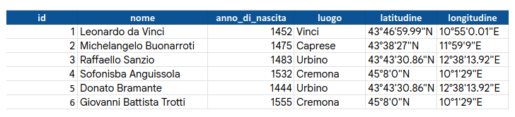
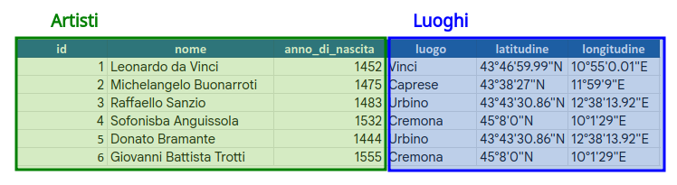
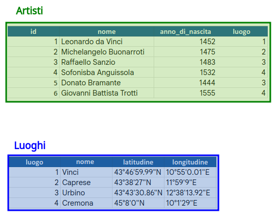
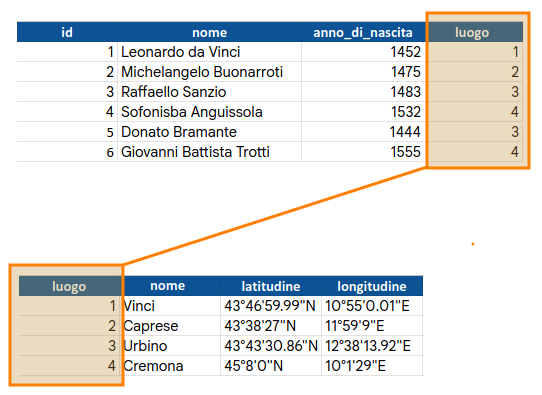
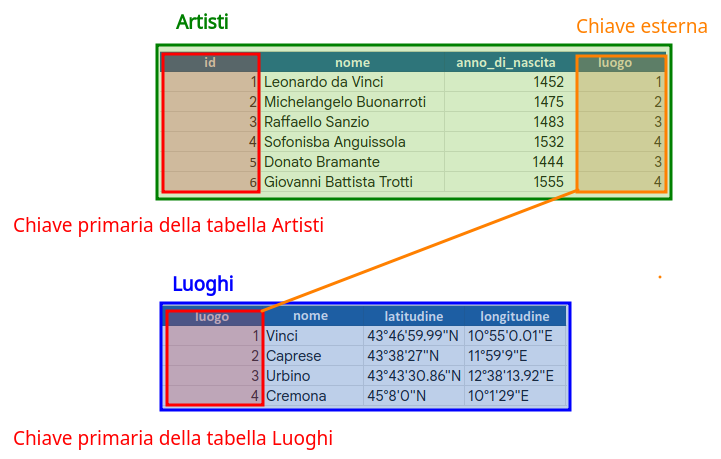

<!-- paginate: False -->

# Digital Humanities e Data Management / Informatica per i Beni Culturali (2025/2026)

## 09. Processamento III

➡️ Mail: [sebastian.barzaghi2@unibo.it](mailto:sebastian.barzaghi2@unibo.it)
➡️ ORCID: [0000-0002-0799-1527](https://orcid.org/0000-0002-0799-1527)
➡️ Sito: [sebastian.barzaghi2](https://www.unibo.it/sitoweb/sebastian.barzaghi2/)

---

<!-- paginate: True -->

### C'era una volta Braccio di Ferro...

Dagli inizi del Novecento, Braccio di Ferro, iconico personaggio dei fumetti che diventa particolarmente forte mangiando spinaci, è stato presentato a bambini e adulti come un modello da seguire.

Si è spesso sostenuto che il consumo di spinaci soddisfi il nostro fabbisogno di ferro e contribuisca quindi a una buona salute.

⚠️ L’idea che Braccio di Ferro diventasse forte grazie al ferro contenuto negli spinaci, e il loro elevato contenuto di ferro, sono _invenzioni_.

---

<!-- paginate: True -->

### Due bugie

⚠️ Nel fumetto di E.C. Segar, lo stesso Braccio di Ferro afferma che gli spinaci sono pieni di _vitamina A_ ed è questa che lo rende forte (in realtà contengono _beta-carotene_, che il nostro corpo poi converte in vitamina A, ma dettagli).

⚠️ Nel 1981, il British Medical Journal dichiara che, quando negli anni Trenta è stato determinato il contenuto di ferro degli spinaci, _la virgola decimale è accidentalmente scivolata di una posizione verso destra_.

---

<!-- paginate: True -->

### C'era una volta Braccio di Ferro...

⚠️ Le conseguenze di questa svista è ancora oggi presente in molte pubblicazioni popolari, ma anche scientifiche.

⚠️ Da una virgola scritta male, si è propagato un errore che ha generato miti culturali e scientifici ritenuti universalmente validi.

➡️ Ci sono chiaramente anche altri fattori da considerare in questa storia, ma a noi per ora ci interessa uno in particolare: _l'attenzione alla bonifica, al controllo qualità, e al trattamento dei dati_.

---

<!-- footer: University of York (2024). Data: A Practical Guide. https //subjectguides.york.ac.uk/data -->

### Termini del _data cleaning_ (2/2)

Abbiamo visto le _**variabili**_ (caratteristiche misurate, contate o descritte), le _**osservazioni**_ (gli oggetti a cui appartengono le caratteristiche) e i _**valori**_ delle variabili. Ci mancano le entità.

➡️ **_Entità_**: Una categoria di osservazione.

Esempio: se stiamo raccogliendo i valori di variabili come `nome` di una serie di artisti, il loro `anno di nascita`, il `luogo` in cui sono nati e la `latitudine` e `longitudine` di quel luogo, quali sono le entità?

---

<!-- footer: University of York (2024). Data: A Practical Guide. https //subjectguides.york.ac.uk/data -->

### Cosa intendiamo per _normalizzazione_?

➡️ La _**normalizzazione dei dati**_ è _il processo di riduzione della ridondanza nei dati_.
* **Una tabella per ogni entità** (es. una tabella per gli artisti, una per i luoghi);
* **Ogni tabella segue i principi del _data cleaning_**;
* **Ogni osservazione è unica e identificata in maniera univoca**.

⚠️ I dati normalizzati non hanno valori ripetuti.

---

<!-- footer: University of York (2024). Data: A Practical Guide. https //subjectguides.york.ac.uk/data -->

### Modelli di dati relazionali

⚠️ Quando lavoriamo con i dati, è raro avere a che fare con una singola tabella.

Spesso diventa quindi necessario combinare più tabelle per rispondere alle domande che ci interessano.

💡 Quando abbiamo più tabelle di dati collegate tra loro, abbiamo _dati relazionali_.

➡️ Un _**modello di dati relazionale**_ è _un modo per rappresentare questi collegamenti tra tabelle di dati_, ed è il fondamento dei _database relazionali_.

---

<!-- footer: University of York (2024). Data: A Practical Guide. https //subjectguides.york.ac.uk/data -->

### Tutto bello, ma perché?

I modelli relazionali sono usati per progettare database relazionali, la tipologia di database più comune. Ciononostante, non è necessario usare un database relazionale per poter usufruire dei vantaggi di un modello relazionale!

💡 I vantaggi di usare un modello di dati relazionale sono:
* Maggiore facilità di gestire dataset molto grandi e complessi;
* Maggiore integrità dei dati;
* Maggiore gestibilità degli errori.

---

<!-- footer: University of York (2024). Data: A Practical Guide. https //subjectguides.york.ac.uk/data -->

### Cosa intendiamo per _chiave_?

Quando lavoriamo con dati relazionali, dobbiamo unire le informazioni da diverse tabelle per effettuare le nostre analisi. Per farlo, dobbiamo utilizzare le _chiavi_, il meccanismo con cui vengono codificate le relazioni tra tabelle diverse.

➡️ Una _**chiave**_ è _una variabile i cui valori identificano univocamente le osservazioni_. 

➡️ In altre parole: _una chiave è una colonna che contiene un valore differente in ogni cella_.

⚠️ Una tabella può avere più chiavi.

---

<!-- footer: University of York (2024). Data: A Practical Guide. https //subjectguides.york.ac.uk/data -->

### Chiavi primarie ed esterne

I due tipi di chiave più comuni nei modelli di dati relazionali sono:
* _**Primaria**_: _una chiave che identifica univocamente ogni osservazione in una tabella_ (è la definizione di chiave, in pratica);
* _**Esterna**_: _un riferimento ad una chiave primaria in un'altra tabella_.

Chiavi primarie (meccanismo di identificazione univoca) e chiavi esterne (riferimento a quell'identificazione) permettono le relazioni tra tabelle.

---

<!-- paginate: False -->
<!-- footer: "" -->

---

### Sessione pratica: manipolazione dei dati con Pandas

Abbiamo continuato ad esaminare la tematica della bonifica dei dati e dell'importanza che la normalizzazione dei dati riveste in essa.

La domanda che sorge spontanea è: come normalizziamo i dati con Pandas? E ancora: una volta normalizzati, come li gestiamo per poterli poi analizzare?

Vediamolo assieme.

## [Link alla sessione pratica](https://colab.research.google.com/drive/1c3qzlB5QA-IuQ68xo05Ih38J0ks-8Sms?usp=sharing)

---

<!-- paginate: False -->
<!-- footer: "" -->

# Digital Humanities e Data Management / Informatica per i Beni Culturali (2025/2026)

## 09. Processamento III ✅

➡️ Mail: [sebastian.barzaghi2@unibo.it](mailto:sebastian.barzaghi2@unibo.it)
➡️ ORCID: [0000-0002-0799-1527](https://orcid.org/0000-0002-0799-1527)
➡️ Sito: [sebastian.barzaghi2](https://www.unibo.it/sitoweb/sebastian.barzaghi2/)
