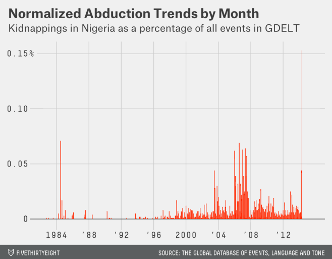
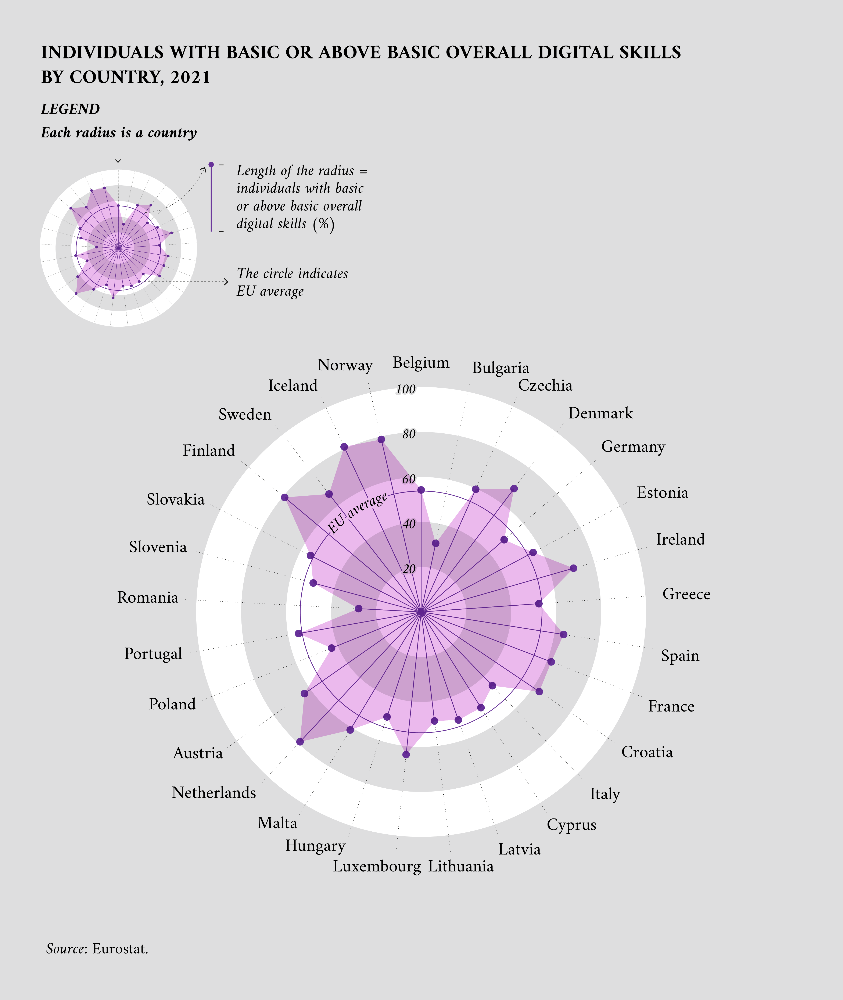
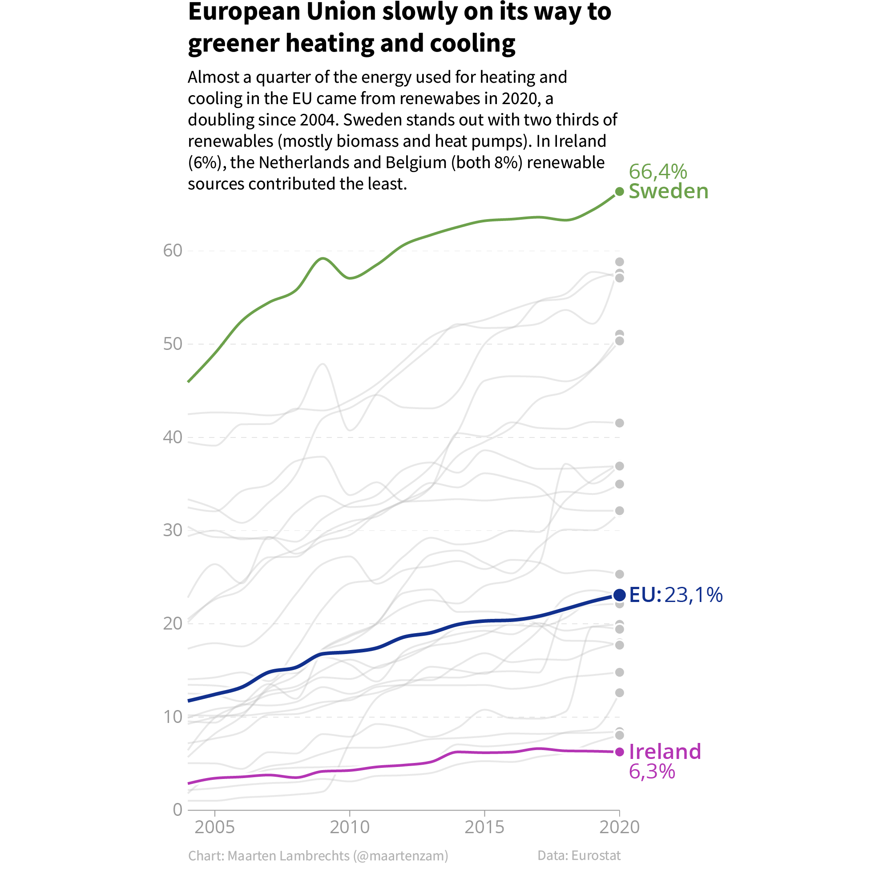
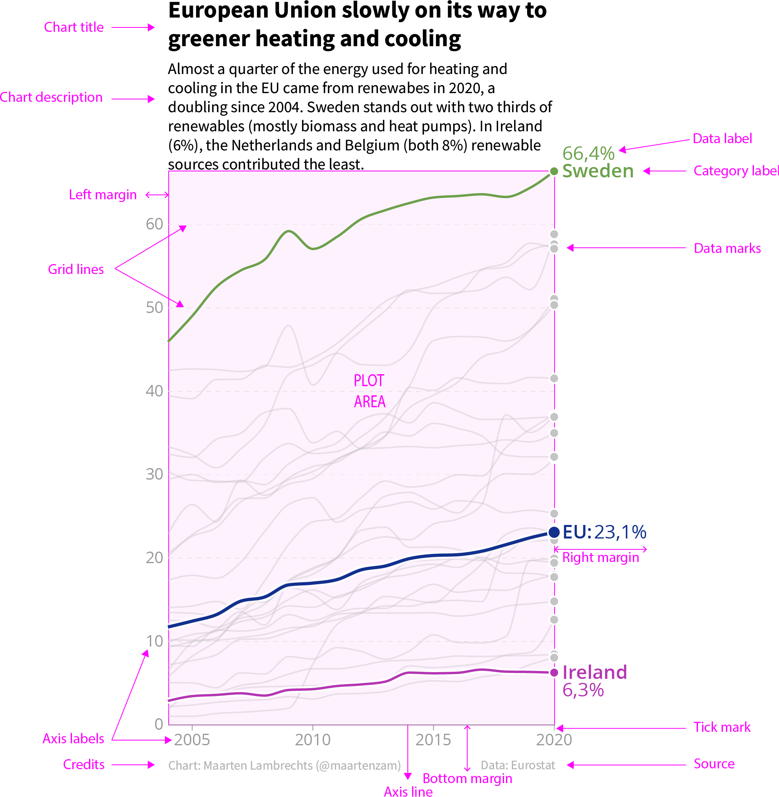
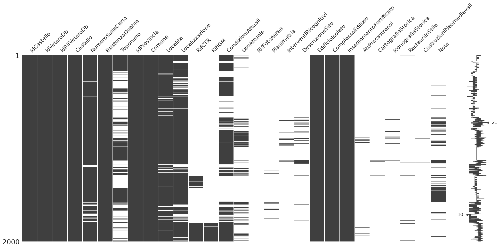

<!-- paginate: False -->

# Digital Humanities e Data Management / Informatica per i Beni Culturali (2025/2026)

## 10. Analisi I

➡️ Mail: [sebastian.barzaghi2@unibo.it](mailto:sebastian.barzaghi2@unibo.it)
➡️ ORCID: [0000-0002-0799-1527](https://orcid.org/0000-0002-0799-1527)
➡️ Sito: [sebastian.barzaghi2](https://www.unibo.it/sitoweb/sebastian.barzaghi2/)

---

<!-- paginate: True -->

### C'era una volta un rapimento...

Aprile 2014.

276 ragazze di una scuola a **Chibok**, nell'est della Nigeria, vengono rapite dal gruppo terroristico Boko Haram.

Poco dopo, _FiveThirtyEight_ esamina la situazione in un articolo, che verrà fortemente criticato per l'utilizzo dei dati nel grafico e per l'analisi del contenuto.

I numeri provengono dal _Global Database of Events, Language and Tone_ (GDELT), un database che raccoglie dati su eventi e località da migliaia di fonti di notizie, tra cui televisione, stampa e pagine web.

---

### Rapimenti o notizie sui rapimenti?

Invece di mostrare i rapimenti giornalieri in Nigeria, il grafico mostra i _rapporti giornalieri_ di notizie sui rapimenti in Nigeria.

Una tendenza in aumento potrebbe essere dovuta a un numero maggiore di rapimenti, ma anche a un numero maggiore di notizie in generale o a una maggiore attenzione dei media verso il fenomeno.

Il problema maggiore è l’assunzione che un singolo evento nel database corrisponda a un singolo rapimento.

---

### Di nuovo, un'interpretazione sbagliata

In seguito, l’articolo è stato aggiornato, precisando: “Questo post dovrebbe fare riferimento ai rapporti dei media sui rapimenti, non ai rapimenti stessi”.

FiveThirtyEight ha preso i dati nel database GDELT per ciò che erano, senza considerare come i dati venissero raccolti e cosa rappresentasse ogni record nel database.

Di conseguenza, tutto questo ha avuto un impatto anche sulla visualizzazione dei dati, rendendola fuorviante.

---

<!-- footer: Koltay, T. (2017). Data literacy for researchers and data librarians. Journal of Librarianship and Information Science, 49(1), 3-14. https://doi.org/10.1177/0961000615616450 -->

### Cosa intendiamo per _data literacy_?

La _data literacy_ è la capacità di leggere, creare, usare, comunicare criticamente i dati.

Dipende dai dati, ma anche dal contesto in cui questi vengono creati ed utilizzati.

Nell’ambito umanistico, consiste nel riconoscimento delle potenzialità della ricerca che si sta portando avanti, essere coscienti dei metodi di ricerca utilizzati, e comprendere il contesto e la provenienza dei dati.

---

<!-- footer: Wickham, H. (2016). Data analysis. In ggplot2: elegant graphics for data analysis (pp. 189-201). Cham: Springer international publishing. https://doi.org/10.1007/978-3-319-24277-4_9 -->

### Cosa intendiamo per _analisi dei dati_?

L'_analisi dei dati_ è il processo di esplorazione ed elaborazione dei dati per identificare pattern e tendenze interessanti.

Obiettivo: trasformare i dati grezzi in informazioni utili.

Dopo l'acquisizione, processamento e pulizia dei dati, bisogna esplorarli ed elaborarli ulteriormente per giungere infine ad una loro interpretazione.

---

<!-- footer: "" -->

### Dati per contenuto (cosa misuriamo)

| Tipo | Definizione | Obiettivo nell'analisi |
| :--- | :--- | :--- |
| **Testuali** | Stringhe di testo, sequenze di caratteri (es. descrizioni di opere d’arte) | Analisi linguistica (frequenze, *sentiment*), identificazione di *pattern* lessicali, ecc. |
| **Spaziali** | Posizioni geografiche, coordinate (es. localizzazione di beni culturali) | Analisi di distribuzione geografica e mappatura. |
| **Temporali** | Espressioni di temporalità (es. date, periodi storici) | Analisi di tendenze, cambiamenti nel tempo e cronologie |
| **Numerici** | Quantità fisiche senza contesto spaziale/temporale (es. altezza, larghezza, misure) | Calcoli statistici, correlazioni. |

---

### Dati per misurabilità (come li trattiamo)

| Tipo | Definizione | Obiettivo nell'analisi |
| :--- | :--- | :--- |
| **Categorici** | Descrivono caratteristiche non misurabili numericamente e non hanno un ordine intrinseco (es. titoli, tipologie, generi di opere d'arte, ecc.) | Classificare gli oggetti e determinare la distribuzione (conteggio) tra le categorie. |
| **Quantitativi** | Hanno un significato quantitativo diretto (es. misure, età, ecc.) | Calcolare medie e correlazioni. |
| **Ordinali** | Simili ai categorici, ma con un ordine implicito e definito (spesso temporale o di scala) (es. anni, livelli di soddisfazione, ecc.) | Analizzare progressioni, tendenze e ordinamento. |

---

### Alcuni tipi di analisi

| Tipo | Oggetto di analisi |
| :--- | :--- |
| **Statistica** | Caratteristiche dei dati a livello micro (es. singola opera), meso (es. un gruppo di opere) e macro (es. evoluzione delle tendenze artistiche nel corso dei secoli) |
| **Temporale** | Cambiamenti delle variabili nel tempo (es. numero di visitatori di un museo nell’arco di cinque anni) |
| **Geospaziale** | Distribuzione spaziale e geografica dei dati (es. mappatura della posizione di beni culturali sul terriorio) |
| **Tematica** | Variabili categoriche, cioè quelle che appartengono a gruppi distinti senza un ordine intrinseco (es. analisi di categorie, classificazione dei beni in base al periodo storico o alla regione geografica di origine) |

---

<!-- footer: Midway, S. R. (2020). Principles of effective data visualization. Patterns, 1(9). https://doi.org/10.1016/j.patter.2020.100141 -->

### Cos’è la _data visualization_?

La _visualizzazione dei dati_ è il processo di rappresentazione visiva dei dati per facilitare la comprensione e la comunicazione dei risultati della loro analisi.

Chi si occupa di progettare e realizzare visualizzazioni dei dati lo fa per comprendere meglio i dati con cui sta lavorando, oppure per trasmettere informazioni, usando elementi del _graphic design_ come il colore, la tipografia, il _layout_, la composizione, ecc.

---

<!-- footer: Behrens, J. T. (1997). Principles and procedures of exploratory data analysis. Psychological Methods, 2(2), 131–160. https://psycnet.apa.org/doi/10.1037/1082-989X.2.2.131 -->

### Exploratory Data Analysis

All'inizio dell'analisi dei dati, dobbiamo esplorare e comprendere i dati a nostra disposizione, in modo da capire cosa abbiamo davanti ed eventualmente aiutarci ad elaborare domande di ricerca.

Uno dei modi più efficaci per familiarizzare con i dati è usare la visualizzazione. In questo caso, parliamo di _Exploratory Data Analysis_ (EDA). Nell'EDA, la visualizzazione occupa un posto rilevante ma secondario rispetto alla sperimentazione e manipolazione dei dati.

---

<!-- paginate: False -->
<!-- footer: "" -->

---

### Sessione pratica: _Exploratory data analysis_ con Pandas

In realtà, abbiamo già iniziato a fare un po' di EDA senza saperlo, con il dataset dei passeggeri del Titanic. Abbiamo preso il dataset, l'abbiamo esaminato, abbiamo posto delle domande e ne abbiamo scoperte altre.

Ora ampliamo questo discorso, vedendo metodi e funzioni che ci permettono di analizzare e visualizzare dati con _pandas_.

## [Link alla sessione pratica](https://colab.research.google.com/drive/1r3de7BuwPVxGdrff1vOWcF-qcaY42zEJ?usp=sharing)

---

# Digital Humanities e Data Management / Informatica per i Beni Culturali (2025/2026)

## 10. Analisi I ✅

➡️ Mail: [sebastian.barzaghi2@unibo.it](mailto:sebastian.barzaghi2@unibo.it)
➡️ ORCID: [0000-0002-0799-1527](https://orcid.org/0000-0002-0799-1527)
➡️ Sito: [sebastian.barzaghi2](https://www.unibo.it/sitoweb/sebastian.barzaghi2/)