<!-- paginate: False -->

# Digital Humanities e Data Management / Informatica per i Beni Culturali (2025/2026)

## 11. Analisi II

➡️ Mail: [sebastian.barzaghi2@unibo.it](mailto:sebastian.barzaghi2@unibo.it)
➡️ ORCID: [0000-0002-0799-1527](https://orcid.org/0000-0002-0799-1527)
➡️ Sito: [sebastian.barzaghi2](https://www.unibo.it/sitoweb/sebastian.barzaghi2/)

---

<!-- paginate: True -->

<!-- footer: -->

### Cosa intendiamo per _Explanatory Data Analysis_?

L'_**Explanatory Data Analysis**_ è _un processo di analisi dei dati usato per mostrare e spiegare pattern nei dati ad altre persone_. 

Chi analizza i dati progetta l'analisi attorno ad una **narrativa**, con l'intenzione di comunicare qualcosa.

Si tratta della naturale conseguenza dell'EDA: una volta che abbiamo esplorato i nostri dati e abbiamo scoperto qualcosa di interessante, vogliamo comunicare quel qualcosa ad un pubblico, possibilmente raccontando una **storia**.

---

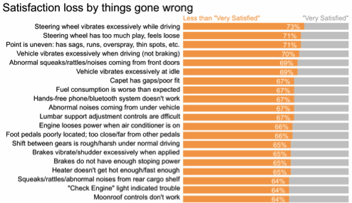

---

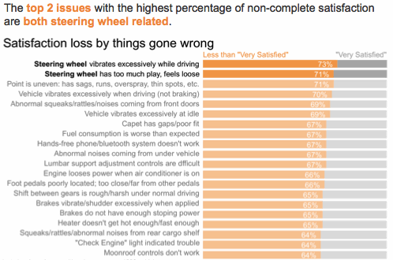

---

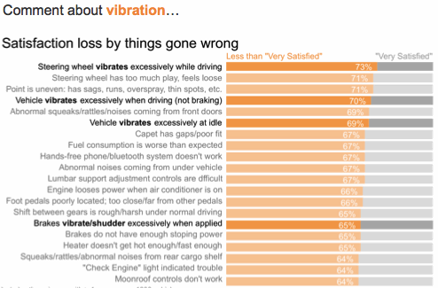

---

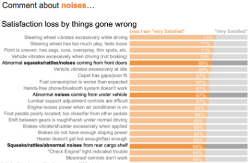

---

<!-- footer: Anderson, K. E. (2010). Storytelling. https://doi.org/10.7282/T35T3HSK  -->

### Cosa rende una storia una buona storia?

Da sempre, le storie vengono raccontate per trasmettere conoscenza.

Una buona storia **ci coinvolge**: innesca la nostra curiosità, ci aggancia, ci emoziona.

Ancora più importante, una storia **ci arricchisce**: ci può insegnare qualcosa sul mondo in cui viviamo, può avere una morale che potrebbe mettere in dubbio le nostre convinzioni, può collegare punti e insegnarci l'esistenza di relazioni inaspettate.

---

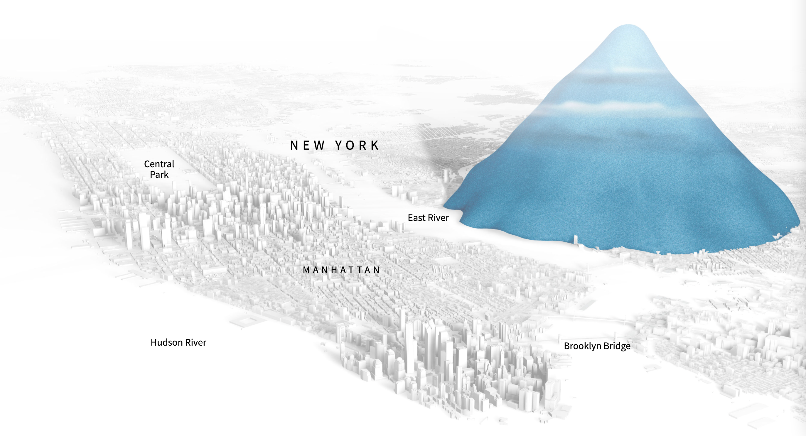

<!-- footer: Tong, C., Roberts, R., Borgo, R., Walton, S., Laramee, R. S., Wegba, K., ... & Ma, X. (2018). Storytelling and visualization: An extended survey. Information, 9(3), 65. https://doi.org/10.3390/info9030065 -->

### Visualizzare i dati e/è raccontare storie

La _data visualization_ insegna qualcosa all'utente finale sui dati e sulla parte di mondo che questi rappresentano, rendendogli il processo di apprendimento il più facile possibile.

Tutti gli elementi di un grafico (tipo, titolo, colori, ecc.) lavorano insieme per rendere la narrativa che vogliamo comunicare chiara, accessibile, richiedendo un minor carico cognitivo da parte dell'utente finale.

---

<!-- footer: "" -->

---

<!-- footer: Sweller, J. (2011). Cognitive load theory. In Psychology of learning and motivation (Vol. 55, pp. 37-76). Academic Press. https://doi.org/10.1016/B978-0-12-387691-1.00002-8 -->

### Attenzione al _cognitive load_

Il concetto di _carico cognitivo_ ci aiuta a capire quanto sia facile o difficile per qualcuno comprendere nuove informazioni.

Per esempio: un numero minore di variabili è più facile da capire rispetto ad un numero maggiore di variabili.

Altro esempio: un numero minore di elementi in un grafico, disposti in maniera prevedibile, rendono un grafico più facile da capire.

---

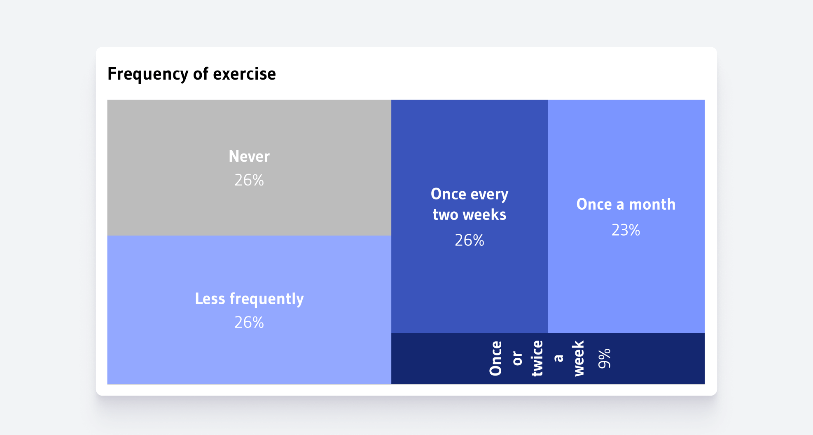

<!-- footer: "" -->

---

### Attenzione al titolo

Guidare il lettore nell'interpretazione di un grafico è molto importante.

Il titolo di un grafico è la prima cosa che le persone guardano quando iniziano a leggere un grafico.

Idealmente, il titolo dovrebbe contenere il messaggio principale del grafico in **10 parole o meno**.

Il titolo dovrebbe essere posizionato sopra il grafico, in grandi dimensioni, e non contraddire quanto espresso dal grafico.

---

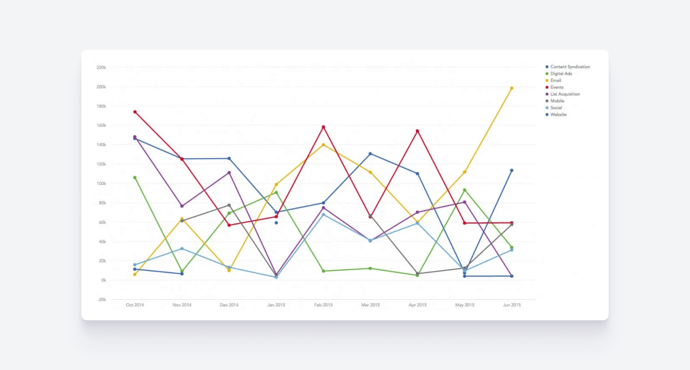

---

<!-- footer: "" -->

### La scelta del grafico dipende da vari fattori

* **Tipo di dato** (per esempio, i grafici a barre e a torta sono ideali per rappresentare dati categorici);

* **Messaggio** (vogliamo parlare di una deviazione, o una correlazione? Vogliamo parlare di una parte del tutto?)

* **Pubblico** (quanto è _data literate_? Sto parlando con esperti di dominio? Considero anche eventuali disabilità?)

http://ft-interactive.github.io/visual-vocabulary/

---

---

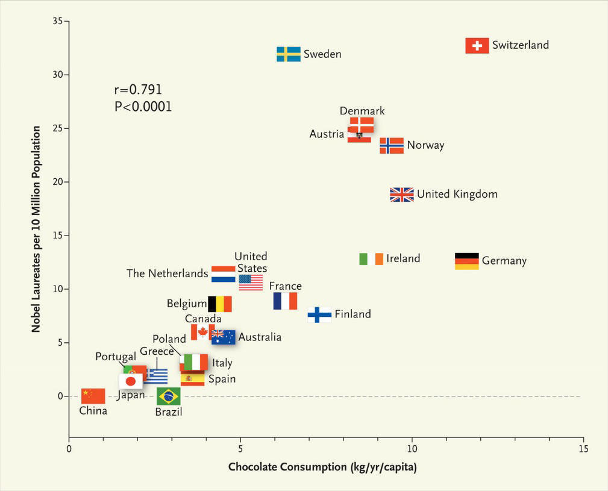

<!-- footer: -->

### Correlazione != Causazione

Esiste una forte correlazione tra il consumo di cioccolato e il numero di premi Nobel vinti da un Paese: i Paesi in cui le persone mangiano più cioccolato vincono più premi Nobel.

Questo significa forse che, per vincere più Premi Nobel, i governi dovrebbero iniziare a implementare campagne di promozione del cioccolato?

Si potrebbe anche concludere da questo grafico che vincere Premi Nobel spinge gli abitanti del Paese vincitore a consumare più cioccolato (conclusione insensata quanto la prima).

---

<!-- footer: -->

### Correlazione != Causazione

**Quando due variabili sono correlate, ciò non significa necessariamente che un cambiamento in una variabile causi il cambiamento nell'altra**. Nel caso del cioccolato e dei Premi Nobel, è in gioco una terza variabile che guida entrambe le variabili mostrate nel grafico: lo sviluppo economico.

Questo ha senso: quando i Paesi diventano più ricchi, i loro abitanti hanno più mezzi finanziari per acquistare beni di lusso (come il cioccolato), e i loro governi hanno più risorse da investire nell'istruzione, il che a lungo termine può portare a vincere più Premi Nobel.

---

<!-- footer: Piantadosi, S., Byar, D. P., & Green, S. B. (1988). The ecological fallacy. American journal of epidemiology, 127(5), 893-904. https://scientificintegrityinstitute.com/wp-content/uploads/2023/03/AJE050188.pdf -->

### La fallacia ecologica

Abbiamo anche ignorato il fatto che i dati mostrati sul grafico sono valori medi. 

Può darsi che le persone che vincono i Premi Nobel mangino pochissimo cioccolato, e che il maggiore consumo di cioccolato delle altre persone nel Paese compensi il basso consumo dei vincitori del Nobel.

Fare un'affermazione a livello individuale basandosi sulle medie di un intero gruppo di persone è chiamata _fallacia ecologica_.

---

<!-- footer: "" -->

### Effetto di un campione troppo piccolo

Sulla base di questo grafico, possiamo concludere che il Liechtenstein è un posto pericoloso in cui vivere, dato che nel 2018 occupava il terzo posto nella classifica dei Paesi europei con il tasso di omicidi più alto.

Ma, per interpretare questi dati correttamente, dobbiamo considerare il campione: qui il tasso di omicidi è calcolato come numero di omicidi per 100.000 abitanti, ma nel 2018 il  Liechtenstein era abitato da sole 38.378 persone. Un tasso del 2,62 rappresenta solo un omicidio.

---

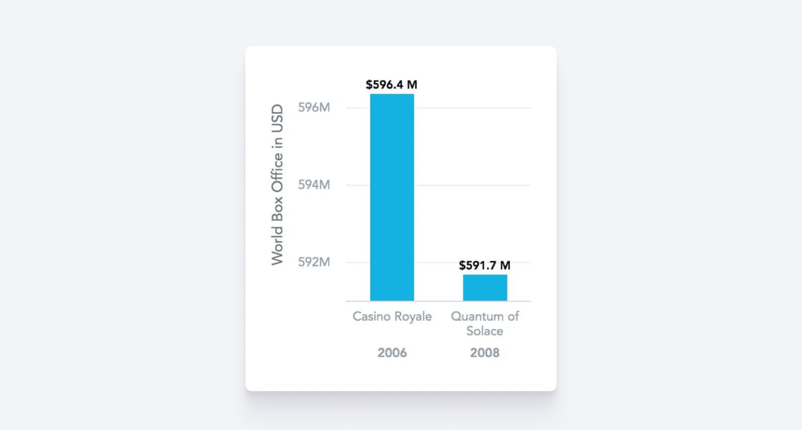

---

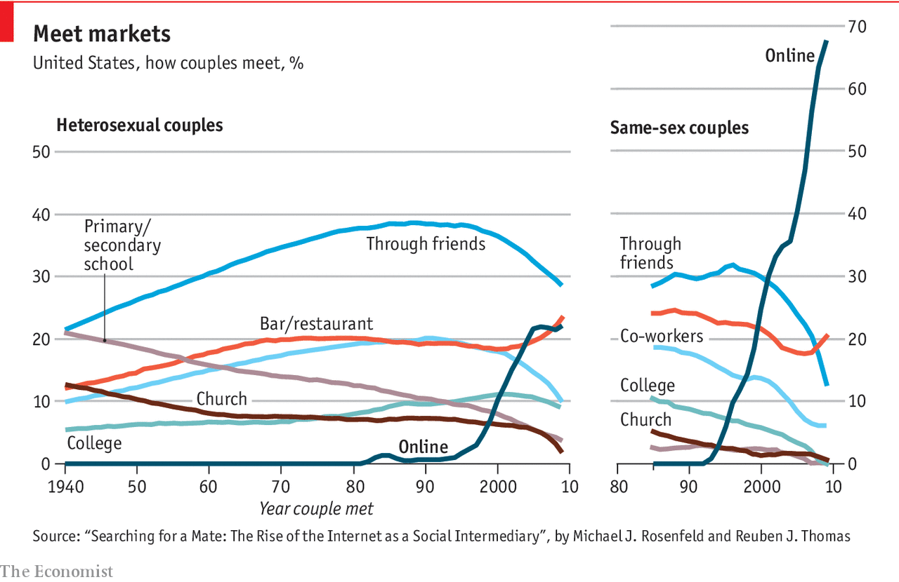

<!-- footer: -->

### Attenzione alle proporzioni

Nel primo grafico, le proporzioni sono completamente sfasate: vengono mostrate  33 persone, di cui 8 che hanno sviluppato dei trombi dopo aver assunto il vaccino di AstraZeneca. Il grafico suggerisce che sia successo a quasi un quarto delle persone vaccinate, quando in realtà è solo lo 0,00005%.

Nel secondo, le proporzioni sono distorte dal layout. Un layout troppo ampio tenderà ad appiattire i trend nelle serie temporali. Un layout alto, con un rapporto larghezza-altezza basso, farà l'opposto e tenderà a sottolineare o persino drammatizzare i trend nei dati.

---

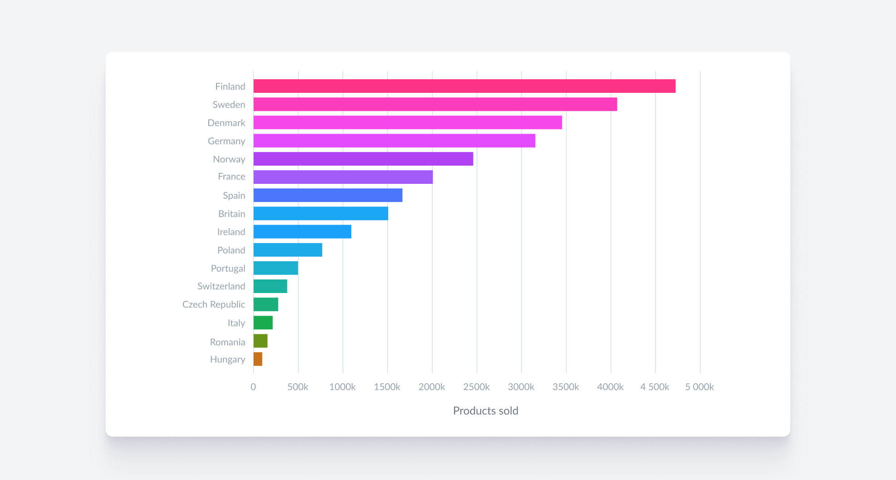

---

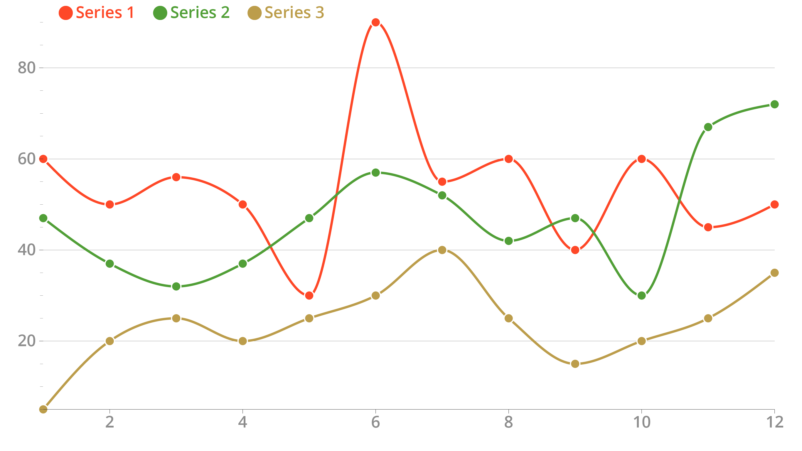

<!-- footer: -->

### Attenzione ai colori

Il primo e più semplice errore in cui cadere quando si parla di colori è quello di usare semplicemente i colori predefiniti dello strumento che stiamo utilizzando per creare la tua visualizzazione.

Lo strumento che stiamo usando non conosce il messaggio che stiamo cercando di comunicare con la visualizzazione, né capisce i nostri dati.

Il secondo grafico non è altro che il primo (composto da linee rosse, verdi e marroni) visto attraverso gli occhi di una persona con daltonismo: tutto diventa indistinguibile.

---

---

<!-- footer: -->

### Attenzione alle caratteristiche dei grafici

La cattiva fama dei grafici a torta è in parte dovuta alla facilità con cui è possibile progettarli male.

I grafici a torta sono usati per mostrare come un totale è composto dalle sue parti. Quindi, le parti della torta dovrebbero sempre ammontare al 100%.

QUensto, in generale, non è un problema, ma inizia a diventare complesso leggere un grafico a torta con molteplici fette. In particolare, i grafici a torta con più di **5 fette** diventano più difficili da leggere.

---

<!-- footer: -->

### Per riassumere

* Non distorcete le proporzioni (es., grafici non troppo stretti né troppo larghi);
* Utilizzate colori appropriati (es., colori accessibili);
* Utilizzate un campione appropriato di dati (non è l'unico elemento da considerare e non c'è una regola universale);
* Utilizzate i tipi di grafico appropriati per i vostri dati e il vostro messaggio;
* Capite i pro e i contro del tipo di grafico che avete scelto;
* Fate attenzione a non suggerire la causalità quando c'è solo correlazione.

---

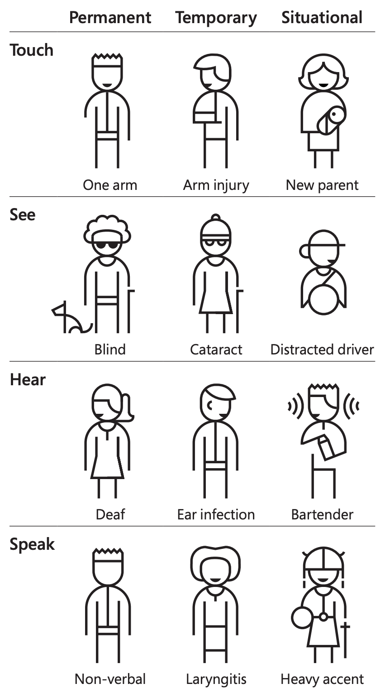

<!-- footer: Yesilada, Y., Brajnik, G., Vigo, M., & Harper, S. (2012). Understanding web accessibility and its drivers. In Proceedings of the international cross-disciplinary conference on web accessibility (pp. 1-9). https://doi.org/10.1145/2207016.22070. -->

### Un appunto sull'accessibilità

L'_**accessibilità**_ è un aspetto della progettazione focalizzato sull'adattamento delle interfacce con cui interagiamo al maggior numero di persone possibile.

L'accessibilità è stata a lungo vista dalla prospettiva delle _disabilità come un attributo personale_, ma ora tiene conto dell'_intero contesto_ in cui gli esseri umani interagiscono con il mondo circostante.

Vengono considerate anche le disabilità temporanee e le circostanze del caso.

---

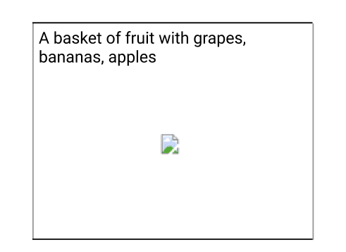

### L'alt text

L'_**alt text**_ è il testo associato ad un'immagine presente in una pagina web che viene letto dagli _screen reader_ e che appare visivamente quando la pagina non riesce a caricare l'immagine.

`TIPO_GRAFICO` di `TIPO_DATI` dove `RISULTATO_DA_COMUNICARE`

Es. _**Grafico a linee** dell'**area bruciata a causa di incendi in Europa** dove **l'area del 2022 è più del doppio della media 2006-2021**_

---

<!-- footer: ""-->

---

### L'Explanatory Data Analysis con Pandas

Dopo l'Exploratory Data Analysis, passiamo all'Explanatory Data Analysis. Vedrete che la distinzione tra le due non è poi così netta, e che spesso e volentieri l'una si mescola con l'altra e viceversa.

Oggi prendiamo di nuovo il dataset di disegni di Liverani e proveremo a rispondere a due domande più specifiche che richiedono un'elaborazione e visualizzazione più curate.

## [Link alla sessione pratica](https://colab.research.google.com/drive/1tuVUaH6ROixqRMsQYoddcbx8Ig7kWvyT?usp=sharing)

---

# Digital Humanities e Data Management / Informatica per i Beni Culturali (2025/2026)

## 11. Analisi II ✅

➡️ Mail: [sebastian.barzaghi2@unibo.it](mailto:sebastian.barzaghi2@unibo.it)
➡️ ORCID: [0000-0002-0799-1527](https://orcid.org/0000-0002-0799-1527)
➡️ Sito: [sebastian.barzaghi2](https://www.unibo.it/sitoweb/sebastian.barzaghi2/)