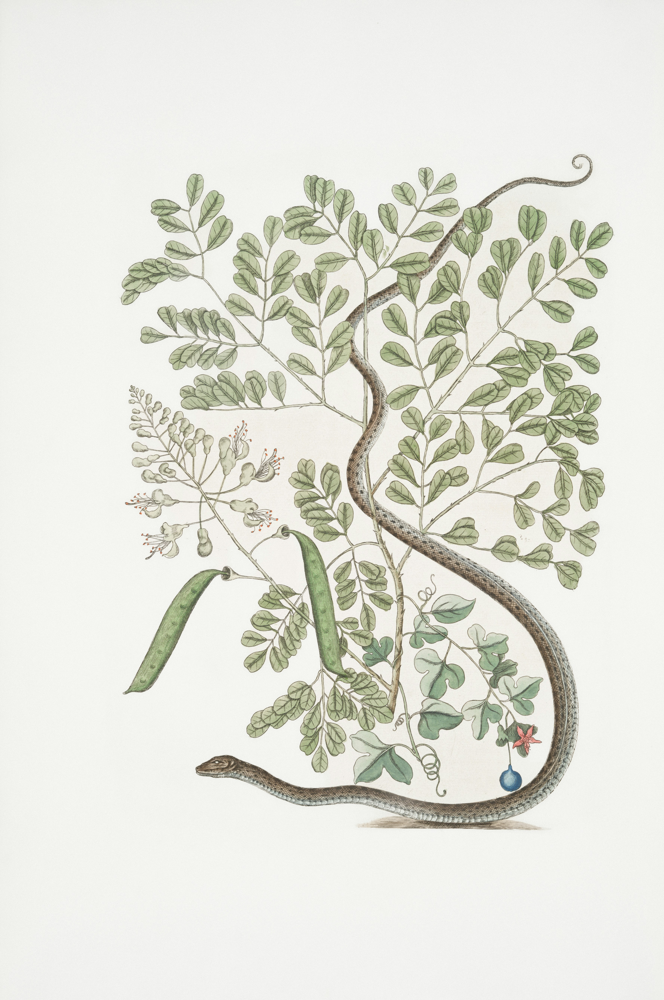
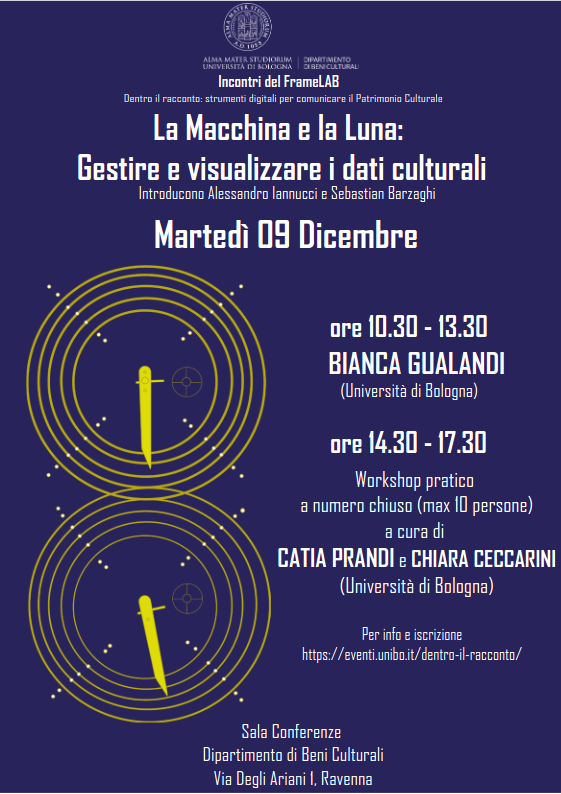
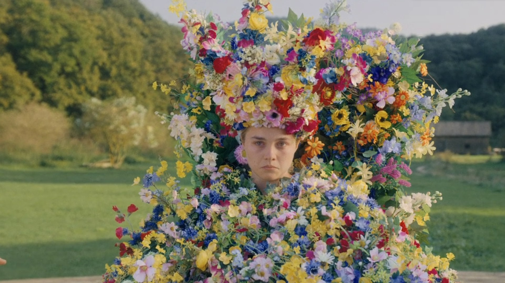
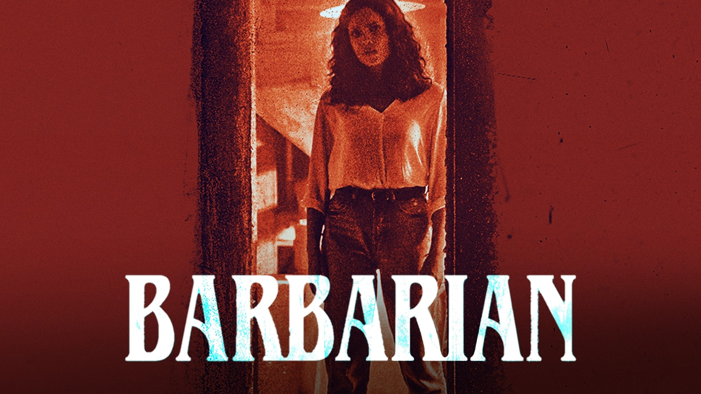
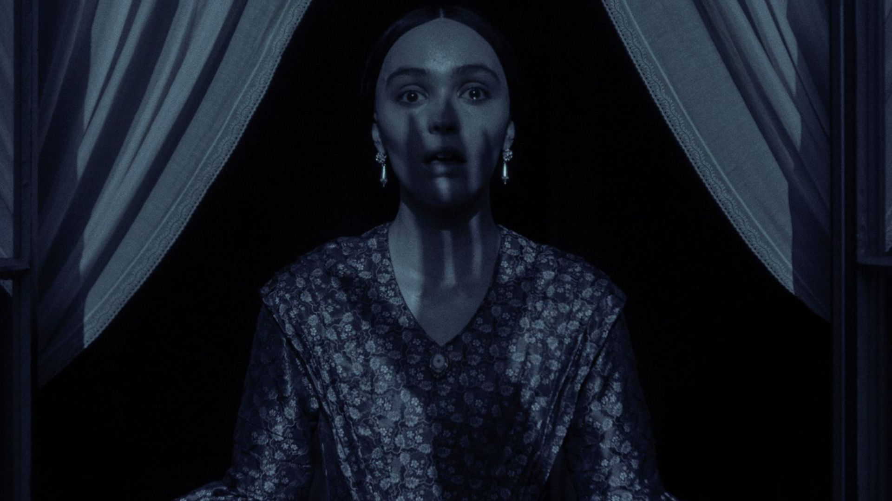

<!-- paginate: False -->

# Digital Humanities e Data Management / Informatica per i Beni Culturali (2025/2026)

## 12. Caso Studio II

➡️ Mail: [sebastian.barzaghi2@unibo.it](mailto:sebastian.barzaghi2@unibo.it)
➡️ ORCID: [0000-0002-0799-1527](https://orcid.org/0000-0002-0799-1527)
➡️ Sito: [sebastian.barzaghi2](https://www.unibo.it/sitoweb/sebastian.barzaghi2/)

---

<!-- paginate: False -->

### Comunicazione: _La Macchina e la Luna_

**Martedì 9 dicembre**, in **Via degli Ariani 1**, ci sarà un seminario dedicato interamente ai dati nel patrimonio culturale.

La mattina (10:30-13:30) sarà dedicata all'intervento di una data steward di Unibo. Si può partecipare liberamente, anche online.

Nel pomeriggio (14:30-17:30) ci sarà un workshop sulla visualizzazione dei dati.

[Link all'evento](https://eventi.unibo.it/dentro-il-racconto/la-macchina-e-la-luna)

[Link al form per il workshop pomeridiano](https://docs.google.com/forms/d/1G70sfWMOabFysGxPnENktiSkakwXteofbYLs3Sw-now/)

---

### Caso studio: Il cinema horror secondo TMDB

Nelle lezioni precedenti, abbiamo imparato ad usare Pandas per il processamento e l'analisi dei dati.

Oggi faremo un esercizio esteso che ci permetterà di mettere insieme tutte queste conoscenze, simulando gran parte del processo che verrà richiesto per l'esame. 

Lavoreremo su un dataset estratto dal _The Movie Database_ che copre la produzione di film horror dal 1950 fino al 2022.

---

### Processo

1. Caricamento e ispezione del dataset: importiamo le librerie, prendiamo il CSV e lo trasformiamo in DataFrame, usiamo `.info()` e altri metodi per studiare la tabella;;
2. Processamento: puliamo i dati, convertiamo i tipi, ecc.;
3. Exploratory Data Analysis: capiamo cosa ci può essere di interessante tra i dati;
4. Explanatory Data Analysis: analizziamo e visualizziamo quelle cose interessanti che abbiamo individuato.

## [Link alla sessione pratica](https://colab.research.google.com/drive/1Om0YmirHjQQ0ztHNLEuU8yKnSd1d6jCq?usp=sharing)

---

<!-- paginate: False -->
<!-- footer: "" -->

# Digital Humanities e Data Management / Informatica per i Beni Culturali (2025/2026)

## 12. Caso Studio II ✅

➡️ Mail: [sebastian.barzaghi2@unibo.it](mailto:sebastian.barzaghi2@unibo.it)
➡️ ORCID: [0000-0002-0799-1527](https://orcid.org/0000-0002-0799-1527)
➡️ Sito: [sebastian.barzaghi2](https://www.unibo.it/sitoweb/sebastian.barzaghi2/)
