<!-- paginate: False -->


# Digital Humanities e Data Management / Informatica per i Beni Culturali (2025/2026)

## 13. Preservazione e Condivisione I

➡️ Mail: [sebastian.barzaghi2@unibo.it](mailto:sebastian.barzaghi2@unibo.it)
➡️ ORCID: [0000-0002-0799-1527](https://orcid.org/0000-0002-0799-1527)
➡️ Sito: [sebastian.barzaghi2](https://www.unibo.it/sitoweb/sebastian.barzaghi2/)

---

<!-- paginate: True -->

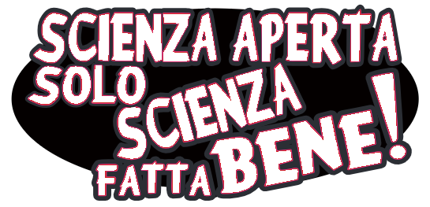

<!-- footer: UNESCO (2021). UNESCO Recommendation on Open Science. https://doi.org/10.54677/MNMH8546. -->

### La scienza fatta bene

L'_Open Science_ è un insieme di movimenti e pratiche che mirano a rendere la conoscenza scientifica più trasparente, accessibile e riutilizzabile per tutti.

Tra i vari motivi a supporto abbiamo:

* Garanzia di maggiore scientificità;
* Appartenenza a tutti della conoscenza scientifica e dei suoi risultati;
* Massimizzazione della possibilità per le singole persone per citazioni, collaborazioni e finanziamenti.

---

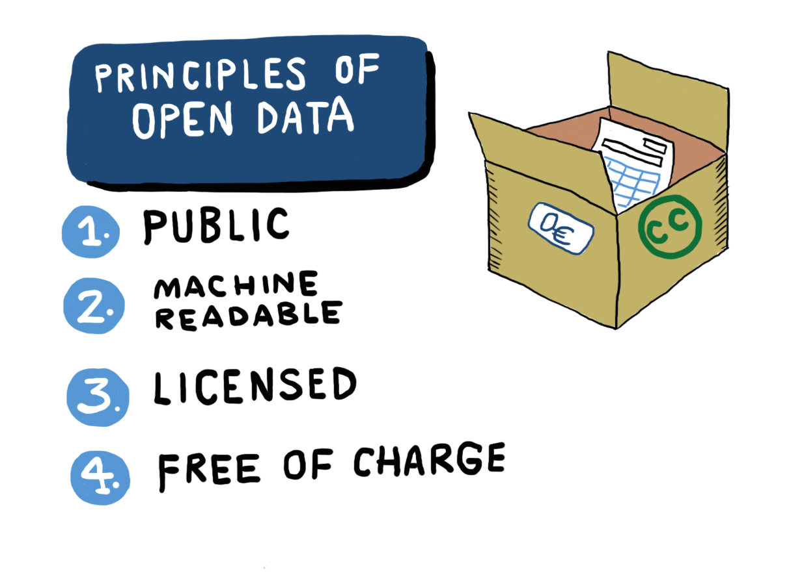

<!-- footer: Wuttke, U. (2018, novembre 19). Introduction to Humanities Research Data Management. Zenodo. https://doi.org/10.5281/zenodo.1491250. -->

### La Scienza Aperta viene costruita sui dati aperti

Fare Scienza Aperta vuol dire creare, usare e condividere dati aperti, cioé dati liberamente disponibili per l’accesso e il (ri)utilizzo.

Idealmente, i dati non dovrebbero avere restrizioni da copyright, brevetti o altri meccanismi di controllo.

Nella realtà, bisogna puntare ad avere dati [aperti quanto più possibile, chiusi secondo necessità](https://rea.ec.europa.eu/open-science_en).

---

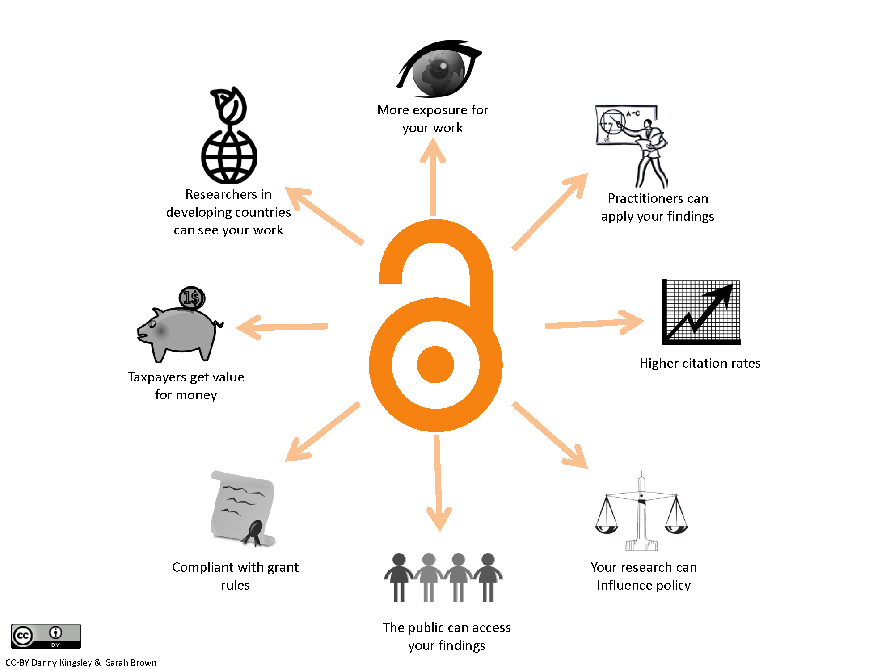

###  Decidere cosa e come condividere

Esistono diversi modelli per la condivisione dei dati, tra cui:

* Accesso completamente aperto (tramite repository accessibili al pubblico);
* Accesso controllato (alle persone autorizzate dopo un processo di valutazione);
* Accesso esclusivo (solo al team di ricerca coinvolto nel processo di gestione dei dati).

---

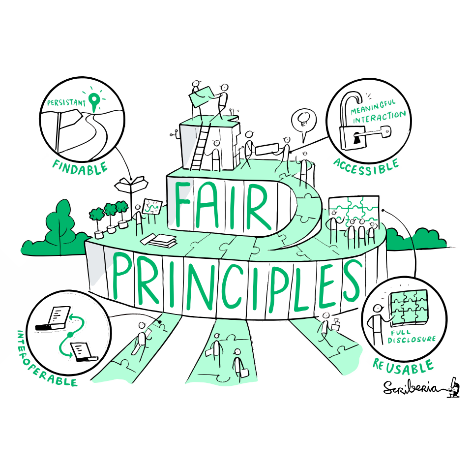

### Riprendiamo i principi FAIR

- **Reperibilità**: I (meta)dati dovrebbero essere facili da trovare sia per gli esseri umani che per i computer;
- **Accessibilità**: Una volta che un potenziale utente trova i dati richiesti, deve sapere come è possibile accedervi;
- **Interoperabilità**: I dati devono poter interagire con altri dati, applicazioni o flussi di lavoro;
- **Riusabilità**: I dati dovrebbero essere ben descritti per poter essere replicati e/o combinati in contesti diversi.

---


<!-- footer: Rocca-Serra, P., Sansone, S.-A., Gu, W., Welter, D., Abbassi Daloii, T., & Portell-Silva, L. (2022). D2.1 FAIR Cookbook. Zenodo. https://doi.org/10.5281/zenodo.6783564. -->

### Reperibilità

Il primo passo per (ri)utilizzare i dati è trovarli.

Per essere reperibili, i dati dovrebbero essere identificati in maniera univoca e persistente.

I dati sono reperibili tramite i metadati e identificabili e localizzabili in maniera univoca tramite meccanismi di identificazione standard.

Esempio: https://doi.org/10.1007/978-3-031-77847-6_11

---


<!-- footer: Rocca-Serra, P., Sansone, S.-A., Gu, W., Welter, D., Abbassi Daloii, T., & Portell-Silva, L. (2022). D2.1 FAIR Cookbook. Zenodo. https://doi.org/10.5281/zenodo.6783564. -->

### Accessibility

Se il primo passo per (ri)utilizzare i dati è trovarli, il secondo è sapere come e a quali condizioni possono essere accessibili. I dati sono accessibili quando possono essere sempre recuperati online sia dalle macchine che dagli esseri umani:

* Dietro appropriata autorizzazione (se necessaria);
* Tramite un protocollo ben definito (es. HTTPS, RESTful API, ecc.).

Se i dati non sono aperti, lo devono essere almeno i metadati che li descrivono.

---


<!-- footer: Rocca-Serra, P., Sansone, S.-A., Gu, W., Welter, D., Abbassi Daloii, T., & Portell-Silva, L. (2022). D2.1 FAIR Cookbook. Zenodo. https://doi.org/10.5281/zenodo.6783564. -->

### Interoperability

I dati di solito devono essere integrati con altri dati e devono essere interoperabili con applicazioni o flussi di lavoro, e questo è possibile se:

* I (meta)dati sono azionabili dalle macchine;
* I (meta)dati utilizzano standard condivisi per formati e contenuti;

I (meta)dati devono quindi essere sintatticamente analizzabili e semanticamente comprensibili dalle macchine.

---


<!-- footer: Rocca-Serra, P., Sansone, S.-A., Gu, W., Welter, D., Abbassi Daloii, T., & Portell-Silva, L. (2022). D2.1 FAIR Cookbook. Zenodo. https://doi.org/10.5281/zenodo.6783564. -->

### Reusability

Ottimizzare il riutilizzo dei dati è l’obiettivo finale. I (meta)dati dovrebbero:

* Essere conformi agli altri principi FAIR;
* Essere sufficientemente descritti per poter essere compresi e (semi-)automaticamente integrati con altri dati e processi;
* Avere licenze il meno restrittive possibile;
* Fare riferimento alle loro fonti in modo da permetterne una corretta citazione.

---

<!-- paginate: False -->

<!-- footer: "" -->


---

<!-- footer: Perez-Riverol, Y., Gatto, L., Wang, R., Sachsenberg, T., Uszkoreit, J., Leprevost, F. D. V., ... & Vizcaíno, J. A. (2016). Ten simple rules for taking advantage of Git and GitHub. PLoS computational biology, 12(7), e1004947. https://doi.org/10.1371/journal.pcbi.1004947 -->

### Cosa intendiamo per _verisonamento_?

Il versionamento è la gestione delle modifiche nei file. La maggior parte delle persone utilizza una qualche forma di versionamento per gestire i propri file.

```
tesi brutta.docx
tesi brutta2.docx
tesi vera finale.docx
```
Aggiungere informazioni di contesto facilmente ordinabili (come le date) rende leggermente più facile seguire lo storico delle modifiche.

```
tesi_2024-03-20.docx
tesi_2024-05-06.docx
tesi_2024-05-10.docx
```

---

<!-- paginate: True -->

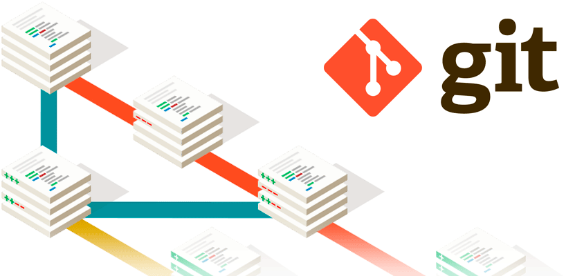

<!-- footer: Ram, K. (2013). Git can facilitate greater reproducibility and increased transparency in science. Source code for biology and medicine, 8, 1-8. https://doi.org/10.1186/1751-0473-8-7 -->

### Git 

Un ottimo sistema di versionamento descrittivo, permissivo, e collaborativo.

Permette di tenere traccia delle modifiche apportate ai file in un progetto.

In pratica, consente di salvare diverse versioni di un file o di un intero progetto nel tempo, così possiamo vedere cosa è cambiato, chi ha fatto le modifiche e quando.

In genere usato tramite linea di comando, ma anche tramite app e altri servizi.

---


<!-- footer: Blischak, J. D., Davenport, E. R., & Wilson, G. (2016). A quick introduction to version control with Git and GitHub. PLoS computational biology, 12(1), e1004668. https://doi.org/10.1371/journal.pcbi.1004668 -->

### GitHub

[GitHub](https://github.com/) è una piattaforma online per repository Git. 

Permette di caricare, condividere e collaborare su progetti Git con altre persone.

Servizio fondamentale per sviluppatori.

Sempre più importante anche per gestire i flussi di lavoro della pubblicazione online, i libri di testo aperti, e  altri progetti di natura più umanistica.

---


<!-- footer: Blischak, J. D., Davenport, E. R., & Wilson, G. (2016). A quick introduction to version control with Git and GitHub. PLoS computational biology, 12(1), e1004668. https://doi.org/10.1371/journal.pcbi.1004668 -->

### Come interagiremo con GitHub

* Creazione di un account;
* Creazione di una nuova _repo_ pubblica (in pratica, la cartella del progetto);
* Creazione di un file README;
* Connessione Colab-Github (`File` > `Salva una copia in GitHub`).

Con Git e GitHub è possibile fare moltissime cose in più, ma ora limitiamoci allo stretto necessario per questo corso e per il progetto d'esame.

---

<!-- paginate: False -->
<!-- footer: "" -->

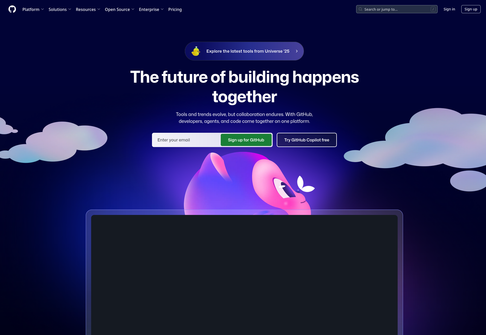

---

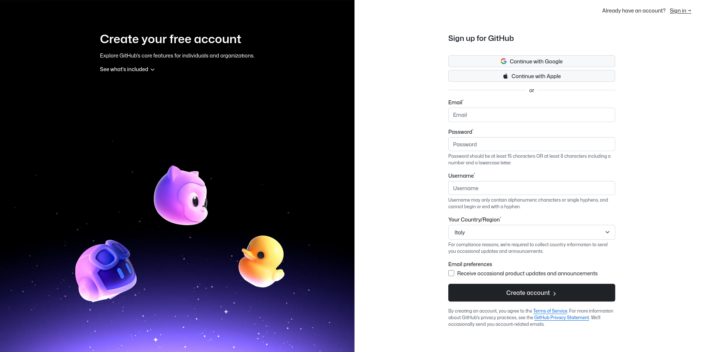

---

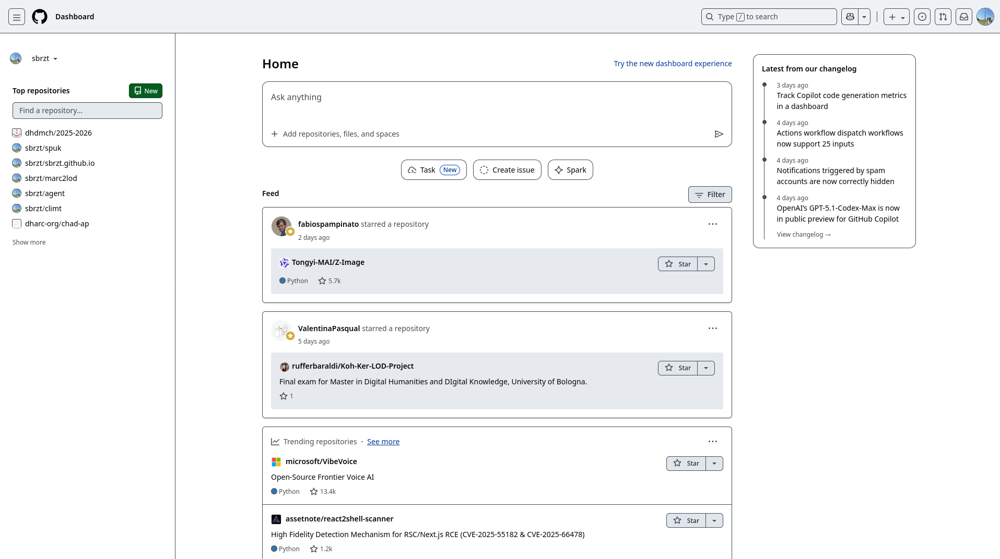

---

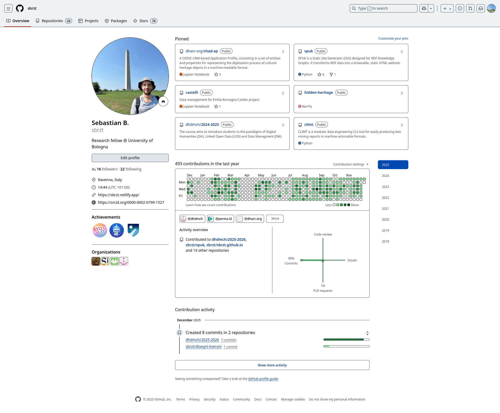

---

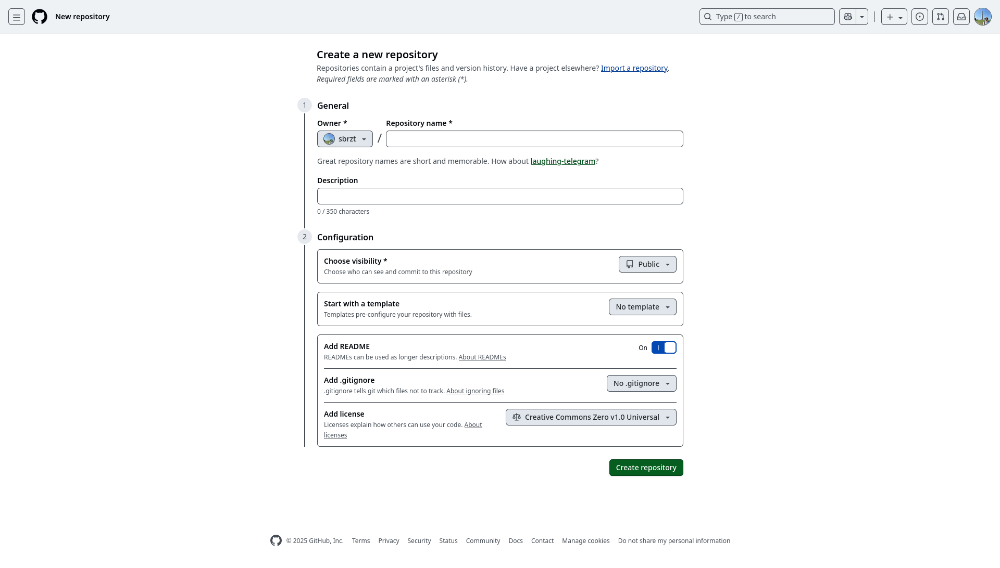

---

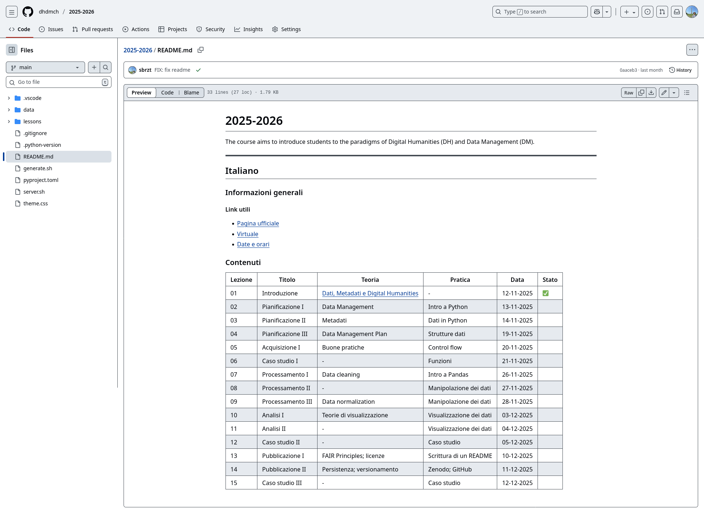

---

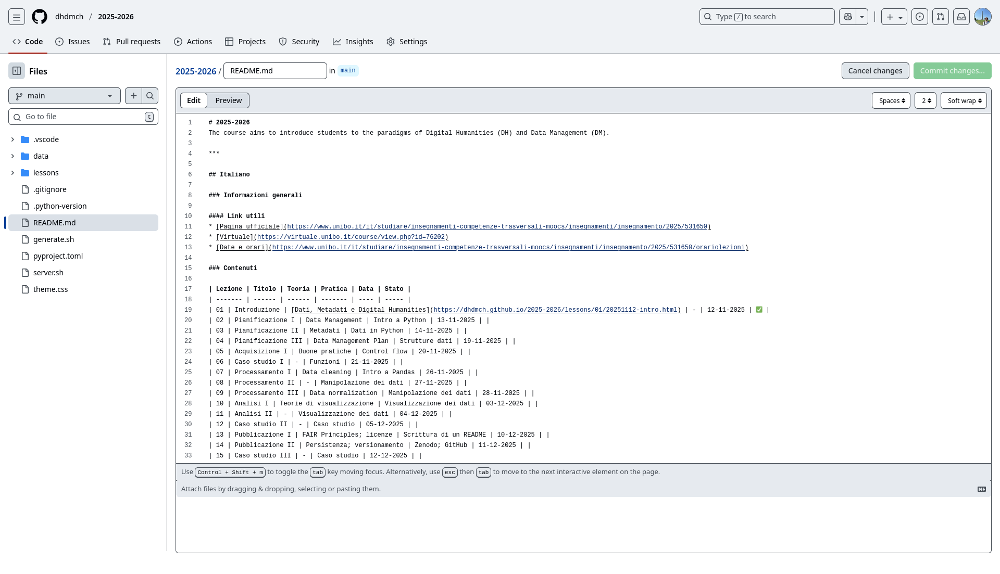

---

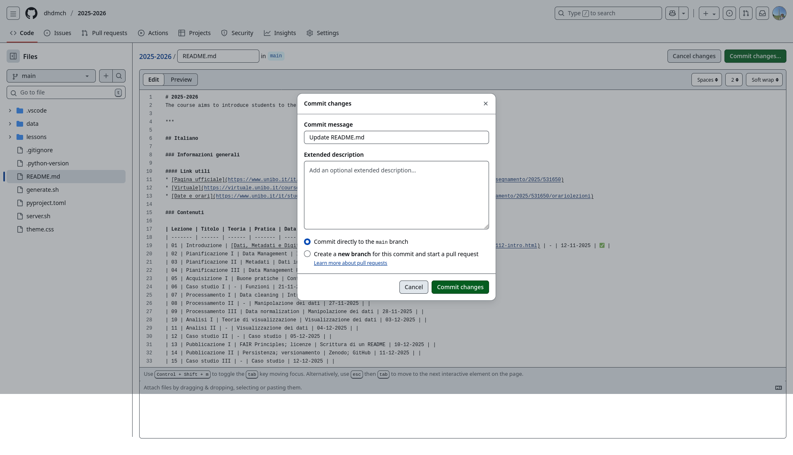

---

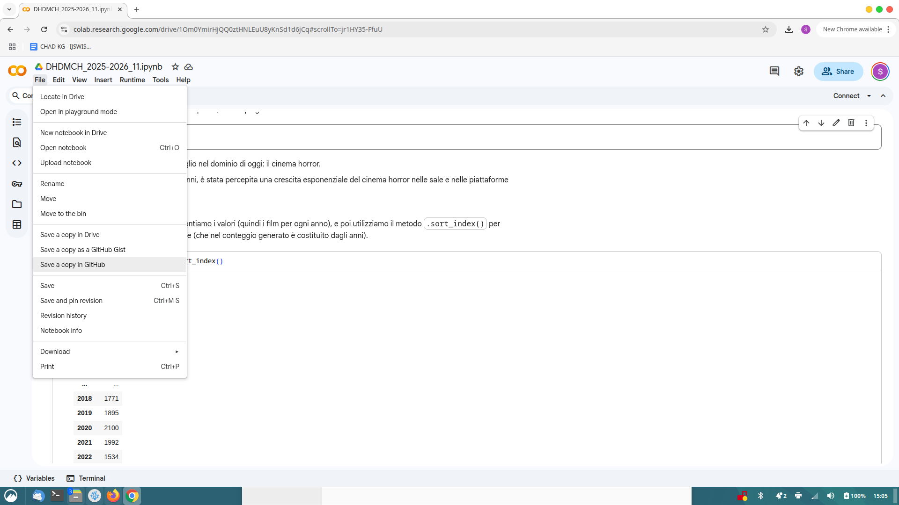

---

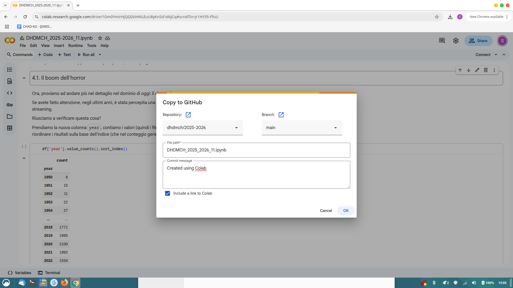

---

<!-- paginate: True -->


<!-- footer: Gruber, J. (2012). Markdown: Syntax. URL http://daringfireball.net/projects/markdown/syntax -->


### Markdown

Markdown è un linguaggio che consente di scrivere testi formattati utilizzando una sintassi semplice e facilmente leggibile.

Viene utilizzato in vari contesti, come la scrittura tecnica su piattaforme come GitHub, e anche per creare contenuti in sistemi di gestione dei contenuti come Jekyll e Hugo.

La sua sintassi intuitiva lo rende ideale per scrivere in modo rapido e strutturato, ed è facilmente convertibile in HTML o altri formati.


---

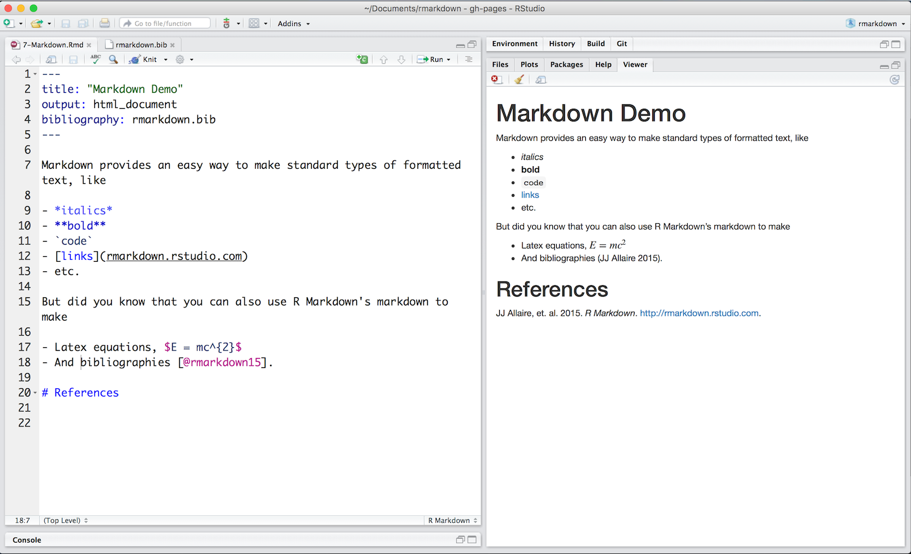

<!-- footer: Gruber, J. (2012). Markdown: Syntax. URL http://daringfireball.net/projects/markdown/syntax -->

### Per visualizzare il risultato

Abbiamo già visto il Markdown in azione: tutte le parti discorsive dei nostri _notebook_ sono completamente scritte in Markdown. 

(Anche queste slide!)

Generalmente, visualizzare immediatamente la resa di un testo in Markdown non è difficile, ma nel nostro caso non è immediato…

Possiamo usare Colab, oppure questo: https://markdownlivepreview.com/

---

<!-- paginate: False -->

### Sintassi

**Corsivo**: possiamo racchiudere le parole in singoli trattini bassi `_` oppure asterischi `*`.

Esempio _in corsivo_. ⬅️ `Esempio _in corsivo_.`

Esempio *in corsivo*. ⬅️ `Esempio *in corsivo*.`

**Grassetto**: possiamo racchiudere le parole con due trattini bassi `__` oppure asterischi `**`.

Esempio __in grassetto__. ⬅️ `Una parola __in grassetto__.`

Esempio **in grassetto**. ⬅️ `Una parola **in grassetto**.`

Possiamo usare sia il corsivo che il grassetto nella stessa riga. Non importa in quale ordine mettiamo gli asterischi o i trattini bassi, a patto che sia coerente.

---

### Sintassi

**Intestazioni**: le intestazioni sono precedute da uno o più cancelletti `#`:

# Intestazione 1 ⬅️ `# Intestazione 1` 

## Intestazione 2 ⬅️ `## Intestazione 2` 

### Intestazione 3 ⬅️ `### Intestazione 3` 

#### Intestazione 4 ⬅️ `#### Intestazione 4` 

##### Intestazione 5 ⬅️ `##### Intestazione 5` 

###### Intestazione 6 ⬅️ `###### Intestazione 6` 

---

### Sintassi

**Link**: racchiudiamo il testo del link tra parentesi quadre `[ ]` e subito dopo racchiudiamo l’URL tra parentesi tonde `( )`.

Link al mio [sito](https://sbrzt.netlify.app). ⬅️ `Link al mio [sito](https://sbrzt.netlify.app).` 

**Immagini**: inseriamo un punto esclamativo `!`, racchiudiamo il testo alternativo tra parentesi quadre `[ ]`, e poi racchiudi il link dell’immagine tra parentesi tonde `( )`.

``

**Citazione**: inseriamo un simbolo "maggiore di" `>` prima del testo.

> Questa è una citazione ⬅️ `> Questa è una citazione`

---

### Sintassi

**Liste puntate**: precediamo ogni elemento della lista con un asterisco `*` o un trattino `-`, seguito da uno spazio.

```
* Primo elemento
* Secondo elemento
* Terzo elemento
```

**Liste ordinate**: precediamo ogni elemento della lista con un numero puntato.

```
1. Primo elemento
2. Secondo elemento
3. Terzo elemento
```

---

### Sintassi

**Tabelle**: usiamo il simbolo _pipe_ `|` per le linee verticali e almeno tre trattini `-` per separare le intestazioni delle colonne dal resto.

```
| Intestazione 1            | Intestazione 2  |
| ------------------------- | --------------- |
| Titolo                    | Testo           |
| Paragrafo                 | Testo           |
```

| Intestazione 1            | Intestazione 2  |
| ------------------------- | --------------- |
| Titolo                    | Testo           |
| Paragrafo                 | Testo           |

---

<!-- paginate: True -->
<!-- footer: "" -->

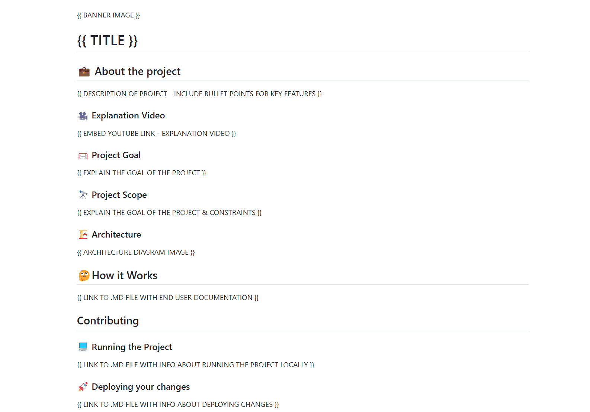

### Il file README

Un README è un file di testo che introduce e spiega un progetto, fornendo informazioni necessarie a contestualizzare e comprendere i contenuti, le metodologie, e i risultati.

Si tratta di uno strumento molto semplice ed efficace per comunicare il proprio progetto ad altre persone.

Solitamente, è il primo file che viene creato (rigorosamente nella cartella principale), ed è uno dei file da aggiornare in continuazione nel corso del tempo.

---

### Creiamo un file README partendo da questo template

```
# Nome del progetto
## Descrizione
Il cosa, perché e come del progetto. Qual'è la motivazione? Quale 
problema stiamo risolvendo? Cosa abbiamo imparato?
## Fonti
Citazione e link alle fonti dei dati utilizzati
## Metodi e strumenti
Metodologie e/o strumenti utilizzati
## Credits
Contatti di tutte le persone coinvolte con relativi ruoli
## Licenza
Nome e link alla licenza
```

---

<!-- paginate: False -->
<!-- footer: "" -->


# Digital Humanities e Data Management / Informatica per i Beni Culturali (2025/2026)

## 13. Preservazione e Condivisione I ✅

➡️ Mail: [sebastian.barzaghi2@unibo.it](mailto:sebastian.barzaghi2@unibo.it)
➡️ ORCID: [0000-0002-0799-1527](https://orcid.org/0000-0002-0799-1527)
➡️ Sito: [sebastian.barzaghi2](https://www.unibo.it/sitoweb/sebastian.barzaghi2/)