<!-- paginate: False -->

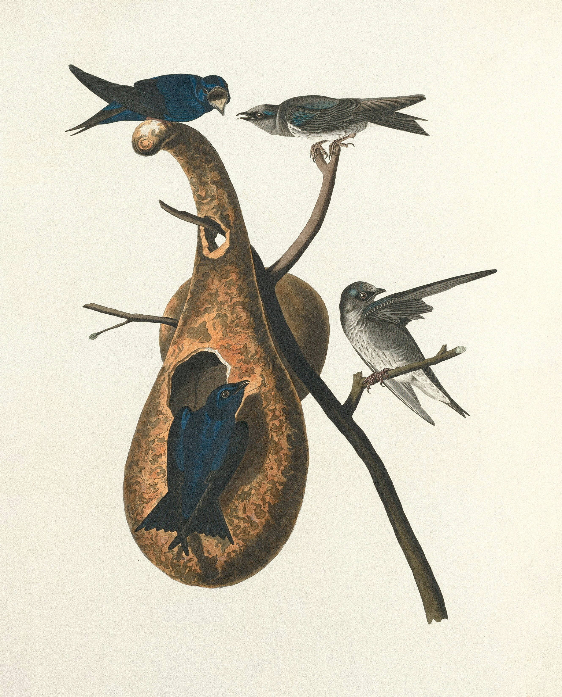

# Digital Humanities e Data Management / Informatica per i Beni Culturali (2025/2026)

## 14. Preservazione e Condivisione II

➡️ Mail: [sebastian.barzaghi2@unibo.it](mailto:sebastian.barzaghi2@unibo.it)
➡️ ORCID: [0000-0002-0799-1527](https://orcid.org/0000-0002-0799-1527)
➡️ Sito: [sebastian.barzaghi2](https://www.unibo.it/sitoweb/sebastian.barzaghi2/)

---

### Rilevazione questionari

https://gestioneval.unibo.it/rilevazioni-docenti

http://val.unibo.it 

---

<!-- paginate: True -->

<!-- footer: Buddenbohm, S., De Jong, M., Minel, J. L., & Moranville, Y. (2021). Find research data repositories for the humanities-the data deposit recommendation service. International Journal of Digital Humanities, 1(3), 343-362. https://doi.org/10.1007/s42803-021-00030-7 -->

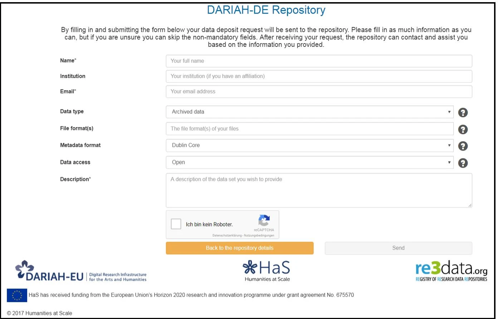

### Archiviare i dati

Possiamo farlo in momenti diversi: quando pubblichiamo, quando finiamo un progetto, oppure ad intervalli regolari.

Spesso dovremo selezionare i dati da archiviare, sulla base della loro utilità e di eventuali ostacoli (legali, tecnici, etici) alla loro archiviazione.

Se i dati vanno a popolare un sito istituzionale o di progetto, è comunque utile archiviarli a lungo termine in una _repository_. 

---

<!-- footer: Alma Mater Studiorum – Università di Bologna & ARIC – Area Ricerca, Settore Coordinamento Servizi Ricerca e Progetti di Area, Data Steward (2024). Linee guida di Ateneo per la gestione dei dati della ricerca. https://www.unibo.it/it/allegati/Lineeguidaricerca_v4_HR.pdf -->

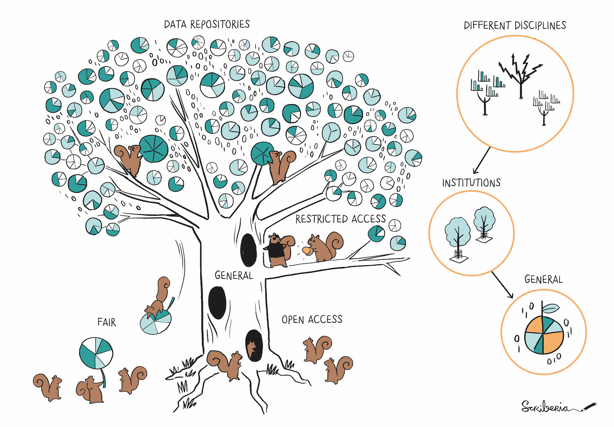

### Cosa intendiamo per _repository_?

Una _repository_ è un'infrastruttura in cui gli oggetti digitali di ricerca sono archiviati per la loro preservazione e condivisione a lungo termine.

Le _repository_ sono progettate per essere affidabili e stabili, tramite l'utilizzo di identificatori persistenti (PID), meccanismi di assegnazione di metadati (secondo standard internazionali) e di licenze ai dataset, e la presenza di policy di preservazione stringenti (es. formati permessi).

---

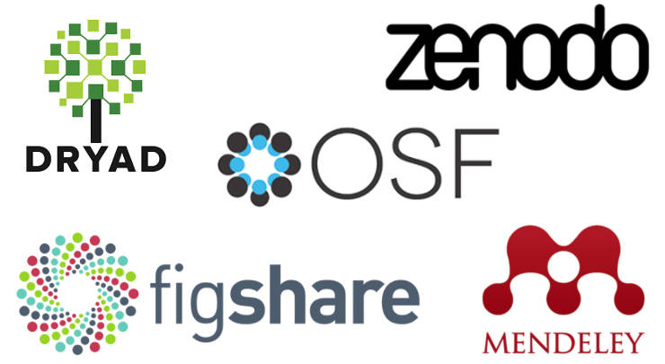

### Come scegliamo una _repository_?

Possiamo utilizzare servizi come [re3data](https://www.re3data.org/) per cercare una o più _repository_ adatte alle nostre necessità. Esistono _repository_:
* **Disciplinari**: per descrivere i dati usando metadati specifici e parlando a precise comunità (es. [Morphosource](https://www.morphosource.org/));
* **Istituzionali**: hanno servizi di supporto, validazione e curatela (es. [AMS Acta](http://amsacta.unibo.it/) e [AMS Historica](https://historica.unibo.it/home));
* **Generaliste**: permettono la descrizione e l'archiviazione di dati eterogenei (es. [Zenodo](https://zenodo.org/)).

---

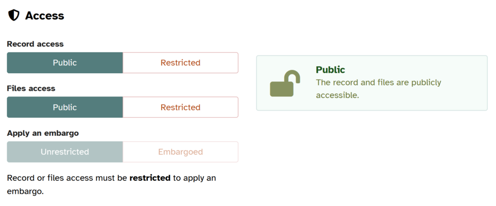

### Scegliere il livello di accesso è un punto essenziale

I livelli di accesso possono essere:

* **Aperto**: il dataset è apertamente accessibile a chiunque lo voglia utilizzare;
* **Ristretto**: il dataset è disponibile previa autorizzazione da parte di chi ha depositato i dati;
* **Embargo**: il dataset è chiuso per un tempo limitato, al termine del quale diventa aperto.

---

<!-- paginate: False -->

<!-- footer: "" -->

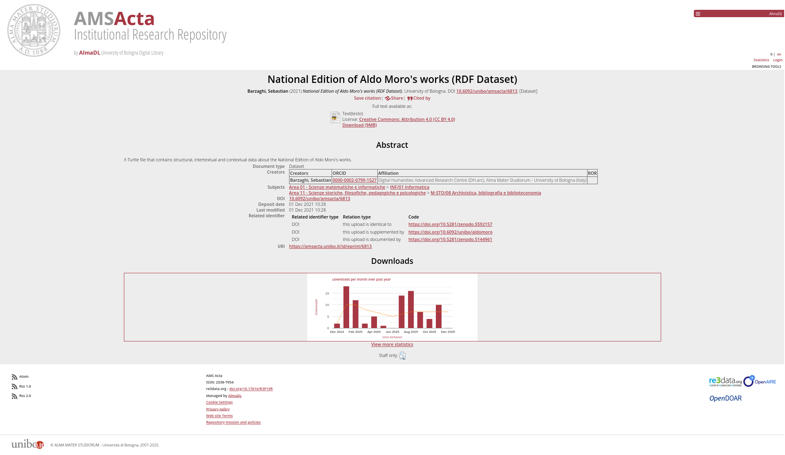

---

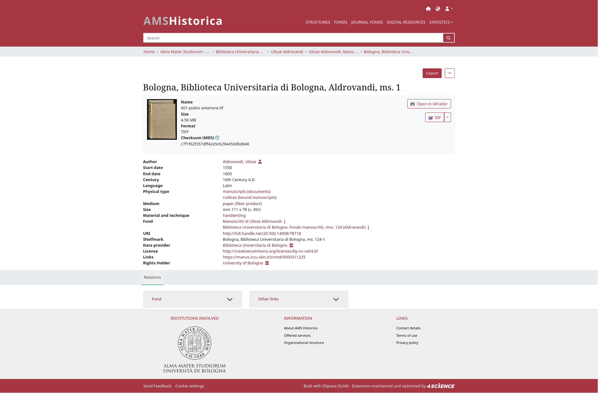

---

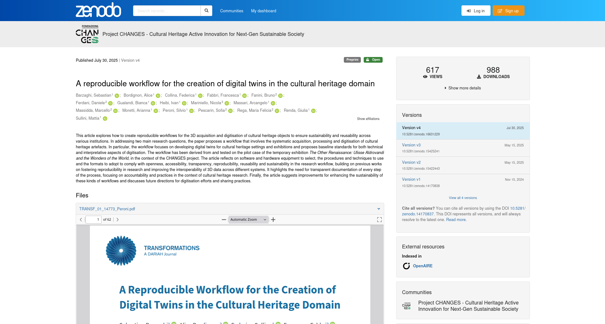

---

<!-- paginate: True -->

<!-- footer: Alma Mater Studiorum – Università di Bologna & ARIC – Area Ricerca, Settore Coordinamento Servizi Ricerca e Progetti di Area, Data Steward (2024). Linee guida di Ateneo per la gestione dei dati della ricerca. https://www.unibo.it/it/allegati/Lineeguidaricerca_v4_HR.pdf -->

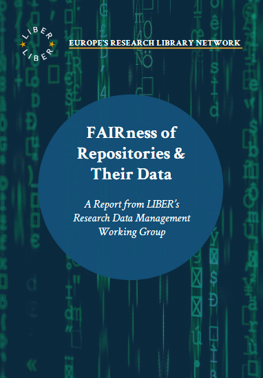

### _Repository_ e FAIR

Usare una _repository_ è un elemento fondamentale di _FAIRness_.

Ogni dataset depositato è accompagnato da metadati, tra cui un identificativo persistente (PID) e una licenza (**reperibilità**, **accessibilità**, e **riusabilità**).

I dataset devono essere in formati standard e aperti (**accessibilità**, e **riusabilità**) e sono descritti, dove possibile, da vocabolari e schemi di metadati standard (**interoperabilità**).

---

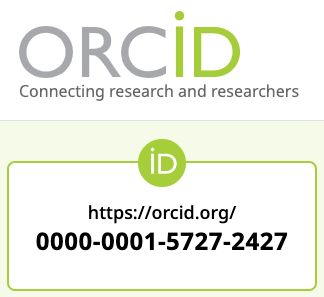

<!-- footer: Alma Mater Studiorum – Università di Bologna & ARIC – Area Ricerca, Settore Coordinamento Servizi Ricerca e Progetti di Area, Data Steward (2024). Linee guida di Ateneo per la gestione dei dati della ricerca. https://www.unibo.it/it/allegati/Lineeguidaricerca_v4_HR.pdf -->

### ORCID

PID per l'individuo che lavora nella ricerca.

Fornisce un'identità unica a cui associare il proprio lavoro, indipendentemente dal nome completo.

Inoltre, è molto utile per accedere o registrarsi a servizi che lo utilizzano come sistema di autenticazione o applicativo di supporto per ulteriori funzionalità (es. Zenodo).

Esempio: [0000-0002-0799-1527](https://orcid.org/0000-0002-0799-1527)

---

<!-- footer: Alma Mater Studiorum – Università di Bologna & ARIC – Area Ricerca, Settore Coordinamento Servizi Ricerca e Progetti di Area, Data Steward (2024). Linee guida di Ateneo per la gestione dei dati della ricerca. https://www.unibo.it/it/allegati/Lineeguidaricerca_v4_HR.pdf -->

### DOI

PID per un oggetto digitale di ricerca pubblicato sul Web.

Rende molto più facile per gli altri citare i dati, riduce il rischio di _link rot_ e consente di tracciare come la nostra ricerca venga utilizzata e citata.

Esistono servizi che associano DOI a ciò che pubblichiamo (es. Zenodo).

Esempio: https://doi.org/10.5281/zenodo.5144961

---

<!-- footer: Alma Mater Studiorum – Università di Bologna & ARIC – Area Ricerca, Settore Coordinamento Servizi Ricerca e Progetti di Area, Data Steward (2024). Linee guida di Ateneo per la gestione dei dati della ricerca. https://www.unibo.it/it/allegati/Lineeguidaricerca_v4_HR.pdf -->

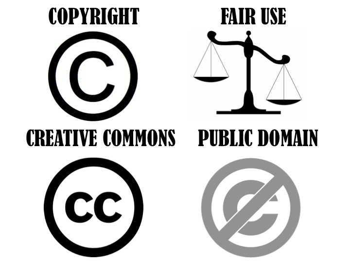

### I dati possono essere soggetti a diritto d’autore…

… Quando sono opere dell’ingegno di carattere creativo (es. testi, immagini, tabelle, database, software, ecc.).

Però, il diritto d’autore tutela la forma espressiva di un’opera dell’ingegno, non i dati.

La tutela autoriale _non dovrebbe_ coprire le idee, i procedimenti, i metodi di funzionamento o i concetti matematici in quanto tali.

---

<!-- paginate: False -->

<!-- footer: "" -->

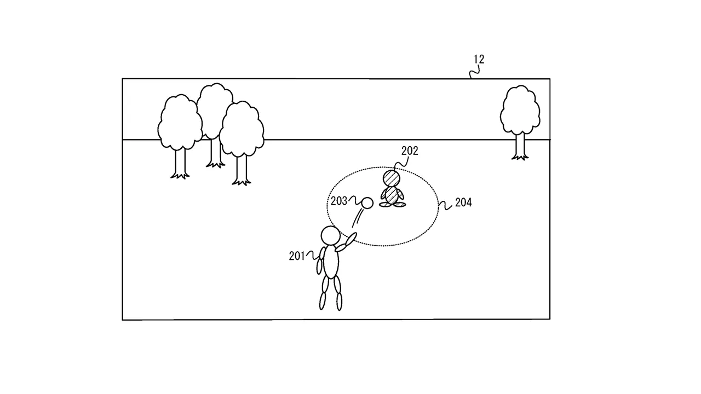

---

<!-- paginate: True -->

<!-- footer: Alma Mater Studiorum – Università di Bologna & ARIC – Area Ricerca, Settore Coordinamento Servizi Ricerca e Progetti di Area, Data Steward (2024). Linee guida di Ateneo per la gestione dei dati della ricerca. https://www.unibo.it/it/allegati/Lineeguidaricerca_v4_HR.pdf -->

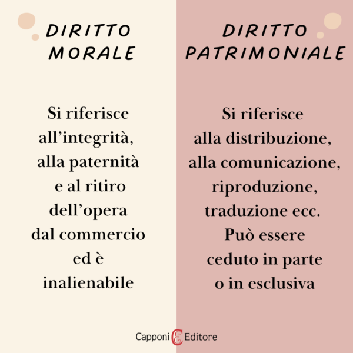

### All’autore spettano diritti morali e patrimoniali

* **Morali**: irrinunciabili, inalienabili, imprescrittibili, possono essere fatti valere senza limiti di tempo dopo la morte dell’autore (es. il diritto di rivendicare la paternità dell’opera, il diritto all’integrità dell’opera);
* **Patrimoniali**: cedibili a titolo oneroso o gratuito, in via esclusiva o non esclusiva, ed esercitabili fino a 70 anni dopo la morte dell’autore (es. il diritto di digitalizzare, il diritto di modificare, ecc.).

---

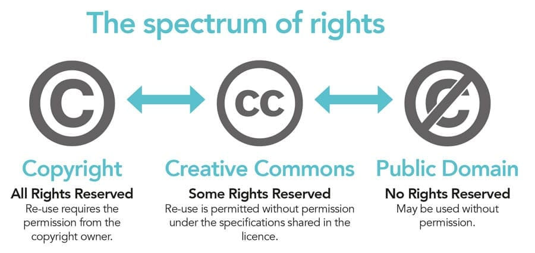

### Cosa intendiamo per _licenza_?

Una **licenza** è _un contratto di concessione d'uso_ dei propri diritti patrimoniali su un'opera.

Un autore usa una licenza per far sapere alle altre persone cosa possono e non possono fare con la sua opera.

I dati ad accesso aperto (Open Data) sono distribuiti con licenze che garantiscono libertà di accesso, utilizzo, modifica e condivisione, con eventuali restrizioni per attribuire la paternità e limitare alcuni usi.

---

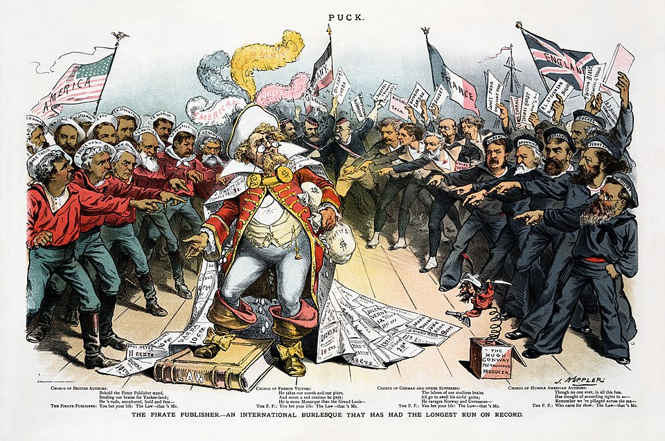

### Fate _molta_ attenzione quando usate dati altrui

Per usare opere o materiali protetti dal diritto d’autore o da diritti connessi, è necessario ottenere il consenso preventivo del titolare dei diritti.

L’uso di un’opera senza autorizzazione è consentito solo in caso di eccezioni previste dalla legge (come l’uso per scopi educativi o di critica).

È sempre necessario verificare i termini della licenza d’uso associata.

---

### Fate attenzione anche quando pubblicate i vostri dati

Se non ci sono problemi legali o economici, è preferibile rendere i dati accessibili a quante più persone possibili.

Vi consiglio di scegliere licenze permissive che permettano l’uso libero dei dati in qualsiasi formato, per qualsiasi scopo, anche commerciale.

Un esempio "radicale" è il **publbico dominio** (**CC0**): chiunque può fare qualsiasi cosa con i dati.

---

<!-- footer: "" -->

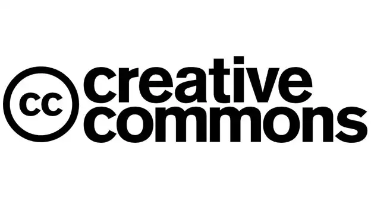

### Le licenze Creative Commons (CC)

L’autore concede l’autorizzazione all’uso dell’opera a determinate condizioni, decidendo quali diritti riservare e quali concedere in uso.

I sei schemi di licenza disponibili si articolano sulla combinazione di quattro clausole:

* **BY** (Attribution);
* **NC** (Non Commercial);
* **SA** (Share Alike);
* **ND** (Non Derivates).

---

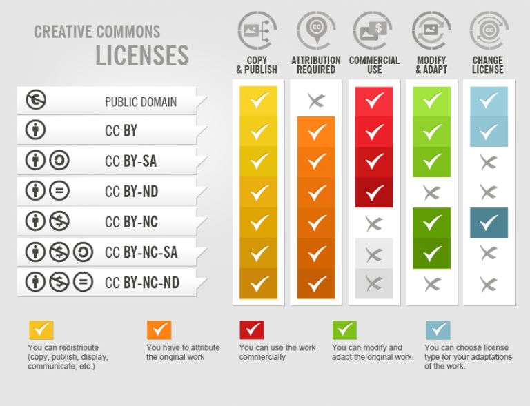

---

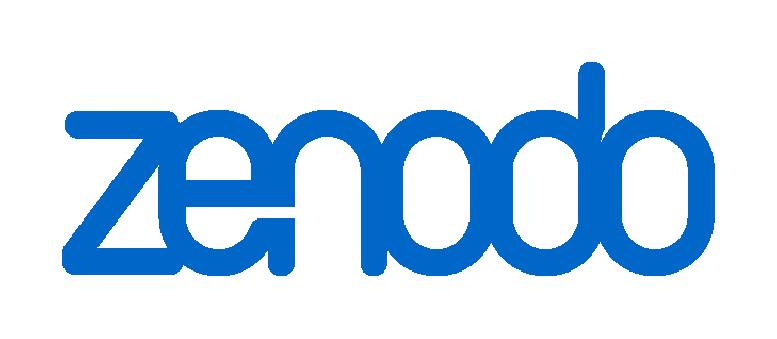

---

###  Zenodo

[Zenodo](https://zenodo.org/) è una _repository_ generalista per l'archiviazione e condivisione a lungo termine dei dati di ricerca.

✅ Sicuro, affidabile, rende i dati citabili, permette caricamenti immediati, permette più tipi di condivisione e accesso, permette il versionamento, ed è integrato con GitHub.

❌ Non viene moderato, non si specializza su nessun tipo di dato in particolare.

Per noi, resta comunque una soluzione più che valida.

---

<!-- paginate: False -->

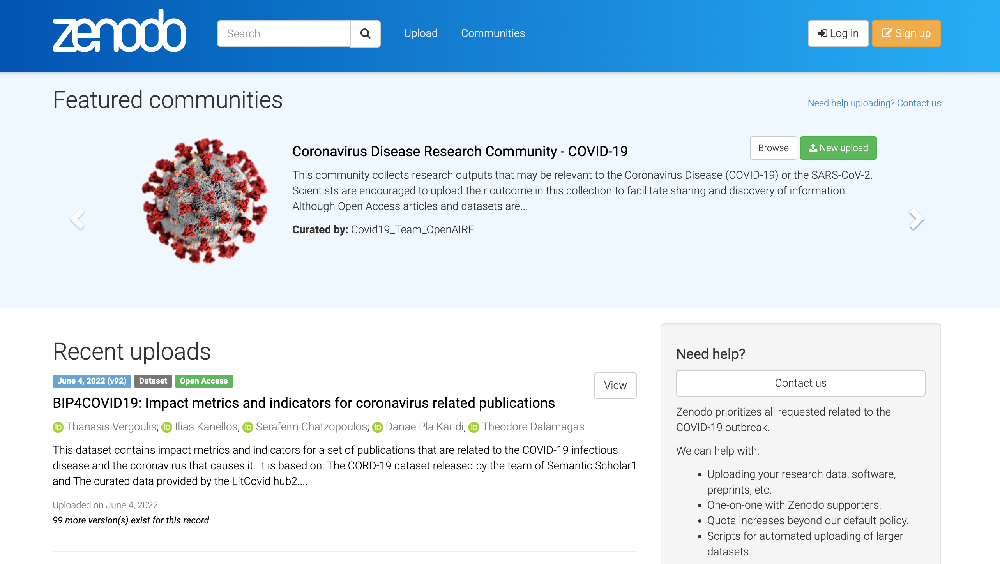

---

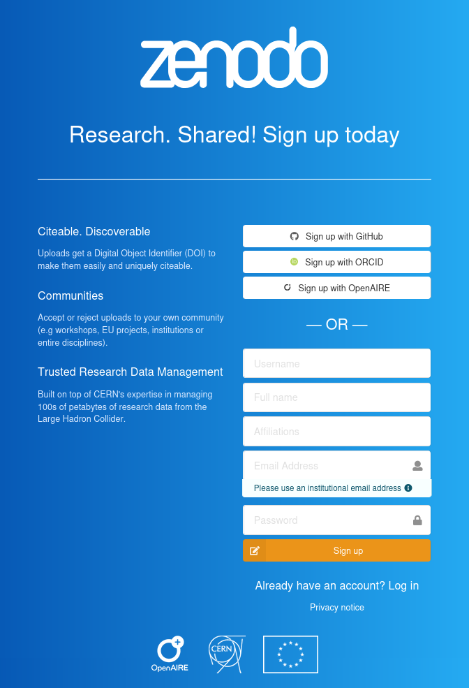

---

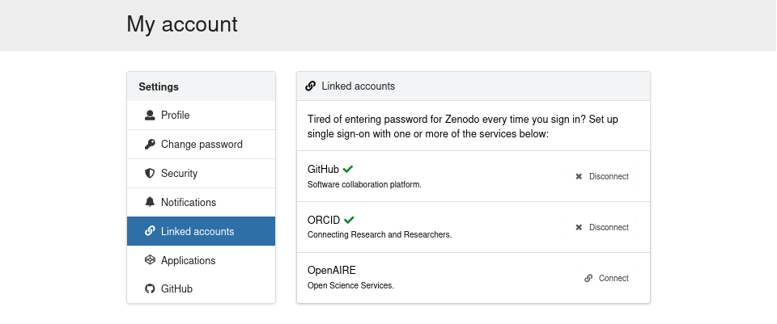

---

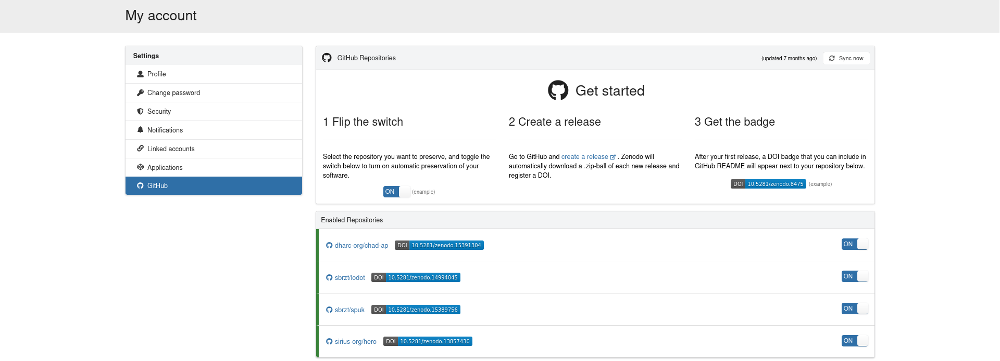

---

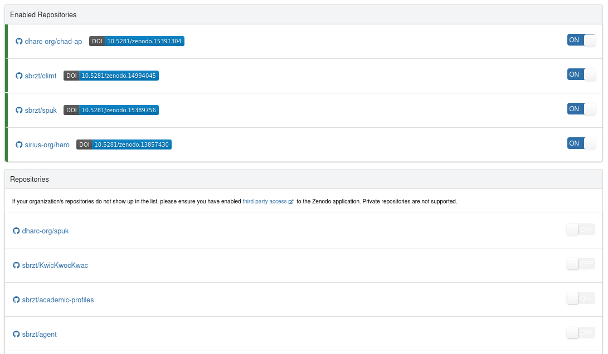

---

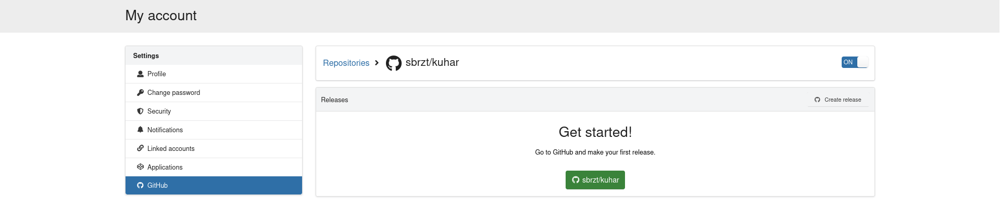

---

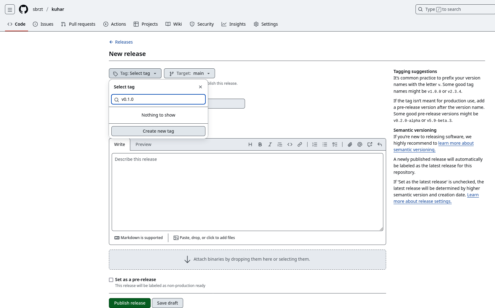

---

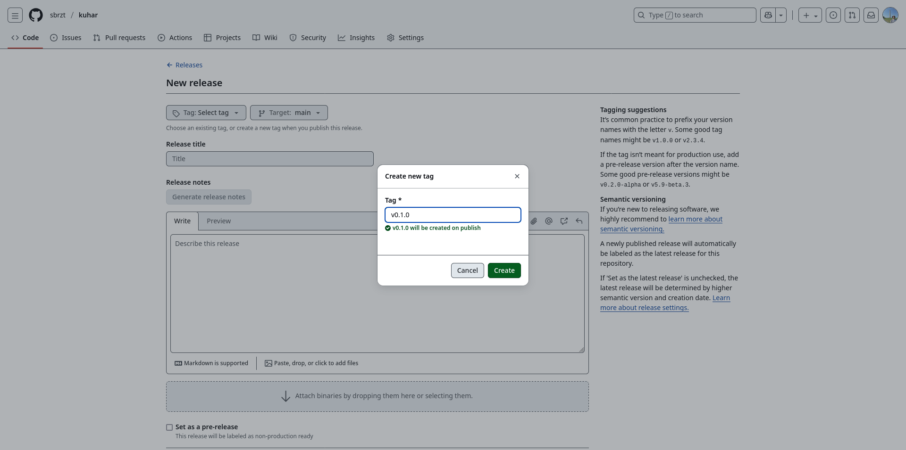

---

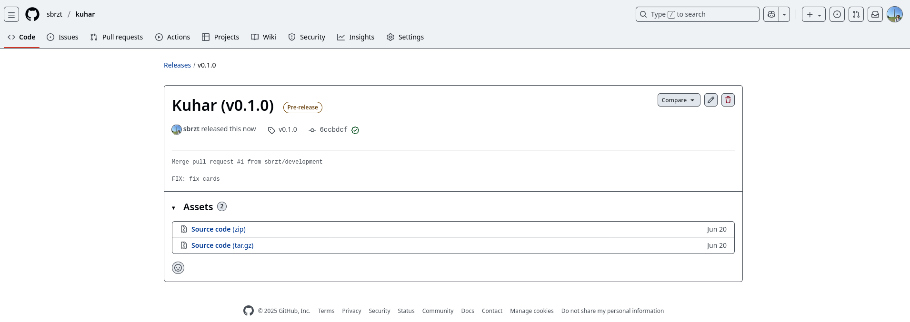

---

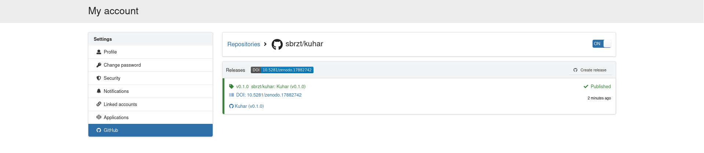

---

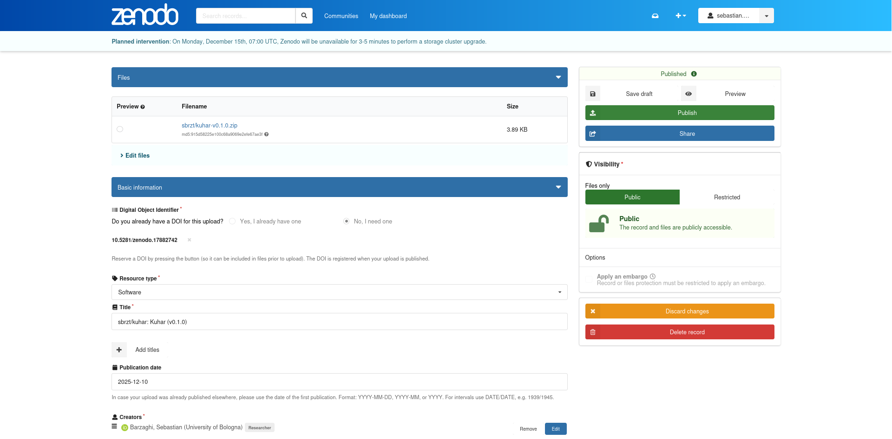

---

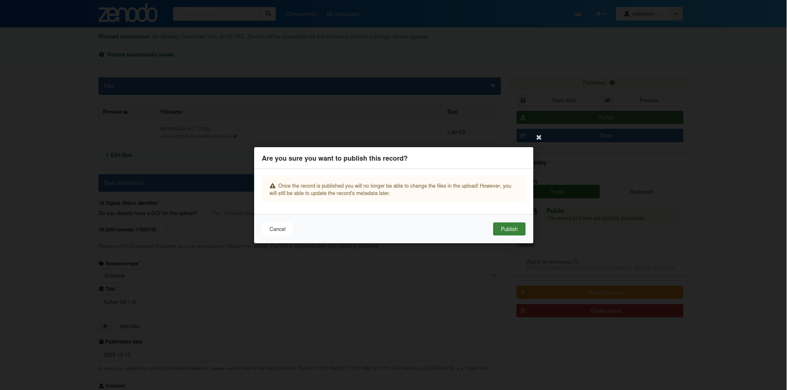

---

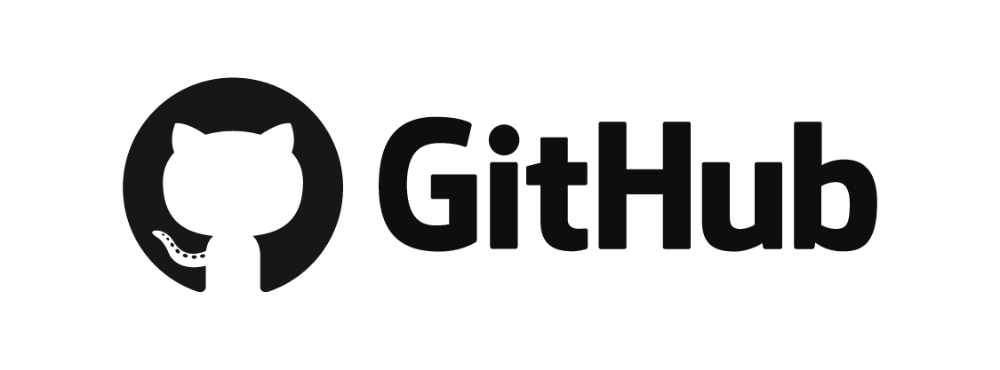

### Cosa faremo

1. Otteniamo un ORCID (facoltativo, ma consigliato);

2. Modifichiamo il README;

3. Entriamo su Zenodo tramite le credenziali GitHub;

4. Prepariamo la repo per l'archiviazione su Zenodo;

5. Creiamo una _release_ su GitHub;

6. Inseriamo i metadati su Zenodo, inclusi il DOI e la licenza.

7. Pubblichiamo.

---

<!-- paginate: False -->

# Digital Humanities e Data Management / Informatica per i Beni Culturali (2025/2026)

## 14. Preservazione e Condivisione II ✅

➡️ Mail: [sebastian.barzaghi2@unibo.it](mailto:sebastian.barzaghi2@unibo.it)
➡️ ORCID: [0000-0002-0799-1527](https://orcid.org/0000-0002-0799-1527)
➡️ Sito: [sebastian.barzaghi2](https://www.unibo.it/sitoweb/sebastian.barzaghi2/)