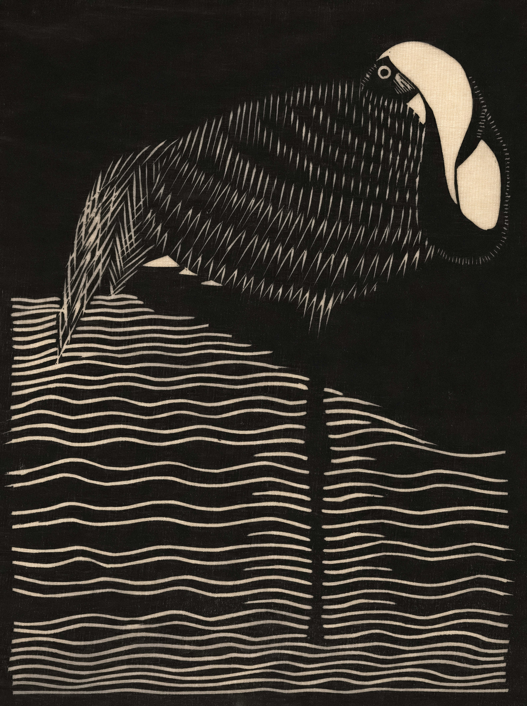
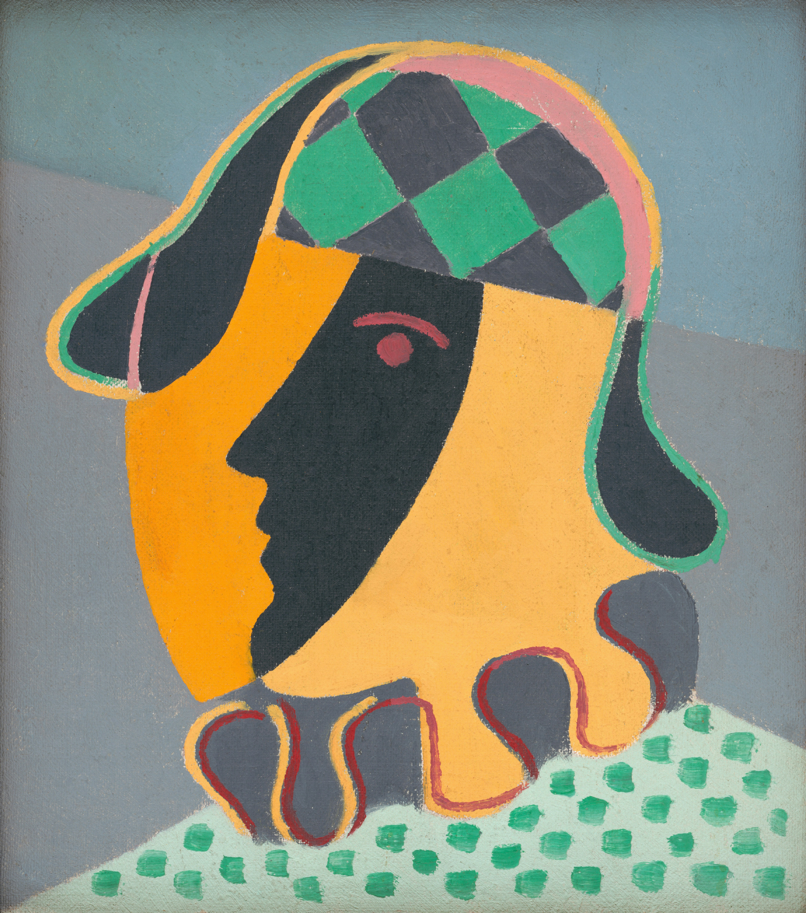
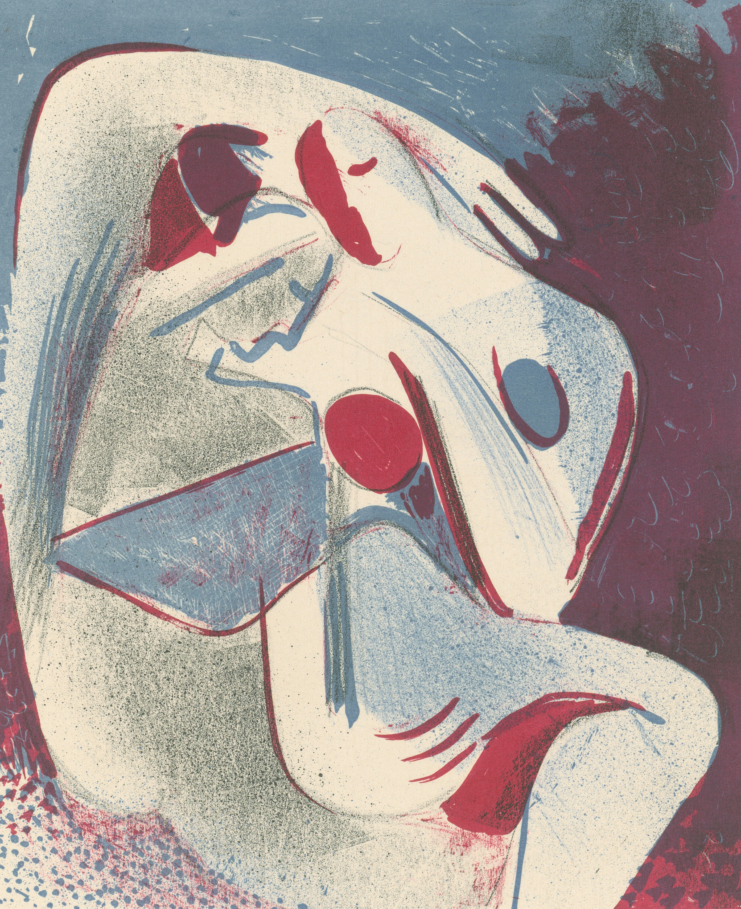
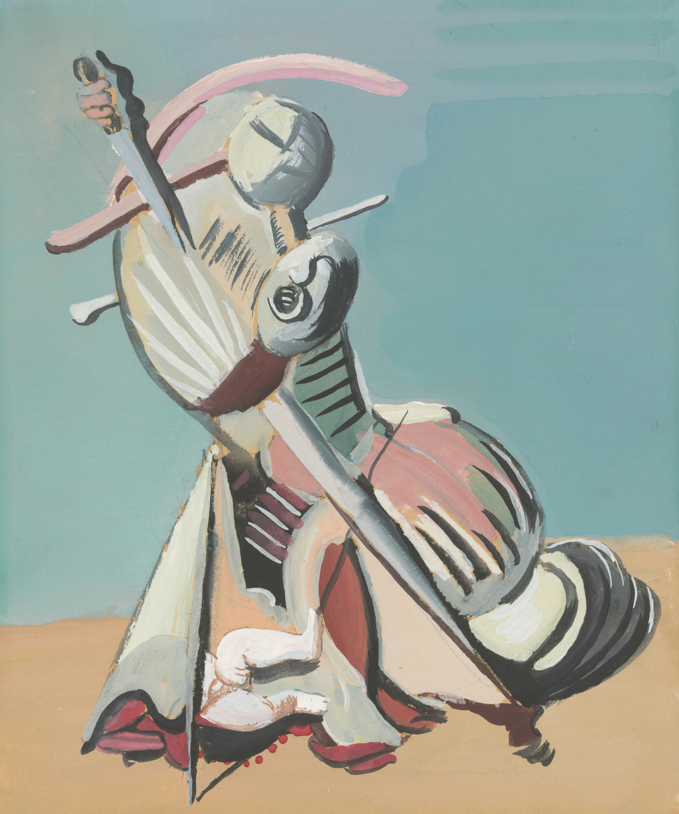
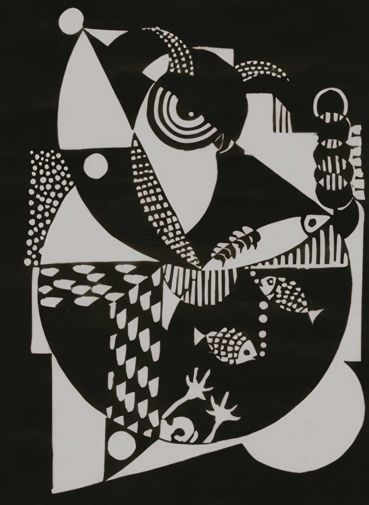
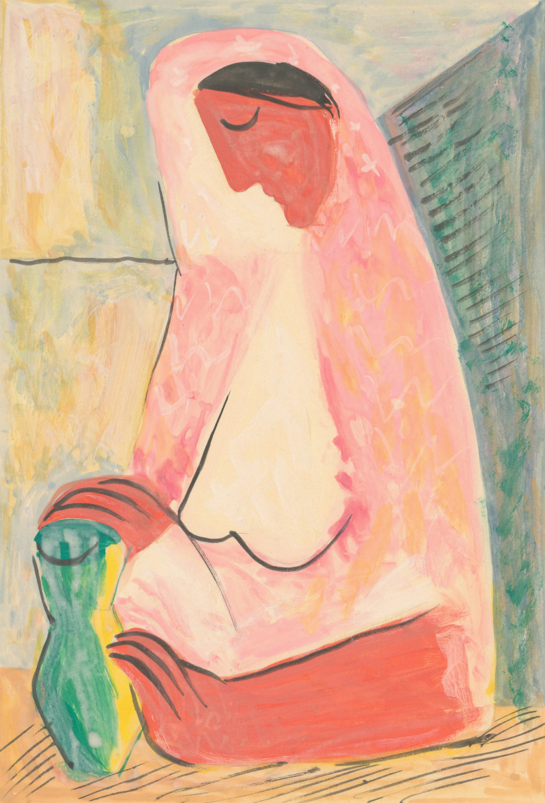
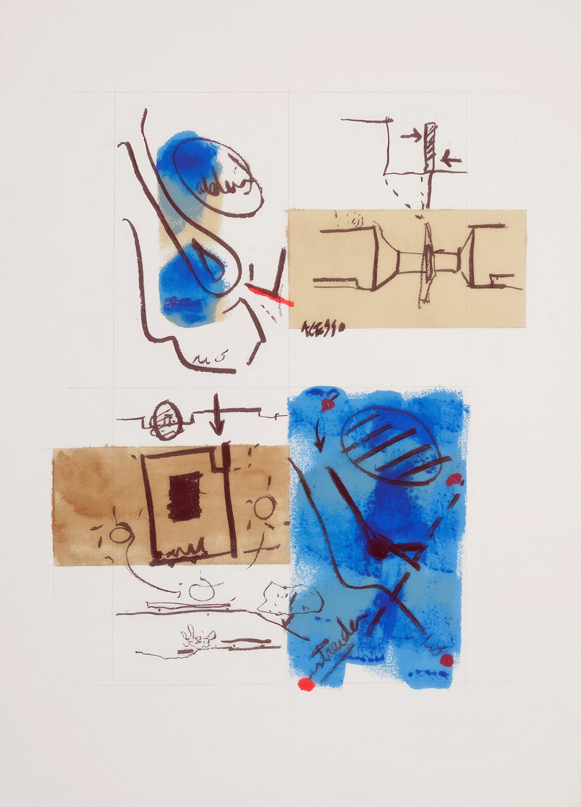
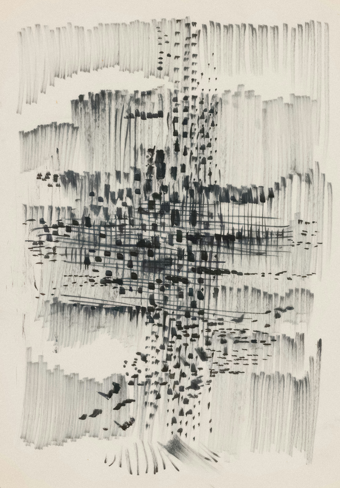

<!-- paginate: False -->

# Digital Humanities e Data Management / Informatica per i Beni Culturali (2025/2026)

## 15. Recap di fine corso

➡️ Mail: [sebastian.barzaghi2@unibo.it](mailto:sebastian.barzaghi2@unibo.it)
➡️ ORCID: [0000-0002-0799-1527](https://orcid.org/0000-0002-0799-1527)
➡️ Sito: [sebastian.barzaghi2](https://www.unibo.it/sitoweb/sebastian.barzaghi2/)

---

<!-- paginate: True -->

### Dataset storico-artistico

Dataset costituito da metadati descrittivi di opere d'arte visuali.

**Obiettivo**: implementazione di un progetto di **gestione dei dati** che coinvolge: 
* 2 o 3 domande di ricerca;
* Acquisizione, esplorazione, pulizia e manipolazione dei dati;
* Analisi dei dati sulla base delle domande scelte;
* Presentazione del processo e risultati.

[Link](https://raw.githubusercontent.com/dhdmch/2025-2026/refs/heads/main/data/vapod/data.csv)

---

### Dataset bibliografico

Dataset costituito da metadati descrittivi di pubblicazioni scientifiche.

**Obiettivo**: implementazione di un progetto di **gestione dei dati** che coinvolge: 
* 2 o 3 domande di ricerca;
* Acquisizione, esplorazione, pulizia e manipolazione dei dati;
* Analisi dei dati sulla base delle domande scelte;
* Presentazione del processo e risultati.

[Link](https://raw.githubusercontent.com/dhdmch/2025-2026/refs/heads/main/data/lispod/data.csv)

---

### L'idea generale

* **Scelta della modalità** (in gruppo o individuale): comunicatemi per mail prima dell'esame se siete in gruppo;
* **Scelta del dataset**;
* **Raccolta, processamento e analisi dei dati** (in un _notebook_ su Colab);
* **Caricamento del _notebook_ su GitHub**;
    * **Creazione di un README** scritto in Markdown;
    * **Assegnazione di una licenza**;
* **Archiviazione su Zenodo**;
* **Presentazione orale**, usando il _notebook_ come guida.

---

### Il notebook

Link al template:

Fatene una copia e partite da questa, ma poi strutturatela come meglio credete.

Non lesinate sulla parte scritta: descrivete in maniera accurata quello che state facendo. Illustrate gli aspetti dei dati che volete esplorare. Rendete chiari i vostri ragionamenti. Non abbiate paura di fare qualcosa che non porta a niente: mi interessa solo che ci provate e che abbiate coscienza di quallo che state facendo.

Scrivere codice pulito è un plus, ma è più importante fare qualcosa che funziona.

---

### Caricamento su GitHub

Guardate il video della lezione 13.

Fate bene il README: vi chiedo si inserire almeno un titolo, una descrizione, il DOI assegnato da Zenodo, la licenza, le persone responsabili (cioé voi: nome completo e ORCID, se l'avete fatto), la citazione alla fonte dei dati.

* [Link al template]()
* [Link ad un esempio](https://github.com/sbrzt/horror-movie-analysis/blob/main/README.md)

Ricordatevi la licenza: fossi in voi userei la CC0, ma fate come meglio credete.

---

### Archiviazione su Zenodo

Guardate il video della lezione 14.

Vi consiglio di crearvi un ORCID.

Vi consiglio di utilizzare GitHub per iscrivervi a Zenodo.

Eseguite l'archiviazione a fine progetto, una volta che avete la certezza che ci sia tutto (notebook, README, licenza).

Modificate e aggiungete i metadati assegnati su Zenodo.

Ricordatevi che poi il progetto archiviato è _vostro_: usatelo per farci tutto quello che volete.

---

### Presentazione orale

Mandatemi per mail il DOI del vostro progetto su Zenodo _almeno_ il giorno prima dell'appello d'esame. 

Parleremo 15-20 minuti del vostro progetto (in media, poi dipenderà tutto anche dal contesto).

Vi lascerò parlare liberamente (se siete in gruppo, decidete voi come dividervi le parti). 

Date una lettura ai materiali in bibliografia giusto per contestualizzare gli argomenti discussi durante il corso.

---

### Altre informazioni

#### Appelli

Ve li comunicherò il prima possibile (spero già settimana prossima) su Virtuale. Prevedo di metterli abbastanza cadenzati, verso la fine di ogni mese (o quasi).

#### Dataset

Vi avviso su Virtuale quando saranno disponibili. Anche questo sarà fatto il prima possibile (settimana prossima massimo).

#### Se mi viene in mente altro, vi avviserò su Virtuale

---

# Digital Humanities e Data Management / Informatica per i Beni Culturali (2025/2026)

## 15. Recap di fine corso ✅

➡️ Mail: [sebastian.barzaghi2@unibo.it](mailto:sebastian.barzaghi2@unibo.it)
➡️ ORCID: [0000-0002-0799-1527](https://orcid.org/0000-0002-0799-1527)
➡️ Sito: [sebastian.barzaghi2](https://www.unibo.it/sitoweb/sebastian.barzaghi2/)